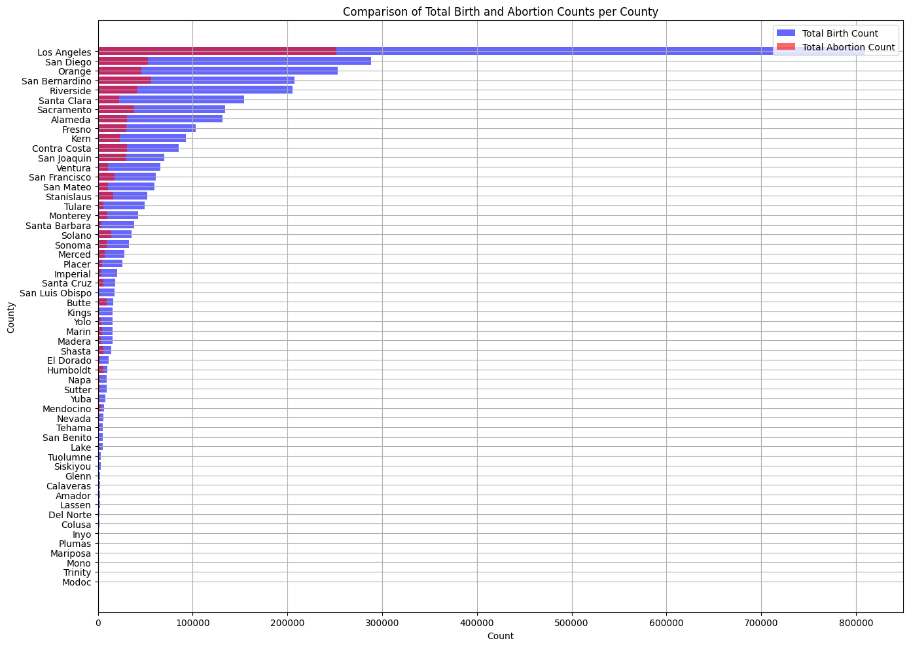
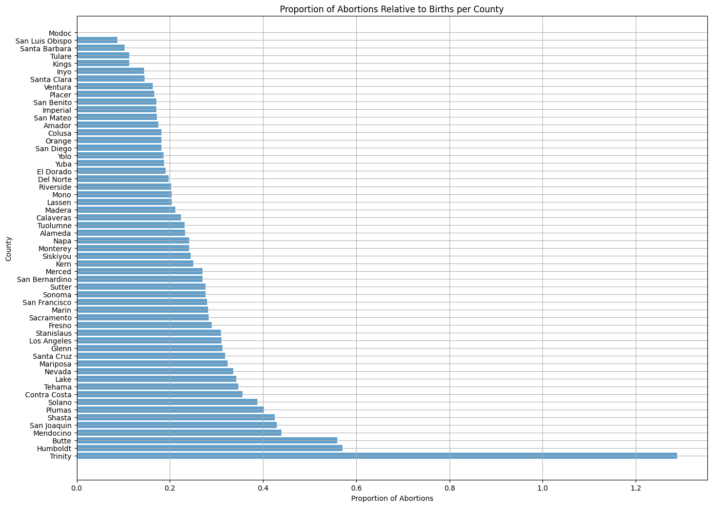
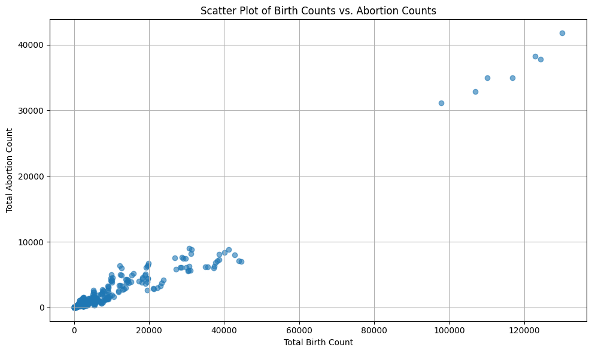
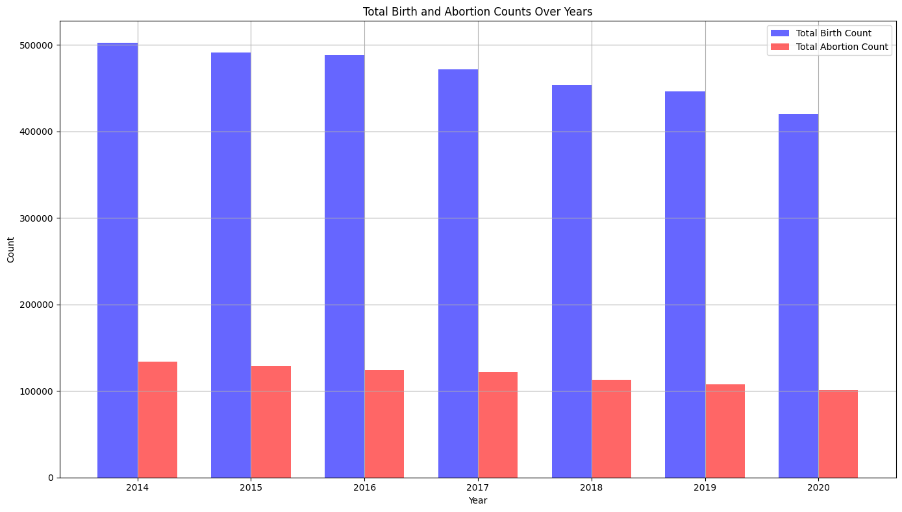

# Real-world Data Wrangling (Birth and Abortion analysis for state California 2014-2020)

## 1. Gather data

### **1.1.** Problem Statement

For this project, I want to analyse how birth and abortion numbers have changed over time and how they differ between counties in California from 2014 to 2020. I will use datasets that show the total number of births and abortions in each county, as well as the proportion of abortions compared to births. This will help understand trends and highlight counties with big differences in these numbers.
The questions we will look at:

#### Trends Over Time:

- How have the total birth counts and total abortion counts changed from 2014 to 2020?
- Is there a consistent trend in the decline or increase of births and abortions over these years?

#### County Comparisons:

- Which counties have the highest and lowest total birth counts?
- Which counties have the highest and lowest total abortion counts?
- How do different counties compare in terms of the proportion of abortions relative to births?

#### Proportional Analysis:

- What is the proportion of abortions relative to births for each county?
- Are there counties with significantly higher or lower abortion proportions compared to others?
- How do the proportions of abortions to births vary across counties, and what might explain these variations?

### **1.2.** Gather at least two datasets using two different data gathering methods

#### **Dataset 1**

Type:  CSV File

Method: The data was gathered using the "Downloading files" method from the Data.gov website, specifically the dataset ["Live Birth Profiles by County" for the state of California](https://catalog.data.gov/dataset/live-birth-profiles-by-county-2b5f8). The dataset was downloaded as a CSV file and then processed for analysis.

Dataset variables:

*   *Year* 
*   *County*
*   *Month*: Data will be grouped by year( month variable will be removed)
*   *Count*: Total count of birth
*   *Geography_Type*: (Occurrence/Residence). The data will be filltered for residence only, then geography_type will be removed
*   *Strata*: General demographic or detail category under which events have been stratified(data will be filltered for total population only)

Strata_Name, Annotation_Code, Annotation_Desc and Data_Revision_Date variables are unnecessary for the analysis, and will be identified and removed during cleaning stage


```python
# Import the packages
import pandas as pd
import numpy as np
import matplotlib.pyplot as plt
import seaborn as sns
import requests

# Read the .csv file and print first few rows
birth_df = pd.read_csv('20230912_births_final_county_month_sup.csv')
birth_df.head()
```


<div>
<style scoped>
    .dataframe tbody tr th:only-of-type {
        vertical-align: middle;
    }

    .dataframe tbody tr th {
        vertical-align: top;
    }

    .dataframe thead th {
        text-align: right;
    }
</style>
<table border="1" class="dataframe">
  <thead>
    <tr style="text-align: right;">
      <th></th>
      <th>Year</th>
      <th>Month</th>
      <th>County</th>
      <th>Geography_Type</th>
      <th>Strata</th>
      <th>Strata_Name</th>
      <th>Count</th>
      <th>Annotation_Code</th>
      <th>Annotation_Desc</th>
      <th>Data_Revision_Date</th>
    </tr>
  </thead>
  <tbody>
    <tr>
      <th>0</th>
      <td>1960</td>
      <td>1</td>
      <td>Alameda</td>
      <td>Occurrence</td>
      <td>Total Population</td>
      <td>Total Population</td>
      <td>1693.0</td>
      <td>NaN</td>
      <td>NaN</td>
      <td>09/12/2023</td>
    </tr>
    <tr>
      <th>1</th>
      <td>1960</td>
      <td>1</td>
      <td>Alpine</td>
      <td>Occurrence</td>
      <td>Total Population</td>
      <td>Total Population</td>
      <td>0.0</td>
      <td>NaN</td>
      <td>NaN</td>
      <td>09/12/2023</td>
    </tr>
    <tr>
      <th>2</th>
      <td>1960</td>
      <td>1</td>
      <td>Amador</td>
      <td>Occurrence</td>
      <td>Total Population</td>
      <td>Total Population</td>
      <td>NaN</td>
      <td>1.0</td>
      <td>Cell suppressed for small numbers</td>
      <td>09/12/2023</td>
    </tr>
    <tr>
      <th>3</th>
      <td>1960</td>
      <td>1</td>
      <td>Butte</td>
      <td>Occurrence</td>
      <td>Total Population</td>
      <td>Total Population</td>
      <td>132.0</td>
      <td>NaN</td>
      <td>NaN</td>
      <td>09/12/2023</td>
    </tr>
    <tr>
      <th>4</th>
      <td>1960</td>
      <td>1</td>
      <td>Calaveras</td>
      <td>Occurrence</td>
      <td>Total Population</td>
      <td>Total Population</td>
      <td>14.0</td>
      <td>NaN</td>
      <td>NaN</td>
      <td>09/12/2023</td>
    </tr>
  </tbody>
</table>
</div>


#### Dataset 2

Type: CSV File

Method: The data was gathered using the "URL download" method from the data.ca.gov website, specifically the dataset ["Abortion-Related Services Funded by Medi-Cal, Calendar Years 2014-2020" for the state of California](https://data.chhs.ca.gov/dataset/04ccec8c-17ca-4659-9001-f7e4ffa8604b/resource/aec980ce-d454-4c4b-95e7-711a0d86095c/download/abortion_services_delivery_system_county.csv). The dataset was downloaded programmatically as a CSV file and then processed for analysis.

Dataset variables:

*   *Calendar Year*
*   *County*
*   *Delivery System*: We will use total only for our analysis
*   *Total Abortion-Related Services*: Total abortion count

Annotation Code, Annotation Description and	Date of Data avriables are unnecesarry for the analysis and will be removed during cleaning process


```python
# URL of the dataset
url = 'https://data.chhs.ca.gov/dataset/04ccec8c-17ca-4659-9001-f7e4ffa8604b/resource/aec980ce-d454-4c4b-95e7-711a0d86095c/download/abortion_services_delivery_system_county.csv'

# Downloading the dataset
response = requests.get(url)
filename = 'abortion_services_delivery_system_county.csv'

# Saving the file locally
with open(filename, 'wb') as file:
    file.write(response.content)

# Reading the CSV file into a DataFrame
abortion_df = pd.read_csv(filename)

# Displaying the DataFrame
abortion_df.head()
```


<div>
<style scoped>
    .dataframe tbody tr th:only-of-type {
        vertical-align: middle;
    }

    .dataframe tbody tr th {
        vertical-align: top;
    }

    .dataframe thead th {
        text-align: right;
    }
</style>
<table border="1" class="dataframe">
  <thead>
    <tr style="text-align: right;">
      <th></th>
      <th>Calendar Year</th>
      <th>County</th>
      <th>Delivery System</th>
      <th>Total Abortion-Related Services</th>
      <th>Annotation Code</th>
      <th>Annotation Description</th>
      <th>Date of Data</th>
    </tr>
  </thead>
  <tbody>
    <tr>
      <th>0</th>
      <td>2014</td>
      <td>Alameda</td>
      <td>Fee-for-Service</td>
      <td>1953.0</td>
      <td>NaN</td>
      <td>NaN</td>
      <td>1/12/2022</td>
    </tr>
    <tr>
      <th>1</th>
      <td>2014</td>
      <td>Alameda</td>
      <td>Managed Care</td>
      <td>2474.0</td>
      <td>NaN</td>
      <td>NaN</td>
      <td>1/12/2022</td>
    </tr>
    <tr>
      <th>2</th>
      <td>2014</td>
      <td>Alameda</td>
      <td>Total</td>
      <td>4427.0</td>
      <td>NaN</td>
      <td>NaN</td>
      <td>1/12/2022</td>
    </tr>
    <tr>
      <th>3</th>
      <td>2014</td>
      <td>Amador</td>
      <td>Fee-for-Service</td>
      <td>18.0</td>
      <td>NaN</td>
      <td>NaN</td>
      <td>1/12/2022</td>
    </tr>
    <tr>
      <th>4</th>
      <td>2014</td>
      <td>Amador</td>
      <td>Managed Care</td>
      <td>18.0</td>
      <td>NaN</td>
      <td>NaN</td>
      <td>1/12/2022</td>
    </tr>
  </tbody>
</table>
</div>


## 2. Assess data

### Check for Quality Issues in Birth Dataset:


```python
# Inspecting the dataframe visually
birth_df.head()
```


<div>
<style scoped>
    .dataframe tbody tr th:only-of-type {
        vertical-align: middle;
    }

    .dataframe tbody tr th {
        vertical-align: top;
    }

    .dataframe thead th {
        text-align: right;
    }
</style>
<table border="1" class="dataframe">
  <thead>
    <tr style="text-align: right;">
      <th></th>
      <th>Year</th>
      <th>Month</th>
      <th>County</th>
      <th>Geography_Type</th>
      <th>Strata</th>
      <th>Strata_Name</th>
      <th>Count</th>
      <th>Annotation_Code</th>
      <th>Annotation_Desc</th>
      <th>Data_Revision_Date</th>
    </tr>
  </thead>
  <tbody>
    <tr>
      <th>0</th>
      <td>1960</td>
      <td>1</td>
      <td>Alameda</td>
      <td>Occurrence</td>
      <td>Total Population</td>
      <td>Total Population</td>
      <td>1693.0</td>
      <td>NaN</td>
      <td>NaN</td>
      <td>09/12/2023</td>
    </tr>
    <tr>
      <th>1</th>
      <td>1960</td>
      <td>1</td>
      <td>Alpine</td>
      <td>Occurrence</td>
      <td>Total Population</td>
      <td>Total Population</td>
      <td>0.0</td>
      <td>NaN</td>
      <td>NaN</td>
      <td>09/12/2023</td>
    </tr>
    <tr>
      <th>2</th>
      <td>1960</td>
      <td>1</td>
      <td>Amador</td>
      <td>Occurrence</td>
      <td>Total Population</td>
      <td>Total Population</td>
      <td>NaN</td>
      <td>1.0</td>
      <td>Cell suppressed for small numbers</td>
      <td>09/12/2023</td>
    </tr>
    <tr>
      <th>3</th>
      <td>1960</td>
      <td>1</td>
      <td>Butte</td>
      <td>Occurrence</td>
      <td>Total Population</td>
      <td>Total Population</td>
      <td>132.0</td>
      <td>NaN</td>
      <td>NaN</td>
      <td>09/12/2023</td>
    </tr>
    <tr>
      <th>4</th>
      <td>1960</td>
      <td>1</td>
      <td>Calaveras</td>
      <td>Occurrence</td>
      <td>Total Population</td>
      <td>Total Population</td>
      <td>14.0</td>
      <td>NaN</td>
      <td>NaN</td>
      <td>09/12/2023</td>
    </tr>
  </tbody>
</table>
</div>


```python
birth_df.tail()
```


<div>
<style scoped>
    .dataframe tbody tr th:only-of-type {
        vertical-align: middle;
    }

    .dataframe tbody tr th {
        vertical-align: top;
    }

    .dataframe thead th {
        text-align: right;
    }
</style>
<table border="1" class="dataframe">
  <thead>
    <tr style="text-align: right;">
      <th></th>
      <th>Year</th>
      <th>Month</th>
      <th>County</th>
      <th>Geography_Type</th>
      <th>Strata</th>
      <th>Strata_Name</th>
      <th>Count</th>
      <th>Annotation_Code</th>
      <th>Annotation_Desc</th>
      <th>Data_Revision_Date</th>
    </tr>
  </thead>
  <tbody>
    <tr>
      <th>115531</th>
      <td>2022</td>
      <td>12</td>
      <td>Yuba</td>
      <td>Residence</td>
      <td>Total Population</td>
      <td>Total Population</td>
      <td>95.0</td>
      <td>NaN</td>
      <td>NaN</td>
      <td>09/12/2023</td>
    </tr>
    <tr>
      <th>115532</th>
      <td>2022</td>
      <td>12</td>
      <td>Yuba</td>
      <td>Residence</td>
      <td>Place Type</td>
      <td>Hospital</td>
      <td>92.0</td>
      <td>NaN</td>
      <td>NaN</td>
      <td>09/12/2023</td>
    </tr>
    <tr>
      <th>115533</th>
      <td>2022</td>
      <td>12</td>
      <td>Yuba</td>
      <td>Residence</td>
      <td>Place Type</td>
      <td>Freestanding Birth Center</td>
      <td>NaN</td>
      <td>1.0</td>
      <td>Cell suppressed for small numbers</td>
      <td>09/12/2023</td>
    </tr>
    <tr>
      <th>115534</th>
      <td>2022</td>
      <td>12</td>
      <td>Yuba</td>
      <td>Residence</td>
      <td>Place Type</td>
      <td>Home</td>
      <td>NaN</td>
      <td>1.0</td>
      <td>Cell suppressed for small numbers</td>
      <td>09/12/2023</td>
    </tr>
    <tr>
      <th>115535</th>
      <td>2022</td>
      <td>12</td>
      <td>Yuba</td>
      <td>Residence</td>
      <td>Place Type</td>
      <td>Other/Unknown</td>
      <td>0.0</td>
      <td>NaN</td>
      <td>NaN</td>
      <td>09/12/2023</td>
    </tr>
  </tbody>
</table>
</div>


```python
# Inspecting the dataframe programmatically
birth_df.columns
```


    Index(['Year', 'Month', 'County', 'Geography_Type', 'Strata', 'Strata_Name',
           'Count', 'Annotation_Code', 'Annotation_Desc', 'Data_Revision_Date'],
          dtype='object')


```python
# Get the number of rows and columns
birth_df.shape
```


    (115536, 10)


```python
birth_df.describe()
```


<div>
<style scoped>
    .dataframe tbody tr th:only-of-type {
        vertical-align: middle;
    }

    .dataframe tbody tr th {
        vertical-align: top;
    }

    .dataframe thead th {
        text-align: right;
    }
</style>
<table border="1" class="dataframe">
  <thead>
    <tr style="text-align: right;">
      <th></th>
      <th>Year</th>
      <th>Month</th>
      <th>Count</th>
      <th>Annotation_Code</th>
    </tr>
  </thead>
  <tbody>
    <tr>
      <th>count</th>
      <td>115536.000000</td>
      <td>115536.000000</td>
      <td>96673.000000</td>
      <td>18863.000000</td>
    </tr>
    <tr>
      <th>mean</th>
      <td>1997.987952</td>
      <td>6.500000</td>
      <td>636.425020</td>
      <td>1.146848</td>
    </tr>
    <tr>
      <th>std</th>
      <td>20.131878</td>
      <td>3.452067</td>
      <td>1646.662386</td>
      <td>0.353964</td>
    </tr>
    <tr>
      <th>min</th>
      <td>1960.000000</td>
      <td>1.000000</td>
      <td>0.000000</td>
      <td>1.000000</td>
    </tr>
    <tr>
      <th>25%</th>
      <td>1980.000000</td>
      <td>3.750000</td>
      <td>24.000000</td>
      <td>1.000000</td>
    </tr>
    <tr>
      <th>50%</th>
      <td>2001.000000</td>
      <td>6.500000</td>
      <td>140.000000</td>
      <td>1.000000</td>
    </tr>
    <tr>
      <th>75%</th>
      <td>2018.000000</td>
      <td>9.250000</td>
      <td>567.000000</td>
      <td>1.000000</td>
    </tr>
    <tr>
      <th>max</th>
      <td>2022.000000</td>
      <td>12.000000</td>
      <td>18811.000000</td>
      <td>2.000000</td>
    </tr>
  </tbody>
</table>
</div>


```python
birth_df.info()
```

    <class 'pandas.core.frame.DataFrame'>
    RangeIndex: 115536 entries, 0 to 115535
    Data columns (total 10 columns):
     #   Column              Non-Null Count   Dtype  
    ---  ------              --------------   -----  
     0   Year                115536 non-null  int64  
     1   Month               115536 non-null  int64  
     2   County              115536 non-null  object 
     3   Geography_Type      115536 non-null  object 
     4   Strata              115536 non-null  object 
     5   Strata_Name         115536 non-null  object 
     6   Count               96673 non-null   float64
     7   Annotation_Code     18863 non-null   float64
     8   Annotation_Desc     18863 non-null   object 
     9   Data_Revision_Date  115536 non-null  object 
    dtypes: float64(2), int64(2), object(6)
    memory usage: 8.8+ MB


After doing some manual and programmatic inspection on our Birth Dataset we can identify some of the quality issues:

- The Count column contains missing values. The Count column is of type float64, which is appropriate for numerical data but requires handling of missing values.
- County column should be a categorical data type. Converting it to a category type can improve performance, especially in terms of memory usage and computational efficiency.
- Count column should be renamed for easier readability

### Check for Quality Issues in Abortion Dataset:


```python
# Inspecting the dataframe visually
abortion_df.head()
```


<div>
<style scoped>
    .dataframe tbody tr th:only-of-type {
        vertical-align: middle;
    }

    .dataframe tbody tr th {
        vertical-align: top;
    }

    .dataframe thead th {
        text-align: right;
    }
</style>
<table border="1" class="dataframe">
  <thead>
    <tr style="text-align: right;">
      <th></th>
      <th>Calendar Year</th>
      <th>County</th>
      <th>Delivery System</th>
      <th>Total Abortion-Related Services</th>
      <th>Annotation Code</th>
      <th>Annotation Description</th>
      <th>Date of Data</th>
    </tr>
  </thead>
  <tbody>
    <tr>
      <th>0</th>
      <td>2014</td>
      <td>Alameda</td>
      <td>Fee-for-Service</td>
      <td>1953.0</td>
      <td>NaN</td>
      <td>NaN</td>
      <td>1/12/2022</td>
    </tr>
    <tr>
      <th>1</th>
      <td>2014</td>
      <td>Alameda</td>
      <td>Managed Care</td>
      <td>2474.0</td>
      <td>NaN</td>
      <td>NaN</td>
      <td>1/12/2022</td>
    </tr>
    <tr>
      <th>2</th>
      <td>2014</td>
      <td>Alameda</td>
      <td>Total</td>
      <td>4427.0</td>
      <td>NaN</td>
      <td>NaN</td>
      <td>1/12/2022</td>
    </tr>
    <tr>
      <th>3</th>
      <td>2014</td>
      <td>Amador</td>
      <td>Fee-for-Service</td>
      <td>18.0</td>
      <td>NaN</td>
      <td>NaN</td>
      <td>1/12/2022</td>
    </tr>
    <tr>
      <th>4</th>
      <td>2014</td>
      <td>Amador</td>
      <td>Managed Care</td>
      <td>18.0</td>
      <td>NaN</td>
      <td>NaN</td>
      <td>1/12/2022</td>
    </tr>
  </tbody>
</table>
</div>


```python
abortion_df.tail()
```


<div>
<style scoped>
    .dataframe tbody tr th:only-of-type {
        vertical-align: middle;
    }

    .dataframe tbody tr th {
        vertical-align: top;
    }

    .dataframe thead th {
        text-align: right;
    }
</style>
<table border="1" class="dataframe">
  <thead>
    <tr style="text-align: right;">
      <th></th>
      <th>Calendar Year</th>
      <th>County</th>
      <th>Delivery System</th>
      <th>Total Abortion-Related Services</th>
      <th>Annotation Code</th>
      <th>Annotation Description</th>
      <th>Date of Data</th>
    </tr>
  </thead>
  <tbody>
    <tr>
      <th>1226</th>
      <td>2016</td>
      <td>Statewide</td>
      <td>Total</td>
      <td>125193.0</td>
      <td>NaN</td>
      <td>NaN</td>
      <td>NaN</td>
    </tr>
    <tr>
      <th>1227</th>
      <td>2017</td>
      <td>Statewide</td>
      <td>Total</td>
      <td>122179.0</td>
      <td>NaN</td>
      <td>NaN</td>
      <td>NaN</td>
    </tr>
    <tr>
      <th>1228</th>
      <td>2018</td>
      <td>Statewide</td>
      <td>Total</td>
      <td>113275.0</td>
      <td>NaN</td>
      <td>NaN</td>
      <td>NaN</td>
    </tr>
    <tr>
      <th>1229</th>
      <td>2019</td>
      <td>Statewide</td>
      <td>Total</td>
      <td>107495.0</td>
      <td>NaN</td>
      <td>NaN</td>
      <td>NaN</td>
    </tr>
    <tr>
      <th>1230</th>
      <td>2020</td>
      <td>Statewide</td>
      <td>Total</td>
      <td>100741.0</td>
      <td>NaN</td>
      <td>NaN</td>
      <td>NaN</td>
    </tr>
  </tbody>
</table>
</div>


```python
# Inspecting the dataframe programmatically
abortion_df.columns
```


    Index(['Calendar Year', 'County', 'Delivery System',
           'Total Abortion-Related Services', 'Annotation Code',
           'Annotation Description', 'Date of Data'],
          dtype='object')


```python
# Get the number of rows and columns
abortion_df.shape
```


    (1231, 7)


```python
abortion_df.describe()
```


<div>
<style scoped>
    .dataframe tbody tr th:only-of-type {
        vertical-align: middle;
    }

    .dataframe tbody tr th {
        vertical-align: top;
    }

    .dataframe thead th {
        text-align: right;
    }
</style>
<table border="1" class="dataframe">
  <thead>
    <tr style="text-align: right;">
      <th></th>
      <th>Calendar Year</th>
      <th>Total Abortion-Related Services</th>
      <th>Annotation Code</th>
    </tr>
  </thead>
  <tbody>
    <tr>
      <th>count</th>
      <td>1231.000000</td>
      <td>1121.000000</td>
      <td>110.000000</td>
    </tr>
    <tr>
      <th>mean</th>
      <td>2017.002437</td>
      <td>2258.700268</td>
      <td>1.281818</td>
    </tr>
    <tr>
      <th>std</th>
      <td>2.003857</td>
      <td>10159.197157</td>
      <td>0.451944</td>
    </tr>
    <tr>
      <th>min</th>
      <td>2014.000000</td>
      <td>0.000000</td>
      <td>1.000000</td>
    </tr>
    <tr>
      <th>25%</th>
      <td>2015.000000</td>
      <td>99.000000</td>
      <td>1.000000</td>
    </tr>
    <tr>
      <th>50%</th>
      <td>2017.000000</td>
      <td>377.000000</td>
      <td>1.000000</td>
    </tr>
    <tr>
      <th>75%</th>
      <td>2019.000000</td>
      <td>1441.000000</td>
      <td>2.000000</td>
    </tr>
    <tr>
      <th>max</th>
      <td>2020.000000</td>
      <td>138171.000000</td>
      <td>2.000000</td>
    </tr>
  </tbody>
</table>
</div>


```python
abortion_df.info()
```

    <class 'pandas.core.frame.DataFrame'>
    RangeIndex: 1231 entries, 0 to 1230
    Data columns (total 7 columns):
     #   Column                           Non-Null Count  Dtype  
    ---  ------                           --------------  -----  
     0   Calendar Year                    1231 non-null   int64  
     1   County                           1231 non-null   object 
     2   Delivery System                  1231 non-null   object 
     3   Total Abortion-Related Services  1121 non-null   float64
     4   Annotation Code                  110 non-null    float64
     5   Annotation Description           110 non-null    object 
     6   Date of Data                     1224 non-null   object 
    dtypes: float64(2), int64(1), object(4)
    memory usage: 67.4+ KB


After doing some manual and programmatic inspection on our Abortion Dataset we can identify some of the quality issues:

- The Total Abortion-Related Services column contains missing values. The Total Abortion-Related Services column is of type float64, which is appropriate for numerical data but requires handling of missing values.
- County column should be a categorical data type. Converting it to a category type can improve performance, especially in terms of memory usage and computational efficiency.
- Total Abortion-Related Services column should be renamed for easier readability
- Calendar Year should be renamed for easier readability

### Check for Tidiness Issues in Birth Dataset:


```python
# Inspecting the dataframe visually
birth_df.head()
```


<div>
<style scoped>
    .dataframe tbody tr th:only-of-type {
        vertical-align: middle;
    }

    .dataframe tbody tr th {
        vertical-align: top;
    }

    .dataframe thead th {
        text-align: right;
    }
</style>
<table border="1" class="dataframe">
  <thead>
    <tr style="text-align: right;">
      <th></th>
      <th>Year</th>
      <th>Month</th>
      <th>County</th>
      <th>Geography_Type</th>
      <th>Strata</th>
      <th>Strata_Name</th>
      <th>Count</th>
      <th>Annotation_Code</th>
      <th>Annotation_Desc</th>
      <th>Data_Revision_Date</th>
    </tr>
  </thead>
  <tbody>
    <tr>
      <th>0</th>
      <td>1960</td>
      <td>1</td>
      <td>Alameda</td>
      <td>Occurrence</td>
      <td>Total Population</td>
      <td>Total Population</td>
      <td>1693.0</td>
      <td>NaN</td>
      <td>NaN</td>
      <td>09/12/2023</td>
    </tr>
    <tr>
      <th>1</th>
      <td>1960</td>
      <td>1</td>
      <td>Alpine</td>
      <td>Occurrence</td>
      <td>Total Population</td>
      <td>Total Population</td>
      <td>0.0</td>
      <td>NaN</td>
      <td>NaN</td>
      <td>09/12/2023</td>
    </tr>
    <tr>
      <th>2</th>
      <td>1960</td>
      <td>1</td>
      <td>Amador</td>
      <td>Occurrence</td>
      <td>Total Population</td>
      <td>Total Population</td>
      <td>NaN</td>
      <td>1.0</td>
      <td>Cell suppressed for small numbers</td>
      <td>09/12/2023</td>
    </tr>
    <tr>
      <th>3</th>
      <td>1960</td>
      <td>1</td>
      <td>Butte</td>
      <td>Occurrence</td>
      <td>Total Population</td>
      <td>Total Population</td>
      <td>132.0</td>
      <td>NaN</td>
      <td>NaN</td>
      <td>09/12/2023</td>
    </tr>
    <tr>
      <th>4</th>
      <td>1960</td>
      <td>1</td>
      <td>Calaveras</td>
      <td>Occurrence</td>
      <td>Total Population</td>
      <td>Total Population</td>
      <td>14.0</td>
      <td>NaN</td>
      <td>NaN</td>
      <td>09/12/2023</td>
    </tr>
  </tbody>
</table>
</div>


```python
# Inspecting the dataframe programmatically
birth_df.columns
```


    Index(['Year', 'Month', 'County', 'Geography_Type', 'Strata', 'Strata_Name',
           'Count', 'Annotation_Code', 'Annotation_Desc', 'Data_Revision_Date'],
          dtype='object')


After inspecting the Birth data set manually and programmatically we have suggestions to improve the tidiness of the data:

- Columns that are not needed for the analysis can clutter the dataset, we need to remove unnecessary columns 
- County names may have inconsistent capitalization and leading/trailing whitespace

### Check for Tidiness Issues in Abortion Dataset: 


```python
# Inspecting the dataframe visually
abortion_df.head()
```


<div>
<style scoped>
    .dataframe tbody tr th:only-of-type {
        vertical-align: middle;
    }

    .dataframe tbody tr th {
        vertical-align: top;
    }

    .dataframe thead th {
        text-align: right;
    }
</style>
<table border="1" class="dataframe">
  <thead>
    <tr style="text-align: right;">
      <th></th>
      <th>Calendar Year</th>
      <th>County</th>
      <th>Delivery System</th>
      <th>Total Abortion-Related Services</th>
      <th>Annotation Code</th>
      <th>Annotation Description</th>
      <th>Date of Data</th>
    </tr>
  </thead>
  <tbody>
    <tr>
      <th>0</th>
      <td>2014</td>
      <td>Alameda</td>
      <td>Fee-for-Service</td>
      <td>1953.0</td>
      <td>NaN</td>
      <td>NaN</td>
      <td>1/12/2022</td>
    </tr>
    <tr>
      <th>1</th>
      <td>2014</td>
      <td>Alameda</td>
      <td>Managed Care</td>
      <td>2474.0</td>
      <td>NaN</td>
      <td>NaN</td>
      <td>1/12/2022</td>
    </tr>
    <tr>
      <th>2</th>
      <td>2014</td>
      <td>Alameda</td>
      <td>Total</td>
      <td>4427.0</td>
      <td>NaN</td>
      <td>NaN</td>
      <td>1/12/2022</td>
    </tr>
    <tr>
      <th>3</th>
      <td>2014</td>
      <td>Amador</td>
      <td>Fee-for-Service</td>
      <td>18.0</td>
      <td>NaN</td>
      <td>NaN</td>
      <td>1/12/2022</td>
    </tr>
    <tr>
      <th>4</th>
      <td>2014</td>
      <td>Amador</td>
      <td>Managed Care</td>
      <td>18.0</td>
      <td>NaN</td>
      <td>NaN</td>
      <td>1/12/2022</td>
    </tr>
  </tbody>
</table>
</div>


```python
# Inspecting the dataframe programmatically
abortion_df.columns
```


    Index(['Calendar Year', 'County', 'Delivery System',
           'Total Abortion-Related Services', 'Annotation Code',
           'Annotation Description', 'Date of Data'],
          dtype='object')


After inspecting the Abortion data set manually and programmatically we have suggestions to improve the tidiness of the data:

- Columns that are not needed for the analysis can clutter the dataset, we need to remove unnecessary columns 
- County names may have inconsistent capitalization and leading/trailing whitespace
- Column names shoud be standardized

## 3. Clean data


```python
# Make a copy of Birth data set
birth_cleaned = birth_df.copy()
# Print couple of rows to check the copy
birth_cleaned.head()
```


<div>
<style scoped>
    .dataframe tbody tr th:only-of-type {
        vertical-align: middle;
    }

    .dataframe tbody tr th {
        vertical-align: top;
    }

    .dataframe thead th {
        text-align: right;
    }
</style>
<table border="1" class="dataframe">
  <thead>
    <tr style="text-align: right;">
      <th></th>
      <th>Year</th>
      <th>Month</th>
      <th>County</th>
      <th>Geography_Type</th>
      <th>Strata</th>
      <th>Strata_Name</th>
      <th>Count</th>
      <th>Annotation_Code</th>
      <th>Annotation_Desc</th>
      <th>Data_Revision_Date</th>
    </tr>
  </thead>
  <tbody>
    <tr>
      <th>0</th>
      <td>1960</td>
      <td>1</td>
      <td>Alameda</td>
      <td>Occurrence</td>
      <td>Total Population</td>
      <td>Total Population</td>
      <td>1693.0</td>
      <td>NaN</td>
      <td>NaN</td>
      <td>09/12/2023</td>
    </tr>
    <tr>
      <th>1</th>
      <td>1960</td>
      <td>1</td>
      <td>Alpine</td>
      <td>Occurrence</td>
      <td>Total Population</td>
      <td>Total Population</td>
      <td>0.0</td>
      <td>NaN</td>
      <td>NaN</td>
      <td>09/12/2023</td>
    </tr>
    <tr>
      <th>2</th>
      <td>1960</td>
      <td>1</td>
      <td>Amador</td>
      <td>Occurrence</td>
      <td>Total Population</td>
      <td>Total Population</td>
      <td>NaN</td>
      <td>1.0</td>
      <td>Cell suppressed for small numbers</td>
      <td>09/12/2023</td>
    </tr>
    <tr>
      <th>3</th>
      <td>1960</td>
      <td>1</td>
      <td>Butte</td>
      <td>Occurrence</td>
      <td>Total Population</td>
      <td>Total Population</td>
      <td>132.0</td>
      <td>NaN</td>
      <td>NaN</td>
      <td>09/12/2023</td>
    </tr>
    <tr>
      <th>4</th>
      <td>1960</td>
      <td>1</td>
      <td>Calaveras</td>
      <td>Occurrence</td>
      <td>Total Population</td>
      <td>Total Population</td>
      <td>14.0</td>
      <td>NaN</td>
      <td>NaN</td>
      <td>09/12/2023</td>
    </tr>
  </tbody>
</table>
</div>


```python
# Create a copy of Abortion the data set
abortion_cleaned = abortion_df.copy()
# Check couple of rows
abortion_cleaned.head()
```


<div>
<style scoped>
    .dataframe tbody tr th:only-of-type {
        vertical-align: middle;
    }

    .dataframe tbody tr th {
        vertical-align: top;
    }

    .dataframe thead th {
        text-align: right;
    }
</style>
<table border="1" class="dataframe">
  <thead>
    <tr style="text-align: right;">
      <th></th>
      <th>Calendar Year</th>
      <th>County</th>
      <th>Delivery System</th>
      <th>Total Abortion-Related Services</th>
      <th>Annotation Code</th>
      <th>Annotation Description</th>
      <th>Date of Data</th>
    </tr>
  </thead>
  <tbody>
    <tr>
      <th>0</th>
      <td>2014</td>
      <td>Alameda</td>
      <td>Fee-for-Service</td>
      <td>1953.0</td>
      <td>NaN</td>
      <td>NaN</td>
      <td>1/12/2022</td>
    </tr>
    <tr>
      <th>1</th>
      <td>2014</td>
      <td>Alameda</td>
      <td>Managed Care</td>
      <td>2474.0</td>
      <td>NaN</td>
      <td>NaN</td>
      <td>1/12/2022</td>
    </tr>
    <tr>
      <th>2</th>
      <td>2014</td>
      <td>Alameda</td>
      <td>Total</td>
      <td>4427.0</td>
      <td>NaN</td>
      <td>NaN</td>
      <td>1/12/2022</td>
    </tr>
    <tr>
      <th>3</th>
      <td>2014</td>
      <td>Amador</td>
      <td>Fee-for-Service</td>
      <td>18.0</td>
      <td>NaN</td>
      <td>NaN</td>
      <td>1/12/2022</td>
    </tr>
    <tr>
      <th>4</th>
      <td>2014</td>
      <td>Amador</td>
      <td>Managed Care</td>
      <td>18.0</td>
      <td>NaN</td>
      <td>NaN</td>
      <td>1/12/2022</td>
    </tr>
  </tbody>
</table>
</div>


### **Fixing Quality Issues in Birth dataset**


```python
# Rename 'Count' to 'Total_Birth_Count' for easier understanding
birth_cleaned = birth_cleaned.rename(columns={'Count': 'Total_Birth_Count'})
birth_cleaned
```


<div>
<style scoped>
    .dataframe tbody tr th:only-of-type {
        vertical-align: middle;
    }

    .dataframe tbody tr th {
        vertical-align: top;
    }

    .dataframe thead th {
        text-align: right;
    }
</style>
<table border="1" class="dataframe">
  <thead>
    <tr style="text-align: right;">
      <th></th>
      <th>Year</th>
      <th>Month</th>
      <th>County</th>
      <th>Geography_Type</th>
      <th>Strata</th>
      <th>Strata_Name</th>
      <th>Total_Birth_Count</th>
      <th>Annotation_Code</th>
      <th>Annotation_Desc</th>
      <th>Data_Revision_Date</th>
    </tr>
  </thead>
  <tbody>
    <tr>
      <th>0</th>
      <td>1960</td>
      <td>1</td>
      <td>Alameda</td>
      <td>Occurrence</td>
      <td>Total Population</td>
      <td>Total Population</td>
      <td>1693.0</td>
      <td>NaN</td>
      <td>NaN</td>
      <td>09/12/2023</td>
    </tr>
    <tr>
      <th>1</th>
      <td>1960</td>
      <td>1</td>
      <td>Alpine</td>
      <td>Occurrence</td>
      <td>Total Population</td>
      <td>Total Population</td>
      <td>0.0</td>
      <td>NaN</td>
      <td>NaN</td>
      <td>09/12/2023</td>
    </tr>
    <tr>
      <th>2</th>
      <td>1960</td>
      <td>1</td>
      <td>Amador</td>
      <td>Occurrence</td>
      <td>Total Population</td>
      <td>Total Population</td>
      <td>NaN</td>
      <td>1.0</td>
      <td>Cell suppressed for small numbers</td>
      <td>09/12/2023</td>
    </tr>
    <tr>
      <th>3</th>
      <td>1960</td>
      <td>1</td>
      <td>Butte</td>
      <td>Occurrence</td>
      <td>Total Population</td>
      <td>Total Population</td>
      <td>132.0</td>
      <td>NaN</td>
      <td>NaN</td>
      <td>09/12/2023</td>
    </tr>
    <tr>
      <th>4</th>
      <td>1960</td>
      <td>1</td>
      <td>Calaveras</td>
      <td>Occurrence</td>
      <td>Total Population</td>
      <td>Total Population</td>
      <td>14.0</td>
      <td>NaN</td>
      <td>NaN</td>
      <td>09/12/2023</td>
    </tr>
    <tr>
      <th>...</th>
      <td>...</td>
      <td>...</td>
      <td>...</td>
      <td>...</td>
      <td>...</td>
      <td>...</td>
      <td>...</td>
      <td>...</td>
      <td>...</td>
      <td>...</td>
    </tr>
    <tr>
      <th>115531</th>
      <td>2022</td>
      <td>12</td>
      <td>Yuba</td>
      <td>Residence</td>
      <td>Total Population</td>
      <td>Total Population</td>
      <td>95.0</td>
      <td>NaN</td>
      <td>NaN</td>
      <td>09/12/2023</td>
    </tr>
    <tr>
      <th>115532</th>
      <td>2022</td>
      <td>12</td>
      <td>Yuba</td>
      <td>Residence</td>
      <td>Place Type</td>
      <td>Hospital</td>
      <td>92.0</td>
      <td>NaN</td>
      <td>NaN</td>
      <td>09/12/2023</td>
    </tr>
    <tr>
      <th>115533</th>
      <td>2022</td>
      <td>12</td>
      <td>Yuba</td>
      <td>Residence</td>
      <td>Place Type</td>
      <td>Freestanding Birth Center</td>
      <td>NaN</td>
      <td>1.0</td>
      <td>Cell suppressed for small numbers</td>
      <td>09/12/2023</td>
    </tr>
    <tr>
      <th>115534</th>
      <td>2022</td>
      <td>12</td>
      <td>Yuba</td>
      <td>Residence</td>
      <td>Place Type</td>
      <td>Home</td>
      <td>NaN</td>
      <td>1.0</td>
      <td>Cell suppressed for small numbers</td>
      <td>09/12/2023</td>
    </tr>
    <tr>
      <th>115535</th>
      <td>2022</td>
      <td>12</td>
      <td>Yuba</td>
      <td>Residence</td>
      <td>Place Type</td>
      <td>Other/Unknown</td>
      <td>0.0</td>
      <td>NaN</td>
      <td>NaN</td>
      <td>09/12/2023</td>
    </tr>
  </tbody>
</table>
<p>115536 rows × 10 columns</p>
</div>


```python
# Change County datatype to category
birth_cleaned['County'] = birth_cleaned['County'].astype('category')
# Check that column data type is now accurate
assert birth_cleaned.County.dtype=='category'
```


```python
# Check fo null values
birth_cleaned.isna().sum()
```


    Year                      0
    Month                     0
    County                    0
    Geography_Type            0
    Strata                    0
    Strata_Name               0
    Total_Birth_Count     18863
    Annotation_Code       96673
    Annotation_Desc       96673
    Data_Revision_Date        0
    dtype: int64


We can see that our data set contains null values in columns 'Total_Birth_Count', 'Annotation_Code' and 'Annotation_Desc'. We can start doing more analysis on Count missing values and exclude the rest of columns with missing values from our data

For our analysis we can keep only columns which can give us information related to our question.


```python
# Fillter out columns which are unnecessary for the analysis
birth_cleaned = birth_cleaned[['Year','Month','County','Geography_Type','Strata_Name','Total_Birth_Count']]
birth_cleaned.head()
```


<div>
<style scoped>
    .dataframe tbody tr th:only-of-type {
        vertical-align: middle;
    }

    .dataframe tbody tr th {
        vertical-align: top;
    }

    .dataframe thead th {
        text-align: right;
    }
</style>
<table border="1" class="dataframe">
  <thead>
    <tr style="text-align: right;">
      <th></th>
      <th>Year</th>
      <th>Month</th>
      <th>County</th>
      <th>Geography_Type</th>
      <th>Strata_Name</th>
      <th>Total_Birth_Count</th>
    </tr>
  </thead>
  <tbody>
    <tr>
      <th>0</th>
      <td>1960</td>
      <td>1</td>
      <td>Alameda</td>
      <td>Occurrence</td>
      <td>Total Population</td>
      <td>1693.0</td>
    </tr>
    <tr>
      <th>1</th>
      <td>1960</td>
      <td>1</td>
      <td>Alpine</td>
      <td>Occurrence</td>
      <td>Total Population</td>
      <td>0.0</td>
    </tr>
    <tr>
      <th>2</th>
      <td>1960</td>
      <td>1</td>
      <td>Amador</td>
      <td>Occurrence</td>
      <td>Total Population</td>
      <td>NaN</td>
    </tr>
    <tr>
      <th>3</th>
      <td>1960</td>
      <td>1</td>
      <td>Butte</td>
      <td>Occurrence</td>
      <td>Total Population</td>
      <td>132.0</td>
    </tr>
    <tr>
      <th>4</th>
      <td>1960</td>
      <td>1</td>
      <td>Calaveras</td>
      <td>Occurrence</td>
      <td>Total Population</td>
      <td>14.0</td>
    </tr>
  </tbody>
</table>
</div>


We need to extract period 2014-2020 from our dataset due to data limitation in abortion dataset


```python
# Extract the data for the years from 2014 till 2020
birth_cleaned = birth_cleaned[(birth_cleaned['Year'] >= 2014) & (birth_cleaned['Year'] <= 2020)]
# Check if it starts from year 2014 month 1(January)
birth_cleaned.head()
```


<div>
<style scoped>
    .dataframe tbody tr th:only-of-type {
        vertical-align: middle;
    }

    .dataframe tbody tr th {
        vertical-align: top;
    }

    .dataframe thead th {
        text-align: right;
    }
</style>
<table border="1" class="dataframe">
  <thead>
    <tr style="text-align: right;">
      <th></th>
      <th>Year</th>
      <th>Month</th>
      <th>County</th>
      <th>Geography_Type</th>
      <th>Strata_Name</th>
      <th>Total_Birth_Count</th>
    </tr>
  </thead>
  <tbody>
    <tr>
      <th>75168</th>
      <td>2014</td>
      <td>1</td>
      <td>Alameda</td>
      <td>Occurrence</td>
      <td>Total Population</td>
      <td>1508.0</td>
    </tr>
    <tr>
      <th>75169</th>
      <td>2014</td>
      <td>1</td>
      <td>Alpine</td>
      <td>Occurrence</td>
      <td>Total Population</td>
      <td>0.0</td>
    </tr>
    <tr>
      <th>75170</th>
      <td>2014</td>
      <td>1</td>
      <td>Amador</td>
      <td>Occurrence</td>
      <td>Total Population</td>
      <td>19.0</td>
    </tr>
    <tr>
      <th>75171</th>
      <td>2014</td>
      <td>1</td>
      <td>Butte</td>
      <td>Occurrence</td>
      <td>Total Population</td>
      <td>243.0</td>
    </tr>
    <tr>
      <th>75172</th>
      <td>2014</td>
      <td>1</td>
      <td>Calaveras</td>
      <td>Occurrence</td>
      <td>Total Population</td>
      <td>0.0</td>
    </tr>
  </tbody>
</table>
</div>


```python
#Check if it ends in year 2020 month 12(December)
birth_cleaned.tail()
```


<div>
<style scoped>
    .dataframe tbody tr th:only-of-type {
        vertical-align: middle;
    }

    .dataframe tbody tr th {
        vertical-align: top;
    }

    .dataframe thead th {
        text-align: right;
    }
</style>
<table border="1" class="dataframe">
  <thead>
    <tr style="text-align: right;">
      <th></th>
      <th>Year</th>
      <th>Month</th>
      <th>County</th>
      <th>Geography_Type</th>
      <th>Strata_Name</th>
      <th>Total_Birth_Count</th>
    </tr>
  </thead>
  <tbody>
    <tr>
      <th>101611</th>
      <td>2020</td>
      <td>12</td>
      <td>Yuba</td>
      <td>Residence</td>
      <td>Total Population</td>
      <td>72.0</td>
    </tr>
    <tr>
      <th>101612</th>
      <td>2020</td>
      <td>12</td>
      <td>Yuba</td>
      <td>Residence</td>
      <td>Hospital</td>
      <td>69.0</td>
    </tr>
    <tr>
      <th>101613</th>
      <td>2020</td>
      <td>12</td>
      <td>Yuba</td>
      <td>Residence</td>
      <td>Freestanding Birth Center</td>
      <td>NaN</td>
    </tr>
    <tr>
      <th>101614</th>
      <td>2020</td>
      <td>12</td>
      <td>Yuba</td>
      <td>Residence</td>
      <td>Home</td>
      <td>NaN</td>
    </tr>
    <tr>
      <th>101615</th>
      <td>2020</td>
      <td>12</td>
      <td>Yuba</td>
      <td>Residence</td>
      <td>Other/Unknown</td>
      <td>0.0</td>
    </tr>
  </tbody>
</table>
</div>


Extract the only 'Total population' from 'Strata_Name'. Total population is a sum of values(Hospital,Freestanding Birth Center, Home, Other/Unknown). We need only total for the future analysis.


```python
# Fillter data for Total population only
birth_cleaned = birth_cleaned[birth_cleaned['Strata_Name'] == 'Total Population']
```


```python
# Get unique values in the 'Strata_Name' column to check if fillter worked
unique_strata = birth_cleaned['Strata_Name'].unique()
unique_strata
```


    array(['Total Population'], dtype=object)


We need to have total of birth for residents only


```python
#Fillter data for 'Residence' only
birth_cleaned = birth_cleaned[birth_cleaned['Geography_Type'] == 'Residence']
```


```python
# Get unique values in the 'Geography_Type' column to check if fillter worked
unique_geography_type = birth_cleaned['Geography_Type'].unique()
unique_geography_type
```


    array(['Residence'], dtype=object)


```python
nan_count_df = birth_cleaned[birth_cleaned['Total_Birth_Count'].isna()]
nan_count_df
```


<div>
<style scoped>
    .dataframe tbody tr th:only-of-type {
        vertical-align: middle;
    }

    .dataframe tbody tr th {
        vertical-align: top;
    }

    .dataframe thead th {
        text-align: right;
    }
</style>
<table border="1" class="dataframe">
  <thead>
    <tr style="text-align: right;">
      <th></th>
      <th>Year</th>
      <th>Month</th>
      <th>County</th>
      <th>Geography_Type</th>
      <th>Strata_Name</th>
      <th>Total_Birth_Count</th>
    </tr>
  </thead>
  <tbody>
    <tr>
      <th>75247</th>
      <td>2014</td>
      <td>1</td>
      <td>Mariposa</td>
      <td>Residence</td>
      <td>Total Population</td>
      <td>NaN</td>
    </tr>
    <tr>
      <th>75250</th>
      <td>2014</td>
      <td>1</td>
      <td>Modoc</td>
      <td>Residence</td>
      <td>Total Population</td>
      <td>NaN</td>
    </tr>
    <tr>
      <th>75251</th>
      <td>2014</td>
      <td>1</td>
      <td>Mono</td>
      <td>Residence</td>
      <td>Total Population</td>
      <td>NaN</td>
    </tr>
    <tr>
      <th>75271</th>
      <td>2014</td>
      <td>1</td>
      <td>Sierra</td>
      <td>Residence</td>
      <td>Total Population</td>
      <td>NaN</td>
    </tr>
    <tr>
      <th>75366</th>
      <td>2014</td>
      <td>2</td>
      <td>Modoc</td>
      <td>Residence</td>
      <td>Total Population</td>
      <td>NaN</td>
    </tr>
    <tr>
      <th>...</th>
      <td>...</td>
      <td>...</td>
      <td>...</td>
      <td>...</td>
      <td>...</td>
      <td>...</td>
    </tr>
    <tr>
      <th>101331</th>
      <td>2020</td>
      <td>12</td>
      <td>Alpine</td>
      <td>Residence</td>
      <td>Total Population</td>
      <td>NaN</td>
    </tr>
    <tr>
      <th>101391</th>
      <td>2020</td>
      <td>12</td>
      <td>Inyo</td>
      <td>Residence</td>
      <td>Total Population</td>
      <td>NaN</td>
    </tr>
    <tr>
      <th>101446</th>
      <td>2020</td>
      <td>12</td>
      <td>Modoc</td>
      <td>Residence</td>
      <td>Total Population</td>
      <td>NaN</td>
    </tr>
    <tr>
      <th>101451</th>
      <td>2020</td>
      <td>12</td>
      <td>Mono</td>
      <td>Residence</td>
      <td>Total Population</td>
      <td>NaN</td>
    </tr>
    <tr>
      <th>101551</th>
      <td>2020</td>
      <td>12</td>
      <td>Sierra</td>
      <td>Residence</td>
      <td>Total Population</td>
      <td>NaN</td>
    </tr>
  </tbody>
</table>
<p>333 rows × 6 columns</p>
</div>


We create a function to check couple of null values for 'County'


```python
# Create a function
def check_county_data(County):
    # Filter the DataFrame to include only rows for the specified county
    county_data = nan_count_df[nan_count_df['County'] == County]
    
    # Print the filtered DataFrame
    print(county_data)

check_county_data('Mono')
```

            Year  Month County Geography_Type       Strata_Name  Total_Birth_Count
    75251   2014      1   Mono      Residence  Total Population                NaN
    75367   2014      2   Mono      Residence  Total Population                NaN
    75715   2014      5   Mono      Residence  Total Population                NaN
    75947   2014      7   Mono      Residence  Total Population                NaN
    76527   2014     12   Mono      Residence  Total Population                NaN
    76991   2015      4   Mono      Residence  Total Population                NaN
    77223   2015      6   Mono      Residence  Total Population                NaN
    77803   2015     11   Mono      Residence  Total Population                NaN
    78151   2016      2   Mono      Residence  Total Population                NaN
    78499   2016      5   Mono      Residence  Total Population                NaN
    79079   2016     10   Mono      Residence  Total Population                NaN
    79311   2016     12   Mono      Residence  Total Population                NaN
    79543   2017      2   Mono      Residence  Total Population                NaN
    80007   2017      6   Mono      Residence  Total Population                NaN
    80355   2017      9   Mono      Residence  Total Population                NaN
    80471   2017     10   Mono      Residence  Total Population                NaN
    80703   2017     12   Mono      Residence  Total Population                NaN
    81151   2018      1   Mono      Residence  Total Population                NaN
    81731   2018      2   Mono      Residence  Total Population                NaN
    83471   2018      5   Mono      Residence  Total Population                NaN
    86371   2018     10   Mono      Residence  Total Population                NaN
    86951   2018     11   Mono      Residence  Total Population                NaN
    88691   2019      2   Mono      Residence  Total Population                NaN
    89271   2019      3   Mono      Residence  Total Population                NaN
    89851   2019      4   Mono      Residence  Total Population                NaN
    91011   2019      6   Mono      Residence  Total Population                NaN
    92171   2019      8   Mono      Residence  Total Population                NaN
    94491   2019     12   Mono      Residence  Total Population                NaN
    95071   2020      1   Mono      Residence  Total Population                NaN
    96231   2020      3   Mono      Residence  Total Population                NaN
    98551   2020      7   Mono      Residence  Total Population                NaN
    99711   2020      9   Mono      Residence  Total Population                NaN
    100291  2020     10   Mono      Residence  Total Population                NaN
    101451  2020     12   Mono      Residence  Total Population                NaN


```python
# Check for Sierra
check_county_data('Sierra')
```

            Year  Month  County Geography_Type       Strata_Name  \
    75271   2014      1  Sierra      Residence  Total Population   
    75387   2014      2  Sierra      Residence  Total Population   
    75503   2014      3  Sierra      Residence  Total Population   
    75619   2014      4  Sierra      Residence  Total Population   
    75735   2014      5  Sierra      Residence  Total Population   
    ...      ...    ...     ...            ...               ...   
    98651   2020      7  Sierra      Residence  Total Population   
    99231   2020      8  Sierra      Residence  Total Population   
    99811   2020      9  Sierra      Residence  Total Population   
    100391  2020     10  Sierra      Residence  Total Population   
    101551  2020     12  Sierra      Residence  Total Population   
    
            Total_Birth_Count  
    75271                 NaN  
    75387                 NaN  
    75503                 NaN  
    75619                 NaN  
    75735                 NaN  
    ...                   ...  
    98651                 NaN  
    99231                 NaN  
    99811                 NaN  
    100391                NaN  
    101551                NaN  
    
    [75 rows x 6 columns]


```python
# Check for Mariposa
check_county_data('Mariposa')
```

            Year  Month    County Geography_Type       Strata_Name  \
    75247   2014      1  Mariposa      Residence  Total Population   
    75943   2014      7  Mariposa      Residence  Total Population   
    76059   2014      8  Mariposa      Residence  Total Population   
    76291   2014     10  Mariposa      Residence  Total Population   
    76639   2015      1  Mariposa      Residence  Total Population   
    77567   2015      9  Mariposa      Residence  Total Population   
    78031   2016      1  Mariposa      Residence  Total Population   
    78379   2016      4  Mariposa      Residence  Total Population   
    79075   2016     10  Mariposa      Residence  Total Population   
    79423   2017      1  Mariposa      Residence  Total Population   
    80003   2017      6  Mariposa      Residence  Total Population   
    80467   2017     10  Mariposa      Residence  Total Population   
    80583   2017     11  Mariposa      Residence  Total Population   
    82871   2018      4  Mariposa      Residence  Total Population   
    83451   2018      5  Mariposa      Residence  Total Population   
    88091   2019      1  Mariposa      Residence  Total Population   
    89251   2019      3  Mariposa      Residence  Total Population   
    89831   2019      4  Mariposa      Residence  Total Population   
    90991   2019      6  Mariposa      Residence  Total Population   
    92151   2019      8  Mariposa      Residence  Total Population   
    93891   2019     11  Mariposa      Residence  Total Population   
    95051   2020      1  Mariposa      Residence  Total Population   
    96211   2020      3  Mariposa      Residence  Total Population   
    97371   2020      5  Mariposa      Residence  Total Population   
    97951   2020      6  Mariposa      Residence  Total Population   
    98531   2020      7  Mariposa      Residence  Total Population   
    99111   2020      8  Mariposa      Residence  Total Population   
    100271  2020     10  Mariposa      Residence  Total Population   
    100851  2020     11  Mariposa      Residence  Total Population   
    
            Total_Birth_Count  
    75247                 NaN  
    75943                 NaN  
    76059                 NaN  
    76291                 NaN  
    76639                 NaN  
    77567                 NaN  
    78031                 NaN  
    78379                 NaN  
    79075                 NaN  
    79423                 NaN  
    80003                 NaN  
    80467                 NaN  
    80583                 NaN  
    82871                 NaN  
    83451                 NaN  
    88091                 NaN  
    89251                 NaN  
    89831                 NaN  
    90991                 NaN  
    92151                 NaN  
    93891                 NaN  
    95051                 NaN  
    96211                 NaN  
    97371                 NaN  
    97951                 NaN  
    98531                 NaN  
    99111                 NaN  
    100271                NaN  
    100851                NaN  


After doing some analysis using the function above, we can see that most of the data from 'Birth Total Count' for specific County is missing. We can drop these rows from the table


```python
# Drop NA values
birth_cleaned = birth_cleaned.dropna()
# Check for missing values
birth_cleaned.isna().sum()
```


    Year                 0
    Month                0
    County               0
    Geography_Type       0
    Strata_Name          0
    Total_Birth_Count    0
    dtype: int64


```python
# Check programmaticaly that number of NA values is 0
assert birth_cleaned.isnull().sum().sum()==0
```


```python
birth_cleaned.head()
```


<div>
<style scoped>
    .dataframe tbody tr th:only-of-type {
        vertical-align: middle;
    }

    .dataframe tbody tr th {
        vertical-align: top;
    }

    .dataframe thead th {
        text-align: right;
    }
</style>
<table border="1" class="dataframe">
  <thead>
    <tr style="text-align: right;">
      <th></th>
      <th>Year</th>
      <th>Month</th>
      <th>County</th>
      <th>Geography_Type</th>
      <th>Strata_Name</th>
      <th>Total_Birth_Count</th>
    </tr>
  </thead>
  <tbody>
    <tr>
      <th>75226</th>
      <td>2014</td>
      <td>1</td>
      <td>Alameda</td>
      <td>Residence</td>
      <td>Total Population</td>
      <td>1582.0</td>
    </tr>
    <tr>
      <th>75227</th>
      <td>2014</td>
      <td>1</td>
      <td>Alpine</td>
      <td>Residence</td>
      <td>Total Population</td>
      <td>0.0</td>
    </tr>
    <tr>
      <th>75228</th>
      <td>2014</td>
      <td>1</td>
      <td>Amador</td>
      <td>Residence</td>
      <td>Total Population</td>
      <td>12.0</td>
    </tr>
    <tr>
      <th>75229</th>
      <td>2014</td>
      <td>1</td>
      <td>Butte</td>
      <td>Residence</td>
      <td>Total Population</td>
      <td>185.0</td>
    </tr>
    <tr>
      <th>75230</th>
      <td>2014</td>
      <td>1</td>
      <td>Calaveras</td>
      <td>Residence</td>
      <td>Total Population</td>
      <td>35.0</td>
    </tr>
  </tbody>
</table>
</div>


```python
# Group by 'Year', 'County', and 'Geography_Type' and sum the 'Total_Birth_Count' values
birth_cleaned = birth_cleaned.groupby(['Year', 'County', 'Geography_Type'])['Total_Birth_Count'].sum().reset_index()
birth_cleaned
```


<div>
<style scoped>
    .dataframe tbody tr th:only-of-type {
        vertical-align: middle;
    }

    .dataframe tbody tr th {
        vertical-align: top;
    }

    .dataframe thead th {
        text-align: right;
    }
</style>
<table border="1" class="dataframe">
  <thead>
    <tr style="text-align: right;">
      <th></th>
      <th>Year</th>
      <th>County</th>
      <th>Geography_Type</th>
      <th>Total_Birth_Count</th>
    </tr>
  </thead>
  <tbody>
    <tr>
      <th>0</th>
      <td>2014</td>
      <td>Alameda</td>
      <td>Residence</td>
      <td>19657.0</td>
    </tr>
    <tr>
      <th>1</th>
      <td>2014</td>
      <td>Alpine</td>
      <td>Residence</td>
      <td>0.0</td>
    </tr>
    <tr>
      <th>2</th>
      <td>2014</td>
      <td>Amador</td>
      <td>Residence</td>
      <td>291.0</td>
    </tr>
    <tr>
      <th>3</th>
      <td>2014</td>
      <td>Butte</td>
      <td>Residence</td>
      <td>2482.0</td>
    </tr>
    <tr>
      <th>4</th>
      <td>2014</td>
      <td>Calaveras</td>
      <td>Residence</td>
      <td>348.0</td>
    </tr>
    <tr>
      <th>...</th>
      <td>...</td>
      <td>...</td>
      <td>...</td>
      <td>...</td>
    </tr>
    <tr>
      <th>401</th>
      <td>2020</td>
      <td>Tulare</td>
      <td>Residence</td>
      <td>6704.0</td>
    </tr>
    <tr>
      <th>402</th>
      <td>2020</td>
      <td>Tuolumne</td>
      <td>Residence</td>
      <td>394.0</td>
    </tr>
    <tr>
      <th>403</th>
      <td>2020</td>
      <td>Ventura</td>
      <td>Residence</td>
      <td>8333.0</td>
    </tr>
    <tr>
      <th>404</th>
      <td>2020</td>
      <td>Yolo</td>
      <td>Residence</td>
      <td>1962.0</td>
    </tr>
    <tr>
      <th>405</th>
      <td>2020</td>
      <td>Yuba</td>
      <td>Residence</td>
      <td>1117.0</td>
    </tr>
  </tbody>
</table>
<p>406 rows × 4 columns</p>
</div>


Justification: To improve the quality and usability of the dataset, several essential data cleaning steps were undertaken. First, variable names were improved for easy readability. Null values were handled appropriately to maintain data integrity, and unnecessary columns, such as Annotation Code, Annotation Description, Data_Revision_Date which contained no relevant information, were removed. These steps collectively ensured a cleaner, more organized dataset, ready for efficient analysis.

### **Fixing Quality Issues in Abortion dataset**


```python
# Rename and standardize column names(only for columns we will use for analysis)
abortion_cleaned = abortion_cleaned.rename(columns={
    'Calendar Year': 'Year',
    'Total Abortion-Related Services': 'Total_Abortion_Count',
    'Delivery System': 'Delivery_System'
})

# Display the DataFrame to confirm the changes
abortion_cleaned.head()
```


<div>
<style scoped>
    .dataframe tbody tr th:only-of-type {
        vertical-align: middle;
    }

    .dataframe tbody tr th {
        vertical-align: top;
    }

    .dataframe thead th {
        text-align: right;
    }
</style>
<table border="1" class="dataframe">
  <thead>
    <tr style="text-align: right;">
      <th></th>
      <th>Year</th>
      <th>County</th>
      <th>Delivery_System</th>
      <th>Total_Abortion_Count</th>
      <th>Annotation Code</th>
      <th>Annotation Description</th>
      <th>Date of Data</th>
    </tr>
  </thead>
  <tbody>
    <tr>
      <th>0</th>
      <td>2014</td>
      <td>Alameda</td>
      <td>Fee-for-Service</td>
      <td>1953.0</td>
      <td>NaN</td>
      <td>NaN</td>
      <td>1/12/2022</td>
    </tr>
    <tr>
      <th>1</th>
      <td>2014</td>
      <td>Alameda</td>
      <td>Managed Care</td>
      <td>2474.0</td>
      <td>NaN</td>
      <td>NaN</td>
      <td>1/12/2022</td>
    </tr>
    <tr>
      <th>2</th>
      <td>2014</td>
      <td>Alameda</td>
      <td>Total</td>
      <td>4427.0</td>
      <td>NaN</td>
      <td>NaN</td>
      <td>1/12/2022</td>
    </tr>
    <tr>
      <th>3</th>
      <td>2014</td>
      <td>Amador</td>
      <td>Fee-for-Service</td>
      <td>18.0</td>
      <td>NaN</td>
      <td>NaN</td>
      <td>1/12/2022</td>
    </tr>
    <tr>
      <th>4</th>
      <td>2014</td>
      <td>Amador</td>
      <td>Managed Care</td>
      <td>18.0</td>
      <td>NaN</td>
      <td>NaN</td>
      <td>1/12/2022</td>
    </tr>
  </tbody>
</table>
</div>


```python
# Change the data type for 'County'
abortion_cleaned['County'] = abortion_cleaned['County'].astype('category')
# Check that column data type is now accurate
assert abortion_cleaned.County.dtype=='category'
```


```python
abortion_cleaned.tail(10)
```


<div>
<style scoped>
    .dataframe tbody tr th:only-of-type {
        vertical-align: middle;
    }

    .dataframe tbody tr th {
        vertical-align: top;
    }

    .dataframe thead th {
        text-align: right;
    }
</style>
<table border="1" class="dataframe">
  <thead>
    <tr style="text-align: right;">
      <th></th>
      <th>Year</th>
      <th>County</th>
      <th>Delivery_System</th>
      <th>Total_Abortion_Count</th>
      <th>Annotation Code</th>
      <th>Annotation Description</th>
      <th>Date of Data</th>
    </tr>
  </thead>
  <tbody>
    <tr>
      <th>1221</th>
      <td>2020</td>
      <td>Yuba</td>
      <td>Fee-for-Service</td>
      <td>66.0</td>
      <td>NaN</td>
      <td>NaN</td>
      <td>1/12/2022</td>
    </tr>
    <tr>
      <th>1222</th>
      <td>2020</td>
      <td>Yuba</td>
      <td>Managed Care</td>
      <td>121.0</td>
      <td>NaN</td>
      <td>NaN</td>
      <td>1/12/2022</td>
    </tr>
    <tr>
      <th>1223</th>
      <td>2020</td>
      <td>Yuba</td>
      <td>Total</td>
      <td>187.0</td>
      <td>NaN</td>
      <td>NaN</td>
      <td>1/12/2022</td>
    </tr>
    <tr>
      <th>1224</th>
      <td>2014</td>
      <td>Statewide</td>
      <td>Total</td>
      <td>137490.0</td>
      <td>NaN</td>
      <td>NaN</td>
      <td>NaN</td>
    </tr>
    <tr>
      <th>1225</th>
      <td>2015</td>
      <td>Statewide</td>
      <td>Total</td>
      <td>138171.0</td>
      <td>NaN</td>
      <td>NaN</td>
      <td>NaN</td>
    </tr>
    <tr>
      <th>1226</th>
      <td>2016</td>
      <td>Statewide</td>
      <td>Total</td>
      <td>125193.0</td>
      <td>NaN</td>
      <td>NaN</td>
      <td>NaN</td>
    </tr>
    <tr>
      <th>1227</th>
      <td>2017</td>
      <td>Statewide</td>
      <td>Total</td>
      <td>122179.0</td>
      <td>NaN</td>
      <td>NaN</td>
      <td>NaN</td>
    </tr>
    <tr>
      <th>1228</th>
      <td>2018</td>
      <td>Statewide</td>
      <td>Total</td>
      <td>113275.0</td>
      <td>NaN</td>
      <td>NaN</td>
      <td>NaN</td>
    </tr>
    <tr>
      <th>1229</th>
      <td>2019</td>
      <td>Statewide</td>
      <td>Total</td>
      <td>107495.0</td>
      <td>NaN</td>
      <td>NaN</td>
      <td>NaN</td>
    </tr>
    <tr>
      <th>1230</th>
      <td>2020</td>
      <td>Statewide</td>
      <td>Total</td>
      <td>100741.0</td>
      <td>NaN</td>
      <td>NaN</td>
      <td>NaN</td>
    </tr>
  </tbody>
</table>
</div>


The data contains total Statewide. We don't need this rows for our analysis


```python
# Exclude 'Statewide' from the column 'County'
abortion_cleaned = abortion_cleaned[abortion_cleaned['County'] != 'Statewide']
# Check if Statewide was removed
abortion_cleaned.tail()
```


<div>
<style scoped>
    .dataframe tbody tr th:only-of-type {
        vertical-align: middle;
    }

    .dataframe tbody tr th {
        vertical-align: top;
    }

    .dataframe thead th {
        text-align: right;
    }
</style>
<table border="1" class="dataframe">
  <thead>
    <tr style="text-align: right;">
      <th></th>
      <th>Year</th>
      <th>County</th>
      <th>Delivery_System</th>
      <th>Total_Abortion_Count</th>
      <th>Annotation Code</th>
      <th>Annotation Description</th>
      <th>Date of Data</th>
    </tr>
  </thead>
  <tbody>
    <tr>
      <th>1219</th>
      <td>2020</td>
      <td>Yolo</td>
      <td>Managed Care</td>
      <td>211.0</td>
      <td>NaN</td>
      <td>NaN</td>
      <td>1/12/2022</td>
    </tr>
    <tr>
      <th>1220</th>
      <td>2020</td>
      <td>Yolo</td>
      <td>Total</td>
      <td>310.0</td>
      <td>NaN</td>
      <td>NaN</td>
      <td>1/12/2022</td>
    </tr>
    <tr>
      <th>1221</th>
      <td>2020</td>
      <td>Yuba</td>
      <td>Fee-for-Service</td>
      <td>66.0</td>
      <td>NaN</td>
      <td>NaN</td>
      <td>1/12/2022</td>
    </tr>
    <tr>
      <th>1222</th>
      <td>2020</td>
      <td>Yuba</td>
      <td>Managed Care</td>
      <td>121.0</td>
      <td>NaN</td>
      <td>NaN</td>
      <td>1/12/2022</td>
    </tr>
    <tr>
      <th>1223</th>
      <td>2020</td>
      <td>Yuba</td>
      <td>Total</td>
      <td>187.0</td>
      <td>NaN</td>
      <td>NaN</td>
      <td>1/12/2022</td>
    </tr>
  </tbody>
</table>
</div>


Fillter the data set. Keep only needed variables for the future analysis


```python
# Fillter out not needed columns from the data set
abortion_cleaned = abortion_cleaned[['Year','County','Delivery_System','Total_Abortion_Count']]
abortion_cleaned.head()
```


<div>
<style scoped>
    .dataframe tbody tr th:only-of-type {
        vertical-align: middle;
    }

    .dataframe tbody tr th {
        vertical-align: top;
    }

    .dataframe thead th {
        text-align: right;
    }
</style>
<table border="1" class="dataframe">
  <thead>
    <tr style="text-align: right;">
      <th></th>
      <th>Year</th>
      <th>County</th>
      <th>Delivery_System</th>
      <th>Total_Abortion_Count</th>
    </tr>
  </thead>
  <tbody>
    <tr>
      <th>0</th>
      <td>2014</td>
      <td>Alameda</td>
      <td>Fee-for-Service</td>
      <td>1953.0</td>
    </tr>
    <tr>
      <th>1</th>
      <td>2014</td>
      <td>Alameda</td>
      <td>Managed Care</td>
      <td>2474.0</td>
    </tr>
    <tr>
      <th>2</th>
      <td>2014</td>
      <td>Alameda</td>
      <td>Total</td>
      <td>4427.0</td>
    </tr>
    <tr>
      <th>3</th>
      <td>2014</td>
      <td>Amador</td>
      <td>Fee-for-Service</td>
      <td>18.0</td>
    </tr>
    <tr>
      <th>4</th>
      <td>2014</td>
      <td>Amador</td>
      <td>Managed Care</td>
      <td>18.0</td>
    </tr>
  </tbody>
</table>
</div>


Check for missing values


```python
abortion_cleaned.info()
```

    <class 'pandas.core.frame.DataFrame'>
    Index: 1224 entries, 0 to 1223
    Data columns (total 4 columns):
     #   Column                Non-Null Count  Dtype   
    ---  ------                --------------  -----   
     0   Year                  1224 non-null   int64   
     1   County                1224 non-null   category
     2   Delivery_System       1224 non-null   object  
     3   Total_Abortion_Count  1114 non-null   float64 
    dtypes: category(1), float64(1), int64(1), object(1)
    memory usage: 42.0+ KB


We have NA values in 'Total_Abortion_Count' column. Lets investigate


```python
nan_count_df = abortion_cleaned[abortion_cleaned['Total_Abortion_Count'].isna()]
nan_count_df
```


<div>
<style scoped>
    .dataframe tbody tr th:only-of-type {
        vertical-align: middle;
    }

    .dataframe tbody tr th {
        vertical-align: top;
    }

    .dataframe thead th {
        text-align: right;
    }
</style>
<table border="1" class="dataframe">
  <thead>
    <tr style="text-align: right;">
      <th></th>
      <th>Year</th>
      <th>County</th>
      <th>Delivery_System</th>
      <th>Total_Abortion_Count</th>
    </tr>
  </thead>
  <tbody>
    <tr>
      <th>9</th>
      <td>2014</td>
      <td>Calaveras</td>
      <td>Fee-for-Service</td>
      <td>NaN</td>
    </tr>
    <tr>
      <th>10</th>
      <td>2014</td>
      <td>Calaveras</td>
      <td>Managed Care</td>
      <td>NaN</td>
    </tr>
    <tr>
      <th>12</th>
      <td>2014</td>
      <td>Colusa</td>
      <td>Fee-for-Service</td>
      <td>NaN</td>
    </tr>
    <tr>
      <th>13</th>
      <td>2014</td>
      <td>Colusa</td>
      <td>Managed Care</td>
      <td>NaN</td>
    </tr>
    <tr>
      <th>36</th>
      <td>2014</td>
      <td>Inyo</td>
      <td>Fee-for-Service</td>
      <td>NaN</td>
    </tr>
    <tr>
      <th>...</th>
      <td>...</td>
      <td>...</td>
      <td>...</td>
      <td>...</td>
    </tr>
    <tr>
      <th>1140</th>
      <td>2020</td>
      <td>Plumas</td>
      <td>Fee-for-Service</td>
      <td>NaN</td>
    </tr>
    <tr>
      <th>1141</th>
      <td>2020</td>
      <td>Plumas</td>
      <td>Managed Care</td>
      <td>NaN</td>
    </tr>
    <tr>
      <th>1182</th>
      <td>2020</td>
      <td>Sierra</td>
      <td>Fee-for-Service</td>
      <td>NaN</td>
    </tr>
    <tr>
      <th>1183</th>
      <td>2020</td>
      <td>Sierra</td>
      <td>Managed Care</td>
      <td>NaN</td>
    </tr>
    <tr>
      <th>1184</th>
      <td>2020</td>
      <td>Sierra</td>
      <td>Total</td>
      <td>NaN</td>
    </tr>
  </tbody>
</table>
<p>110 rows × 4 columns</p>
</div>


```python
# Check for missing values in 'Delivery System' column for all total values
nan_count_abortion = nan_count_df[nan_count_df['Delivery_System']=='Total']
nan_count_abortion
```


<div>
<style scoped>
    .dataframe tbody tr th:only-of-type {
        vertical-align: middle;
    }

    .dataframe tbody tr th {
        vertical-align: top;
    }

    .dataframe thead th {
        text-align: right;
    }
</style>
<table border="1" class="dataframe">
  <thead>
    <tr style="text-align: right;">
      <th></th>
      <th>Year</th>
      <th>County</th>
      <th>Delivery_System</th>
      <th>Total_Abortion_Count</th>
    </tr>
  </thead>
  <tbody>
    <tr>
      <th>71</th>
      <td>2014</td>
      <td>Modoc</td>
      <td>Total</td>
      <td>NaN</td>
    </tr>
    <tr>
      <th>74</th>
      <td>2014</td>
      <td>Mono</td>
      <td>Total</td>
      <td>NaN</td>
    </tr>
    <tr>
      <th>134</th>
      <td>2014</td>
      <td>Sierra</td>
      <td>Total</td>
      <td>NaN</td>
    </tr>
    <tr>
      <th>179</th>
      <td>2015</td>
      <td>Alpine</td>
      <td>Total</td>
      <td>NaN</td>
    </tr>
    <tr>
      <th>311</th>
      <td>2015</td>
      <td>Sierra</td>
      <td>Total</td>
      <td>NaN</td>
    </tr>
    <tr>
      <th>425</th>
      <td>2016</td>
      <td>Mono</td>
      <td>Total</td>
      <td>NaN</td>
    </tr>
    <tr>
      <th>485</th>
      <td>2016</td>
      <td>Sierra</td>
      <td>Total</td>
      <td>NaN</td>
    </tr>
    <tr>
      <th>659</th>
      <td>2017</td>
      <td>Sierra</td>
      <td>Total</td>
      <td>NaN</td>
    </tr>
    <tr>
      <th>704</th>
      <td>2018</td>
      <td>Alpine</td>
      <td>Total</td>
      <td>NaN</td>
    </tr>
    <tr>
      <th>773</th>
      <td>2018</td>
      <td>Modoc</td>
      <td>Total</td>
      <td>NaN</td>
    </tr>
    <tr>
      <th>878</th>
      <td>2019</td>
      <td>Alpine</td>
      <td>Total</td>
      <td>NaN</td>
    </tr>
    <tr>
      <th>1052</th>
      <td>2020</td>
      <td>Alpine</td>
      <td>Total</td>
      <td>NaN</td>
    </tr>
    <tr>
      <th>1088</th>
      <td>2020</td>
      <td>Inyo</td>
      <td>Total</td>
      <td>NaN</td>
    </tr>
    <tr>
      <th>1121</th>
      <td>2020</td>
      <td>Modoc</td>
      <td>Total</td>
      <td>NaN</td>
    </tr>
    <tr>
      <th>1184</th>
      <td>2020</td>
      <td>Sierra</td>
      <td>Total</td>
      <td>NaN</td>
    </tr>
  </tbody>
</table>
</div>


Check null values for the counties. We keep all types of delivery system to see if we can make a value for total.


```python
# Create a function
def check_county_abortion(County):
    # Filter the DataFrame to include only rows for the specified county
    county_data = abortion_cleaned[abortion_cleaned['County'] == County]
    
    # Print the filtered DataFrame
    print(county_data)

check_county_abortion('Sierra')
```

          Year  County  Delivery_System  Total_Abortion_Count
    132   2014  Sierra  Fee-for-Service                   NaN
    133   2014  Sierra     Managed Care                   0.0
    134   2014  Sierra            Total                   NaN
    309   2015  Sierra  Fee-for-Service                   NaN
    310   2015  Sierra     Managed Care                   NaN
    311   2015  Sierra            Total                   NaN
    483   2016  Sierra  Fee-for-Service                   NaN
    484   2016  Sierra     Managed Care                   0.0
    485   2016  Sierra            Total                   NaN
    657   2017  Sierra  Fee-for-Service                   NaN
    658   2017  Sierra     Managed Care                   0.0
    659   2017  Sierra            Total                   NaN
    1182  2020  Sierra  Fee-for-Service                   NaN
    1183  2020  Sierra     Managed Care                   NaN
    1184  2020  Sierra            Total                   NaN


```python
check_county_abortion('Alpine')
```

          Year  County  Delivery_System  Total_Abortion_Count
    177   2015  Alpine  Fee-for-Service                   0.0
    178   2015  Alpine     Managed Care                   NaN
    179   2015  Alpine            Total                   NaN
    702   2018  Alpine  Fee-for-Service                   NaN
    703   2018  Alpine     Managed Care                   0.0
    704   2018  Alpine            Total                   NaN
    876   2019  Alpine  Fee-for-Service                   NaN
    877   2019  Alpine     Managed Care                   NaN
    878   2019  Alpine            Total                   NaN
    1050  2020  Alpine  Fee-for-Service                   NaN
    1051  2020  Alpine     Managed Care                   0.0
    1052  2020  Alpine            Total                   NaN


```python
check_county_abortion('Inyo')
```

          Year County  Delivery_System  Total_Abortion_Count
    36    2014   Inyo  Fee-for-Service                   NaN
    37    2014   Inyo     Managed Care                   NaN
    38    2014   Inyo            Total                  12.0
    213   2015   Inyo  Fee-for-Service                   NaN
    214   2015   Inyo     Managed Care                   NaN
    215   2015   Inyo            Total                  23.0
    387   2016   Inyo  Fee-for-Service                   NaN
    388   2016   Inyo     Managed Care                   NaN
    389   2016   Inyo            Total                  13.0
    561   2017   Inyo  Fee-for-Service                   NaN
    562   2017   Inyo     Managed Care                   NaN
    563   2017   Inyo            Total                  44.0
    738   2018   Inyo  Fee-for-Service                  14.0
    739   2018   Inyo     Managed Care                  21.0
    740   2018   Inyo            Total                  35.0
    912   2019   Inyo  Fee-for-Service                  11.0
    913   2019   Inyo     Managed Care                  18.0
    914   2019   Inyo            Total                  29.0
    1086  2020   Inyo  Fee-for-Service                   NaN
    1087  2020   Inyo     Managed Care                   NaN
    1088  2020   Inyo            Total                   NaN


Remove rows with missing values, as these counties can't be filled with mean values due to a big range.


```python
# Drop missing values
abortion_cleaned = abortion_cleaned.dropna()
```


```python
# Check if missing values have been removed
assert abortion_cleaned.isnull().sum().sum() == 0
```

After doing analysis on missing values we clearly see that the data mostly missing for 'Fee-for-Service' and 'Managed Care' from the column 'Delivery System'


```python
# Fillter out 'Fee-for-Service' and 'Managed Care' from the column 'Delivery System'
abortion_cleaned = abortion_cleaned[abortion_cleaned['Delivery_System'] == 'Total']

# Get unique values in the 'Delivery System' column to check if fillter worked
unique_delivery_system = abortion_cleaned['Delivery_System'].unique()
unique_delivery_system
```


    array(['Total'], dtype=object)


```python
# Check again for missing values
abortion_cleaned.isna().sum()
```


    Year                    0
    County                  0
    Delivery_System         0
    Total_Abortion_Count    0
    dtype: int64


```python
# Reset the index
abortion_cleaned.reset_index()
```


<div>
<style scoped>
    .dataframe tbody tr th:only-of-type {
        vertical-align: middle;
    }

    .dataframe tbody tr th {
        vertical-align: top;
    }

    .dataframe thead th {
        text-align: right;
    }
</style>
<table border="1" class="dataframe">
  <thead>
    <tr style="text-align: right;">
      <th></th>
      <th>index</th>
      <th>Year</th>
      <th>County</th>
      <th>Delivery_System</th>
      <th>Total_Abortion_Count</th>
    </tr>
  </thead>
  <tbody>
    <tr>
      <th>0</th>
      <td>2</td>
      <td>2014</td>
      <td>Alameda</td>
      <td>Total</td>
      <td>4427.0</td>
    </tr>
    <tr>
      <th>1</th>
      <td>5</td>
      <td>2014</td>
      <td>Amador</td>
      <td>Total</td>
      <td>36.0</td>
    </tr>
    <tr>
      <th>2</th>
      <td>8</td>
      <td>2014</td>
      <td>Butte</td>
      <td>Total</td>
      <td>1582.0</td>
    </tr>
    <tr>
      <th>3</th>
      <td>11</td>
      <td>2014</td>
      <td>Calaveras</td>
      <td>Total</td>
      <td>42.0</td>
    </tr>
    <tr>
      <th>4</th>
      <td>14</td>
      <td>2014</td>
      <td>Colusa</td>
      <td>Total</td>
      <td>20.0</td>
    </tr>
    <tr>
      <th>...</th>
      <td>...</td>
      <td>...</td>
      <td>...</td>
      <td>...</td>
      <td>...</td>
    </tr>
    <tr>
      <th>388</th>
      <td>1211</td>
      <td>2020</td>
      <td>Tuolumne</td>
      <td>Total</td>
      <td>100.0</td>
    </tr>
    <tr>
      <th>389</th>
      <td>1214</td>
      <td>2020</td>
      <td>Unknown</td>
      <td>Total</td>
      <td>2.0</td>
    </tr>
    <tr>
      <th>390</th>
      <td>1217</td>
      <td>2020</td>
      <td>Ventura</td>
      <td>Total</td>
      <td>1184.0</td>
    </tr>
    <tr>
      <th>391</th>
      <td>1220</td>
      <td>2020</td>
      <td>Yolo</td>
      <td>Total</td>
      <td>310.0</td>
    </tr>
    <tr>
      <th>392</th>
      <td>1223</td>
      <td>2020</td>
      <td>Yuba</td>
      <td>Total</td>
      <td>187.0</td>
    </tr>
  </tbody>
</table>
<p>393 rows × 5 columns</p>
</div>


Justification: To enhance the quality and usability of the second dataset, several essential data cleaning steps were undertaken. First, I renamed and standardized the column names used for analysis to ensure consistency and improve readability. I handled null values by removing rows with missing data to maintain data integrity. Additionally, unnecessary rows that were not relevant to the analysis were filtered out. These steps collectively ensured a cleaner, more organized dataset, ready for efficient and accurate analysis.

### **Tidiness Issue 1: FILL IN**


```python
birth_cleaned.head()
```


<div>
<style scoped>
    .dataframe tbody tr th:only-of-type {
        vertical-align: middle;
    }

    .dataframe tbody tr th {
        vertical-align: top;
    }

    .dataframe thead th {
        text-align: right;
    }
</style>
<table border="1" class="dataframe">
  <thead>
    <tr style="text-align: right;">
      <th></th>
      <th>Year</th>
      <th>County</th>
      <th>Geography_Type</th>
      <th>Total_Birth_Count</th>
    </tr>
  </thead>
  <tbody>
    <tr>
      <th>0</th>
      <td>2014</td>
      <td>Alameda</td>
      <td>Residence</td>
      <td>19657.0</td>
    </tr>
    <tr>
      <th>1</th>
      <td>2014</td>
      <td>Alpine</td>
      <td>Residence</td>
      <td>0.0</td>
    </tr>
    <tr>
      <th>2</th>
      <td>2014</td>
      <td>Amador</td>
      <td>Residence</td>
      <td>291.0</td>
    </tr>
    <tr>
      <th>3</th>
      <td>2014</td>
      <td>Butte</td>
      <td>Residence</td>
      <td>2482.0</td>
    </tr>
    <tr>
      <th>4</th>
      <td>2014</td>
      <td>Calaveras</td>
      <td>Residence</td>
      <td>348.0</td>
    </tr>
  </tbody>
</table>
</div>


```python
# Standardize County names (strip whitespace)
birth_cleaned['County'] = birth_cleaned['County'].str.strip()
```


```python
# Standardize County names (convert to title case)
birth_cleaned['County'] = birth_cleaned['County'].str.title()
birth_cleaned.head()
```


<div>
<style scoped>
    .dataframe tbody tr th:only-of-type {
        vertical-align: middle;
    }

    .dataframe tbody tr th {
        vertical-align: top;
    }

    .dataframe thead th {
        text-align: right;
    }
</style>
<table border="1" class="dataframe">
  <thead>
    <tr style="text-align: right;">
      <th></th>
      <th>Year</th>
      <th>County</th>
      <th>Geography_Type</th>
      <th>Total_Birth_Count</th>
    </tr>
  </thead>
  <tbody>
    <tr>
      <th>0</th>
      <td>2014</td>
      <td>Alameda</td>
      <td>Residence</td>
      <td>19657.0</td>
    </tr>
    <tr>
      <th>1</th>
      <td>2014</td>
      <td>Alpine</td>
      <td>Residence</td>
      <td>0.0</td>
    </tr>
    <tr>
      <th>2</th>
      <td>2014</td>
      <td>Amador</td>
      <td>Residence</td>
      <td>291.0</td>
    </tr>
    <tr>
      <th>3</th>
      <td>2014</td>
      <td>Butte</td>
      <td>Residence</td>
      <td>2482.0</td>
    </tr>
    <tr>
      <th>4</th>
      <td>2014</td>
      <td>Calaveras</td>
      <td>Residence</td>
      <td>348.0</td>
    </tr>
  </tbody>
</table>
</div>


```python
birth_cleaned.tail()
```


<div>
<style scoped>
    .dataframe tbody tr th:only-of-type {
        vertical-align: middle;
    }

    .dataframe tbody tr th {
        vertical-align: top;
    }

    .dataframe thead th {
        text-align: right;
    }
</style>
<table border="1" class="dataframe">
  <thead>
    <tr style="text-align: right;">
      <th></th>
      <th>Year</th>
      <th>County</th>
      <th>Geography_Type</th>
      <th>Total_Birth_Count</th>
    </tr>
  </thead>
  <tbody>
    <tr>
      <th>401</th>
      <td>2020</td>
      <td>Tulare</td>
      <td>Residence</td>
      <td>6704.0</td>
    </tr>
    <tr>
      <th>402</th>
      <td>2020</td>
      <td>Tuolumne</td>
      <td>Residence</td>
      <td>394.0</td>
    </tr>
    <tr>
      <th>403</th>
      <td>2020</td>
      <td>Ventura</td>
      <td>Residence</td>
      <td>8333.0</td>
    </tr>
    <tr>
      <th>404</th>
      <td>2020</td>
      <td>Yolo</td>
      <td>Residence</td>
      <td>1962.0</td>
    </tr>
    <tr>
      <th>405</th>
      <td>2020</td>
      <td>Yuba</td>
      <td>Residence</td>
      <td>1117.0</td>
    </tr>
  </tbody>
</table>
</div>


```python
# Fillter out Geography_Type(after quality cleaning this row holds residence only info)
birth_cleaned = birth_cleaned[['Year','County','Total_Birth_Count']]
birth_cleaned.head()
```


<div>
<style scoped>
    .dataframe tbody tr th:only-of-type {
        vertical-align: middle;
    }

    .dataframe tbody tr th {
        vertical-align: top;
    }

    .dataframe thead th {
        text-align: right;
    }
</style>
<table border="1" class="dataframe">
  <thead>
    <tr style="text-align: right;">
      <th></th>
      <th>Year</th>
      <th>County</th>
      <th>Total_Birth_Count</th>
    </tr>
  </thead>
  <tbody>
    <tr>
      <th>0</th>
      <td>2014</td>
      <td>Alameda</td>
      <td>19657.0</td>
    </tr>
    <tr>
      <th>1</th>
      <td>2014</td>
      <td>Alpine</td>
      <td>0.0</td>
    </tr>
    <tr>
      <th>2</th>
      <td>2014</td>
      <td>Amador</td>
      <td>291.0</td>
    </tr>
    <tr>
      <th>3</th>
      <td>2014</td>
      <td>Butte</td>
      <td>2482.0</td>
    </tr>
    <tr>
      <th>4</th>
      <td>2014</td>
      <td>Calaveras</td>
      <td>348.0</td>
    </tr>
  </tbody>
</table>
</div>


Justification: To improve the tidiness and usability of the dataset, several critical cleaning steps were undertaken. First, the County names were standardized by stripping any leading or trailing whitespace and converting the names to title case, ensuring consistency and clarity across all entries. Additionally, rows were filtered to retain only those with relevant Geography_Type information, specifically focusing on "residence" data. These steps collectively ensured a more organized and consistent dataset.

### **Tidiness Issue 2: FILL IN**


```python
abortion_cleaned.head()
```


<div>
<style scoped>
    .dataframe tbody tr th:only-of-type {
        vertical-align: middle;
    }

    .dataframe tbody tr th {
        vertical-align: top;
    }

    .dataframe thead th {
        text-align: right;
    }
</style>
<table border="1" class="dataframe">
  <thead>
    <tr style="text-align: right;">
      <th></th>
      <th>Year</th>
      <th>County</th>
      <th>Delivery_System</th>
      <th>Total_Abortion_Count</th>
    </tr>
  </thead>
  <tbody>
    <tr>
      <th>2</th>
      <td>2014</td>
      <td>Alameda</td>
      <td>Total</td>
      <td>4427.0</td>
    </tr>
    <tr>
      <th>5</th>
      <td>2014</td>
      <td>Amador</td>
      <td>Total</td>
      <td>36.0</td>
    </tr>
    <tr>
      <th>8</th>
      <td>2014</td>
      <td>Butte</td>
      <td>Total</td>
      <td>1582.0</td>
    </tr>
    <tr>
      <th>11</th>
      <td>2014</td>
      <td>Calaveras</td>
      <td>Total</td>
      <td>42.0</td>
    </tr>
    <tr>
      <th>14</th>
      <td>2014</td>
      <td>Colusa</td>
      <td>Total</td>
      <td>20.0</td>
    </tr>
  </tbody>
</table>
</div>


```python
# Standardize County names (strip whitespace)
abortion_cleaned['County'] = abortion_cleaned['County'].str.strip()
```


```python
# Standardize County names (convert to title case)
abortion_cleaned['County'] = abortion_cleaned['County'].str.title()
abortion_cleaned.head()
```


<div>
<style scoped>
    .dataframe tbody tr th:only-of-type {
        vertical-align: middle;
    }

    .dataframe tbody tr th {
        vertical-align: top;
    }

    .dataframe thead th {
        text-align: right;
    }
</style>
<table border="1" class="dataframe">
  <thead>
    <tr style="text-align: right;">
      <th></th>
      <th>Year</th>
      <th>County</th>
      <th>Delivery_System</th>
      <th>Total_Abortion_Count</th>
    </tr>
  </thead>
  <tbody>
    <tr>
      <th>2</th>
      <td>2014</td>
      <td>Alameda</td>
      <td>Total</td>
      <td>4427.0</td>
    </tr>
    <tr>
      <th>5</th>
      <td>2014</td>
      <td>Amador</td>
      <td>Total</td>
      <td>36.0</td>
    </tr>
    <tr>
      <th>8</th>
      <td>2014</td>
      <td>Butte</td>
      <td>Total</td>
      <td>1582.0</td>
    </tr>
    <tr>
      <th>11</th>
      <td>2014</td>
      <td>Calaveras</td>
      <td>Total</td>
      <td>42.0</td>
    </tr>
    <tr>
      <th>14</th>
      <td>2014</td>
      <td>Colusa</td>
      <td>Total</td>
      <td>20.0</td>
    </tr>
  </tbody>
</table>
</div>


```python
# Remove Delivery System column from our data
abortion_cleaned = abortion_cleaned[['Year','County','Total_Abortion_Count']]
abortion_cleaned.head()
```


<div>
<style scoped>
    .dataframe tbody tr th:only-of-type {
        vertical-align: middle;
    }

    .dataframe tbody tr th {
        vertical-align: top;
    }

    .dataframe thead th {
        text-align: right;
    }
</style>
<table border="1" class="dataframe">
  <thead>
    <tr style="text-align: right;">
      <th></th>
      <th>Year</th>
      <th>County</th>
      <th>Total_Abortion_Count</th>
    </tr>
  </thead>
  <tbody>
    <tr>
      <th>2</th>
      <td>2014</td>
      <td>Alameda</td>
      <td>4427.0</td>
    </tr>
    <tr>
      <th>5</th>
      <td>2014</td>
      <td>Amador</td>
      <td>36.0</td>
    </tr>
    <tr>
      <th>8</th>
      <td>2014</td>
      <td>Butte</td>
      <td>1582.0</td>
    </tr>
    <tr>
      <th>11</th>
      <td>2014</td>
      <td>Calaveras</td>
      <td>42.0</td>
    </tr>
    <tr>
      <th>14</th>
      <td>2014</td>
      <td>Colusa</td>
      <td>20.0</td>
    </tr>
  </tbody>
</table>
</div>


Justification: To make the dataset tidier and easier to use, I performed several cleaning steps. First, I standardized the County names by removing any extra spaces and converting them to title case, making them consistent and clear. Then, I removed the Delivery_System column since it only contained "Total" information, which wasn't needed for the analysis. These changes helped to create a cleaner and more organized dataset, making it easier to analyze accurately.

### **Remove unnecessary variables and combine datasets**

Depending on the datasets, you can also peform the combination before the cleaning steps.


```python
# Merge two data sets
birth_abortion_df = pd.merge(birth_cleaned,abortion_cleaned,on=['Year','County'],how='inner')
birth_abortion_df
```


<div>
<style scoped>
    .dataframe tbody tr th:only-of-type {
        vertical-align: middle;
    }

    .dataframe tbody tr th {
        vertical-align: top;
    }

    .dataframe thead th {
        text-align: right;
    }
</style>
<table border="1" class="dataframe">
  <thead>
    <tr style="text-align: right;">
      <th></th>
      <th>Year</th>
      <th>County</th>
      <th>Total_Birth_Count</th>
      <th>Total_Abortion_Count</th>
    </tr>
  </thead>
  <tbody>
    <tr>
      <th>0</th>
      <td>2014</td>
      <td>Alameda</td>
      <td>19657.0</td>
      <td>4427.0</td>
    </tr>
    <tr>
      <th>1</th>
      <td>2014</td>
      <td>Amador</td>
      <td>291.0</td>
      <td>36.0</td>
    </tr>
    <tr>
      <th>2</th>
      <td>2014</td>
      <td>Butte</td>
      <td>2482.0</td>
      <td>1582.0</td>
    </tr>
    <tr>
      <th>3</th>
      <td>2014</td>
      <td>Calaveras</td>
      <td>348.0</td>
      <td>42.0</td>
    </tr>
    <tr>
      <th>4</th>
      <td>2014</td>
      <td>Colusa</td>
      <td>285.0</td>
      <td>20.0</td>
    </tr>
    <tr>
      <th>...</th>
      <td>...</td>
      <td>...</td>
      <td>...</td>
      <td>...</td>
    </tr>
    <tr>
      <th>381</th>
      <td>2020</td>
      <td>Tulare</td>
      <td>6704.0</td>
      <td>940.0</td>
    </tr>
    <tr>
      <th>382</th>
      <td>2020</td>
      <td>Tuolumne</td>
      <td>394.0</td>
      <td>100.0</td>
    </tr>
    <tr>
      <th>383</th>
      <td>2020</td>
      <td>Ventura</td>
      <td>8333.0</td>
      <td>1184.0</td>
    </tr>
    <tr>
      <th>384</th>
      <td>2020</td>
      <td>Yolo</td>
      <td>1962.0</td>
      <td>310.0</td>
    </tr>
    <tr>
      <th>385</th>
      <td>2020</td>
      <td>Yuba</td>
      <td>1117.0</td>
      <td>187.0</td>
    </tr>
  </tbody>
</table>
<p>386 rows × 4 columns</p>
</div>


```python
# Check for any missing values
birth_abortion_df.isna().sum()
```


    Year                    0
    County                  0
    Total_Birth_Count       0
    Total_Abortion_Count    0
    dtype: int64


## 4. Update your data store
Update your local database/data store with the cleaned data, following best practices for storing your cleaned data:

- Must maintain different instances / versions of data (raw and cleaned data)
- Must name the dataset files informatively
- Ensure both the raw and cleaned data is saved to your database/data store


```python
# Save raw birth dataset
birth_df.to_csv('birth_california.csv', index=False)
birth_df_raw = pd.read_csv('birth_california.csv')
birth_df_raw.head()
```


<div>
<style scoped>
    .dataframe tbody tr th:only-of-type {
        vertical-align: middle;
    }

    .dataframe tbody tr th {
        vertical-align: top;
    }

    .dataframe thead th {
        text-align: right;
    }
</style>
<table border="1" class="dataframe">
  <thead>
    <tr style="text-align: right;">
      <th></th>
      <th>Year</th>
      <th>Month</th>
      <th>County</th>
      <th>Geography_Type</th>
      <th>Strata</th>
      <th>Strata_Name</th>
      <th>Count</th>
      <th>Annotation_Code</th>
      <th>Annotation_Desc</th>
      <th>Data_Revision_Date</th>
    </tr>
  </thead>
  <tbody>
    <tr>
      <th>0</th>
      <td>1960</td>
      <td>1</td>
      <td>Alameda</td>
      <td>Occurrence</td>
      <td>Total Population</td>
      <td>Total Population</td>
      <td>1693.0</td>
      <td>NaN</td>
      <td>NaN</td>
      <td>09/12/2023</td>
    </tr>
    <tr>
      <th>1</th>
      <td>1960</td>
      <td>1</td>
      <td>Alpine</td>
      <td>Occurrence</td>
      <td>Total Population</td>
      <td>Total Population</td>
      <td>0.0</td>
      <td>NaN</td>
      <td>NaN</td>
      <td>09/12/2023</td>
    </tr>
    <tr>
      <th>2</th>
      <td>1960</td>
      <td>1</td>
      <td>Amador</td>
      <td>Occurrence</td>
      <td>Total Population</td>
      <td>Total Population</td>
      <td>NaN</td>
      <td>1.0</td>
      <td>Cell suppressed for small numbers</td>
      <td>09/12/2023</td>
    </tr>
    <tr>
      <th>3</th>
      <td>1960</td>
      <td>1</td>
      <td>Butte</td>
      <td>Occurrence</td>
      <td>Total Population</td>
      <td>Total Population</td>
      <td>132.0</td>
      <td>NaN</td>
      <td>NaN</td>
      <td>09/12/2023</td>
    </tr>
    <tr>
      <th>4</th>
      <td>1960</td>
      <td>1</td>
      <td>Calaveras</td>
      <td>Occurrence</td>
      <td>Total Population</td>
      <td>Total Population</td>
      <td>14.0</td>
      <td>NaN</td>
      <td>NaN</td>
      <td>09/12/2023</td>
    </tr>
  </tbody>
</table>
</div>


```python
# Save raw abortion dataset
abortion_df.to_csv('abortion_california.csv', index=False)
abortion_df_raw = pd.read_csv('abortion_california.csv')
abortion_df_raw.head()
```


<div>
<style scoped>
    .dataframe tbody tr th:only-of-type {
        vertical-align: middle;
    }

    .dataframe tbody tr th {
        vertical-align: top;
    }

    .dataframe thead th {
        text-align: right;
    }
</style>
<table border="1" class="dataframe">
  <thead>
    <tr style="text-align: right;">
      <th></th>
      <th>Calendar Year</th>
      <th>County</th>
      <th>Delivery System</th>
      <th>Total Abortion-Related Services</th>
      <th>Annotation Code</th>
      <th>Annotation Description</th>
      <th>Date of Data</th>
    </tr>
  </thead>
  <tbody>
    <tr>
      <th>0</th>
      <td>2014</td>
      <td>Alameda</td>
      <td>Fee-for-Service</td>
      <td>1953.0</td>
      <td>NaN</td>
      <td>NaN</td>
      <td>1/12/2022</td>
    </tr>
    <tr>
      <th>1</th>
      <td>2014</td>
      <td>Alameda</td>
      <td>Managed Care</td>
      <td>2474.0</td>
      <td>NaN</td>
      <td>NaN</td>
      <td>1/12/2022</td>
    </tr>
    <tr>
      <th>2</th>
      <td>2014</td>
      <td>Alameda</td>
      <td>Total</td>
      <td>4427.0</td>
      <td>NaN</td>
      <td>NaN</td>
      <td>1/12/2022</td>
    </tr>
    <tr>
      <th>3</th>
      <td>2014</td>
      <td>Amador</td>
      <td>Fee-for-Service</td>
      <td>18.0</td>
      <td>NaN</td>
      <td>NaN</td>
      <td>1/12/2022</td>
    </tr>
    <tr>
      <th>4</th>
      <td>2014</td>
      <td>Amador</td>
      <td>Managed Care</td>
      <td>18.0</td>
      <td>NaN</td>
      <td>NaN</td>
      <td>1/12/2022</td>
    </tr>
  </tbody>
</table>
</div>


```python
# Save new merged cleaned dataset
birth_abortion_df.to_csv('birth_abortion_2014_2020_california.csv', index=False)
```


```python
# Check new dataset
birth_abortion_new = pd.read_csv('birth_abortion_2014_2020_california.csv')
birth_abortion_new.head()
```


<div>
<style scoped>
    .dataframe tbody tr th:only-of-type {
        vertical-align: middle;
    }

    .dataframe tbody tr th {
        vertical-align: top;
    }

    .dataframe thead th {
        text-align: right;
    }
</style>
<table border="1" class="dataframe">
  <thead>
    <tr style="text-align: right;">
      <th></th>
      <th>Year</th>
      <th>County</th>
      <th>Total_Birth_Count</th>
      <th>Total_Abortion_Count</th>
    </tr>
  </thead>
  <tbody>
    <tr>
      <th>0</th>
      <td>2014</td>
      <td>Alameda</td>
      <td>19657.0</td>
      <td>4427.0</td>
    </tr>
    <tr>
      <th>1</th>
      <td>2014</td>
      <td>Amador</td>
      <td>291.0</td>
      <td>36.0</td>
    </tr>
    <tr>
      <th>2</th>
      <td>2014</td>
      <td>Butte</td>
      <td>2482.0</td>
      <td>1582.0</td>
    </tr>
    <tr>
      <th>3</th>
      <td>2014</td>
      <td>Calaveras</td>
      <td>348.0</td>
      <td>42.0</td>
    </tr>
    <tr>
      <th>4</th>
      <td>2014</td>
      <td>Colusa</td>
      <td>285.0</td>
      <td>20.0</td>
    </tr>
  </tbody>
</table>
</div>


## 5. Answer the research question

### **5.1:** Define and answer the research question 

#### *Research question:* Totals by county:

- Which counties have the highest and lowest total birth counts?
- Which counties have the highest and lowest total abortion counts?


```python
# Aggregating the data to get the total counts per county
df_aggregated = birth_abortion_new.groupby('County').sum().reset_index()

# Sorting the data by total birth count
df_sorted = df_aggregated.sort_values(by='Total_Birth_Count', ascending=True)

# Plotting the horizontal bar chart
plt.figure(figsize=(14, 10))

# Bar plot for Total Birth Count
plt.barh(df_sorted['County'], df_sorted['Total_Birth_Count'], color='b', alpha=0.6, label='Total Birth Count')

# Bar plot for Total Abortion Count
plt.barh(df_sorted['County'], df_sorted['Total_Abortion_Count'], color='r', alpha=0.6, label='Total Abortion Count')

plt.xlabel('Count')
plt.ylabel('County')
plt.title('Comparison of Total Birth and Abortion Counts per County')
plt.legend(loc='upper right')
plt.grid(True)
plt.tight_layout()

plt.show()
```


    

    


#### *Research outcome:*
Los Angeles has the highest total birth count.
Counties like Modoc, Trinity, and Mono have the lowest total birth counts, as their bars are very small or non-existent.
Los Angeles has the highest total abortion count.
Counties like Modoc, Trinity, and Mono have the lowest total abortion counts.

#### *Research question:* Proportional Analysis:

- What is the proportion of abortions relative to births for each county?
- Are there counties with significantly higher or lower abortion proportions compared to others?
- How do the proportions of abortions to births vary across counties, and what might explain these variations?

To answer the research question above we need to create a new column, calculating the proportion of abortions relative to births. It allows for more accurate comparisons between counties, provides valuable insights for public health analysis, and supports better decision-making.


```python
# Calculate the proportion of abortions relative to births
birth_abortion_new['Abortion_Proportion'] = birth_abortion_new['Total_Abortion_Count'] / birth_abortion_new['Total_Birth_Count']
birth_abortion_new
```


<div>
<style scoped>
    .dataframe tbody tr th:only-of-type {
        vertical-align: middle;
    }

    .dataframe tbody tr th {
        vertical-align: top;
    }

    .dataframe thead th {
        text-align: right;
    }
</style>
<table border="1" class="dataframe">
  <thead>
    <tr style="text-align: right;">
      <th></th>
      <th>Year</th>
      <th>County</th>
      <th>Total_Birth_Count</th>
      <th>Total_Abortion_Count</th>
      <th>Abortion_Proportion</th>
    </tr>
  </thead>
  <tbody>
    <tr>
      <th>0</th>
      <td>2014</td>
      <td>Alameda</td>
      <td>19657.0</td>
      <td>4427.0</td>
      <td>0.225212</td>
    </tr>
    <tr>
      <th>1</th>
      <td>2014</td>
      <td>Amador</td>
      <td>291.0</td>
      <td>36.0</td>
      <td>0.123711</td>
    </tr>
    <tr>
      <th>2</th>
      <td>2014</td>
      <td>Butte</td>
      <td>2482.0</td>
      <td>1582.0</td>
      <td>0.637389</td>
    </tr>
    <tr>
      <th>3</th>
      <td>2014</td>
      <td>Calaveras</td>
      <td>348.0</td>
      <td>42.0</td>
      <td>0.120690</td>
    </tr>
    <tr>
      <th>4</th>
      <td>2014</td>
      <td>Colusa</td>
      <td>285.0</td>
      <td>20.0</td>
      <td>0.070175</td>
    </tr>
    <tr>
      <th>...</th>
      <td>...</td>
      <td>...</td>
      <td>...</td>
      <td>...</td>
      <td>...</td>
    </tr>
    <tr>
      <th>381</th>
      <td>2020</td>
      <td>Tulare</td>
      <td>6704.0</td>
      <td>940.0</td>
      <td>0.140215</td>
    </tr>
    <tr>
      <th>382</th>
      <td>2020</td>
      <td>Tuolumne</td>
      <td>394.0</td>
      <td>100.0</td>
      <td>0.253807</td>
    </tr>
    <tr>
      <th>383</th>
      <td>2020</td>
      <td>Ventura</td>
      <td>8333.0</td>
      <td>1184.0</td>
      <td>0.142086</td>
    </tr>
    <tr>
      <th>384</th>
      <td>2020</td>
      <td>Yolo</td>
      <td>1962.0</td>
      <td>310.0</td>
      <td>0.158002</td>
    </tr>
    <tr>
      <th>385</th>
      <td>2020</td>
      <td>Yuba</td>
      <td>1117.0</td>
      <td>187.0</td>
      <td>0.167413</td>
    </tr>
  </tbody>
</table>
<p>386 rows × 5 columns</p>
</div>


```python
# Aggregating the data to get the mean proportion per county over the years
df_aggregated = birth_abortion_new.groupby('County').mean().reset_index()
```


```python
# Sort the data by Abortion Proportion
df_sorted = df_aggregated.sort_values(by='Abortion_Proportion', ascending=False)

# Plotting the horizontal bar chart for the proportion of abortions
plt.figure(figsize=(14, 10))
plt.barh(df_sorted['County'], df_sorted['Abortion_Proportion'], alpha=0.7)

plt.xlabel('Proportion of Abortions')
plt.ylabel('County')
plt.title('Proportion of Abortions Relative to Births per County')
plt.grid(True)
plt.tight_layout()
```


    

    


Create a scatter plot to check if there is a correlation between total birth counts and total abortion counts.


```python
# Scatter plot to visualize the relationship
plt.figure(figsize=(10, 6))
plt.scatter(birth_abortion_df['Total_Birth_Count'], birth_abortion_df['Total_Abortion_Count'], alpha=0.6)
plt.title('Scatter Plot of Birth Counts vs. Abortion Counts')
plt.xlabel('Total Birth Count')
plt.ylabel('Total Abortion Count')
plt.grid(True)
plt.tight_layout()
plt.show()
```


    

    


The scatter plot shows a positive correlation between total birth counts and total abortion counts. This means that as the number of births increases, the number of abortions tends to increase as well. There is a dense cluster of points in the lower left part of the plot, indicating that many counties have relatively low birth and abortion counts. The spread of points becomes more sparse as the birth and abortion counts increase, showing fewer counties with extremely high counts.

#### *Research outcome:*
Highest Proportion: Trinity County has the highest proportion of abortions relative to births, with a proportion slightly above 1.2.
Lowest Proportion: Modoc County has the lowest proportion of abortions relative to births.
General Trend: The chart shows a wide range of proportions, indicating significant variation in abortion rates relative to births across different counties.
The proportions vary widely. Counties like Trinity have a much higher proportion, which could be due to various socio-economic factors, access to healthcare, cultural differences, or policy variations.
The scatter plot "Scatter Plot of Birth Counts vs. Abortion Counts" shows a general trend where higher birth counts correlate with higher abortion counts, but the proportions reveal more specific insights into how common abortions are relative to births in each county.

#### *Research question:*  Trends Over Time:

- How have the total birth counts and total abortion counts changed from 2014 to 2020?
- Is there a consistent trend in the decline or increase of births and abortions over these years?


```python
# Aggregate data by year to see the trend birth and abortion over years for state California
df_yearly = birth_abortion_df.groupby('Year').sum().reset_index()
# Visualization: Bar Chart for Total Birth and Abortion Counts Over Years
fig, ax = plt.subplots(figsize=(14, 8))

width = 0.35  # the width of the bars
x = df_yearly['Year']

ax.bar(x - width/2, df_yearly['Total_Birth_Count'], width, label='Total Birth Count', color='b', alpha=0.6)
ax.bar(x + width/2, df_yearly['Total_Abortion_Count'], width, label='Total Abortion Count', color='r', alpha=0.6)

ax.set_title('Total Birth and Abortion Counts Over Years')
ax.set_xlabel('Year')
ax.set_ylabel('Count')
ax.legend()
ax.grid(True)

plt.tight_layout()
plt.show()
```


    

    


#### *Research outcome:*

The total birth counts (blue bars) show a gradual decline from 2014 to 2020.
The total abortion counts (red bars) also show a declining trend over the same period.
Both metrics decrease year by year, indicating a consistent downward trend in both births and abortions. 
There is a consistent decline in both birth counts and abortion counts from 2014 to 2020. Each subsequent year shows lower counts compared to the previous year.

### **5.2:** Reflection
If I had more time, I would look into why some counties have higher or lower abortion rates by exploring factors like income, education, and access to healthcare. I would also make sure the data is complete and accurate, fixing any missing or incorrect information.


```python
# Create a zip file
import zipfile
```


```python
# Name of the zip file
zip_filename = 'Data_Wrangling_Project_Starter.zip'

# Files to include in the zip file
files_to_zip = [
    'Data_Wrangling_Project_Starter.ipynb', 
    'birth_california.csv', 
    'abortion_california.csv',
    'birth_abortion_2014_2020_california.csv'
]

# Create a zip file
with zipfile.ZipFile(zip_filename, 'w') as zipf:
    for file in files_to_zip:
        zipf.write(file)
```


    ---------------------------------------------------------------------------

    TypeError                                 Traceback (most recent call last)

    Cell In[226], line 15
         13 with zipfile.ZipFile(zip_filename, 'w') as zipf:
         14     for file in files_to_zip:
    ---> 15         zipf.write(file)


    File /opt/conda/lib/python3.10/zipfile.py:1741, in ZipFile.write(self, filename, arcname, compress_type, compresslevel)
       1736 if self._writing:
       1737     raise ValueError(
       1738         "Can't write to ZIP archive while an open writing handle exists"
       1739     )
    -> 1741 zinfo = ZipInfo.from_file(filename, arcname,
       1742                           strict_timestamps=self._strict_timestamps)
       1744 if zinfo.is_dir():
       1745     zinfo.compress_size = 0


    File /opt/conda/lib/python3.10/zipfile.py:504, in ZipInfo.from_file(cls, filename, arcname, strict_timestamps)
        502 if isinstance(filename, os.PathLike):
        503     filename = os.fspath(filename)
    --> 504 st = os.stat(filename)
        505 isdir = stat.S_ISDIR(st.st_mode)
        506 mtime = time.localtime(st.st_mtime)


    TypeError: stat: path should be string, bytes, os.PathLike or integer, not DataFrame


```python

```
