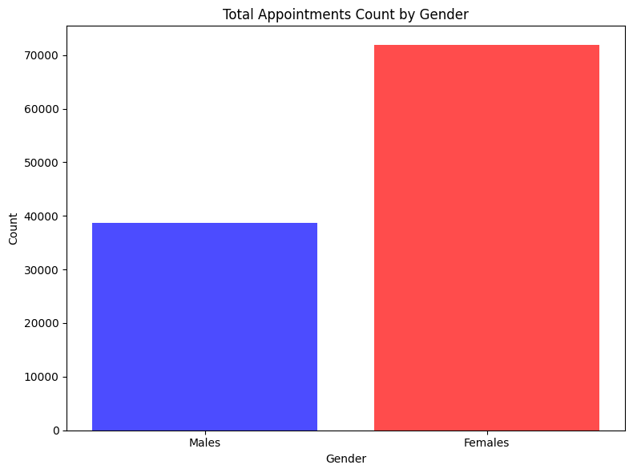
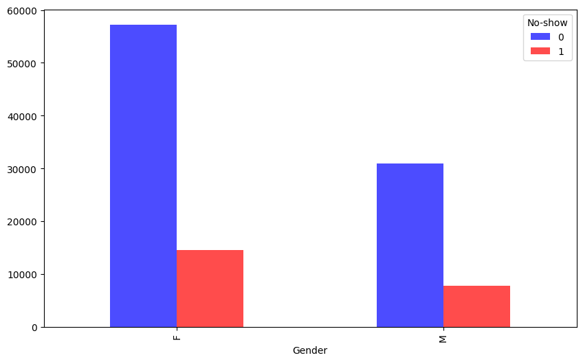
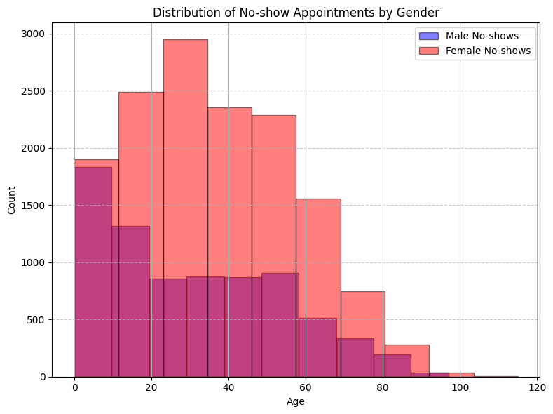
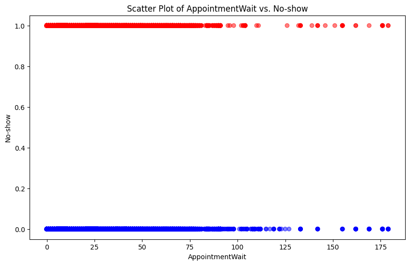

# Project: Investigate a Dataset - [No-show appointments]

## Table of Contents
<ul>
<li><a href="#intro">Introduction</a></li>
<li><a href="#wrangling">Data Wrangling</a></li>
<li><a href="#eda">Exploratory Data Analysis</a></li>
<li><a href="#conclusions">Conclusions</a></li>
</ul>

<a id='intro'></a>
## Introduction

### Dataset Description 


This dataset collects information from over 100k medical appointments in Brazil and is focused on the question of whether or not patients show up for their appointment. A number of characteristics about the patient are included in each row. Columns description:
- `PatientId` information about the patient’s identity.
- `AppointmentID` unique identifier for each appointment has been made.
- `Gender` gives us information about who the person is Male or Female.
- `Age` what age that person is (-1 means it is pregnant, 0 means is baby under 1 year old)
- `ScheduledDay` tells us on what day the patient set up their appointment.
- `AppointmentDay` tells us on what day the patient should come for their appointment.
- `Neighborhood` indicates the location of the hospital.
- `Scholarship` indicates whether or not the patient is enrolled in Brasilian welfare program Bolsa Família.
- `Hipertension` is a condition (0-No/1-Yes).
- `Diabetes` is a condition (0-No/1-Yes).
- `Alcoholism` is a condition (0-No/1-Yes).
- `Handcap` stands for the amount of different health conditions(0 - No, 1 - 1 condition, 2 - 2 conditions, 3 - 3 conditions, 4 - 4 conditions).
- `SMS_received` stands for sms received by patient(0-No/1-Yes)
- `No-show` tells us about patient turn up for the appointment or not(No-show(Yes) - missed appointment, No-show(No) - came for the appointment)


### Question(s) for Analysis


Over the course of this report, I will explore several key questions to understand the factors influencing patient no-show rates. The aim is to identify patterns and underlying causes that contribute to missed appointments, which can inform strategies to improve appointment adherence. The questions I plan to address are:

What is the relationship between gender, age, and no-show rates?
- Dependent Variable: No-show status
- Independent Variables: Gender, Age

How do neighborhood factors impact no-show rates?
- Dependent Variable: No-show status
- Independent Variable: Neighborhood

Do specific days of the week influence no-show rates in certain neighborhoods?
- Dependent Variable: No-show status
- Independent Variables: Neighborhood, Day of the week

Is there a correlation between appointment wait times and no-show rates, and how effective are SMS reminders in this context?
- Dependent Variable: No-show status
- Independent Variables: Appointment wait time, SMS reminders

These questions will be thoroughly analyzed in the Data Analysis section, and insights will be synthesized in the Conclusion section. By investigating these variables, we aim to uncover actionable insights to enhance patient appointment adherence and reduce no-show rates.


<a id='wrangling'></a>
## Data Wrangling


```python
# Load the Data and Import Packages for Analysis
import pandas as pd
import matplotlib.pyplot as plt
df=pd.read_csv('KaggleV2-May-2016.csv')
df.head()
```


<div>
<style scoped>
    .dataframe tbody tr th:only-of-type {
        vertical-align: middle;
    }

    .dataframe tbody tr th {
        vertical-align: top;
    }

    .dataframe thead th {
        text-align: right;
    }
</style>
<table border="1" class="dataframe">
  <thead>
    <tr style="text-align: right;">
      <th></th>
      <th>PatientId</th>
      <th>AppointmentID</th>
      <th>Gender</th>
      <th>ScheduledDay</th>
      <th>AppointmentDay</th>
      <th>Age</th>
      <th>Neighbourhood</th>
      <th>Scholarship</th>
      <th>Hipertension</th>
      <th>Diabetes</th>
      <th>Alcoholism</th>
      <th>Handcap</th>
      <th>SMS_received</th>
      <th>No-show</th>
    </tr>
  </thead>
  <tbody>
    <tr>
      <th>0</th>
      <td>2.987250e+13</td>
      <td>5642903</td>
      <td>F</td>
      <td>2016-04-29T18:38:08Z</td>
      <td>2016-04-29T00:00:00Z</td>
      <td>62</td>
      <td>JARDIM DA PENHA</td>
      <td>0</td>
      <td>1</td>
      <td>0</td>
      <td>0</td>
      <td>0</td>
      <td>0</td>
      <td>No</td>
    </tr>
    <tr>
      <th>1</th>
      <td>5.589978e+14</td>
      <td>5642503</td>
      <td>M</td>
      <td>2016-04-29T16:08:27Z</td>
      <td>2016-04-29T00:00:00Z</td>
      <td>56</td>
      <td>JARDIM DA PENHA</td>
      <td>0</td>
      <td>0</td>
      <td>0</td>
      <td>0</td>
      <td>0</td>
      <td>0</td>
      <td>No</td>
    </tr>
    <tr>
      <th>2</th>
      <td>4.262962e+12</td>
      <td>5642549</td>
      <td>F</td>
      <td>2016-04-29T16:19:04Z</td>
      <td>2016-04-29T00:00:00Z</td>
      <td>62</td>
      <td>MATA DA PRAIA</td>
      <td>0</td>
      <td>0</td>
      <td>0</td>
      <td>0</td>
      <td>0</td>
      <td>0</td>
      <td>No</td>
    </tr>
    <tr>
      <th>3</th>
      <td>8.679512e+11</td>
      <td>5642828</td>
      <td>F</td>
      <td>2016-04-29T17:29:31Z</td>
      <td>2016-04-29T00:00:00Z</td>
      <td>8</td>
      <td>PONTAL DE CAMBURI</td>
      <td>0</td>
      <td>0</td>
      <td>0</td>
      <td>0</td>
      <td>0</td>
      <td>0</td>
      <td>No</td>
    </tr>
    <tr>
      <th>4</th>
      <td>8.841186e+12</td>
      <td>5642494</td>
      <td>F</td>
      <td>2016-04-29T16:07:23Z</td>
      <td>2016-04-29T00:00:00Z</td>
      <td>56</td>
      <td>JARDIM DA PENHA</td>
      <td>0</td>
      <td>1</td>
      <td>1</td>
      <td>0</td>
      <td>0</td>
      <td>0</td>
      <td>No</td>
    </tr>
  </tbody>
</table>
</div>


### General Properties


```python
# Get information about Data type, column names and any missing values
df.info()
```

    <class 'pandas.core.frame.DataFrame'>
    RangeIndex: 110527 entries, 0 to 110526
    Data columns (total 14 columns):
     #   Column          Non-Null Count   Dtype  
    ---  ------          --------------   -----  
     0   PatientId       110527 non-null  float64
     1   AppointmentID   110527 non-null  int64  
     2   Gender          110527 non-null  object 
     3   ScheduledDay    110527 non-null  object 
     4   AppointmentDay  110527 non-null  object 
     5   Age             110527 non-null  int64  
     6   Neighbourhood   110527 non-null  object 
     7   Scholarship     110527 non-null  int64  
     8   Hipertension    110527 non-null  int64  
     9   Diabetes        110527 non-null  int64  
     10  Alcoholism      110527 non-null  int64  
     11  Handcap         110527 non-null  int64  
     12  SMS_received    110527 non-null  int64  
     13  No-show         110527 non-null  object 
    dtypes: float64(1), int64(8), object(5)
    memory usage: 11.8+ MB


```python
# Get to know if the same person made more then one appointment
df['PatientId'].nunique()
```


    62299


```python
# Check how many missed appointments in dataset.
df_missed = df[df['No-show'] == 'Yes']
df_missed.count()
```


    PatientId         22319
    AppointmentID     22319
    Gender            22319
    ScheduledDay      22319
    AppointmentDay    22319
    Age               22319
    Neighbourhood     22319
    Scholarship       22319
    Hipertension      22319
    Diabetes          22319
    Alcoholism        22319
    Handcap           22319
    SMS_received      22319
    No-show           22319
    dtype: int64


### Data Cleaning

Let's convert 'PatientId' into string data type to improve data readability.


```python
# Change the 'PatientId'  to a string format. That will make it easy to find the right PatientId.
df['PatientId'] = df['PatientId'].astype(str)
```

Let's convert 'No-show' into int for future analysis


```python
# Ensure the No-show column is of type int for the future analysis
df['No-show'] = df['No-show'].map({'No': 0, 'Yes': 1})
```

To simplify dates manipulation we have to:
1. Convert 'AppointmentDay' and 'ScheduledDay' to the datetime 
2. Create 'AppointmentDate' and 'ScheduledDate' which contain date part only


```python
# Convert to datetime.
df['AppointmentDay'] = pd.to_datetime(df['AppointmentDay']) # Change data type to datetime
df['AppointmentDate'] = df['AppointmentDay'].dt.date # Change to date without timezone to find the 'AppointmentWait'
df['ScheduledDay'] = pd.to_datetime(df['ScheduledDay'])
df['ScheduledDate'] = df['ScheduledDay'].dt.date
```

Create 'AppointmentWait' column to get the number of days waiting for their appointment 


```python
# Calculate the difference in days.
df['AppointmentWait'] = (df['AppointmentDate'] - df['ScheduledDate']).dt.days
```


```python
# Get the value counts of the wait times.
appointment_wait = df['AppointmentWait'].value_counts()
```


```python
appointment_wait
```


    0      38563
    2       6725
    4       5290
    1       5213
    7       4906
           ...  
    82         1
    127        1
    126        1
    151        1
    123        1
    Name: AppointmentWait, Length: 131, dtype: int64


Check if there are any negative values in 'AppointmentWait' which can be considered as invalid data


```python
# Check for negative numbers in 'AppointmentWait'.
negative_appointment_wait = df[df['AppointmentWait'] < 0]
negative_appointment_wait
```


<div>
<style scoped>
    .dataframe tbody tr th:only-of-type {
        vertical-align: middle;
    }

    .dataframe tbody tr th {
        vertical-align: top;
    }

    .dataframe thead th {
        text-align: right;
    }
</style>
<table border="1" class="dataframe">
  <thead>
    <tr style="text-align: right;">
      <th></th>
      <th>PatientId</th>
      <th>AppointmentID</th>
      <th>Gender</th>
      <th>ScheduledDay</th>
      <th>AppointmentDay</th>
      <th>Age</th>
      <th>Neighbourhood</th>
      <th>Scholarship</th>
      <th>Hipertension</th>
      <th>Diabetes</th>
      <th>Alcoholism</th>
      <th>Handcap</th>
      <th>SMS_received</th>
      <th>No-show</th>
      <th>AppointmentDate</th>
      <th>ScheduledDate</th>
      <th>AppointmentWait</th>
    </tr>
  </thead>
  <tbody>
    <tr>
      <th>27033</th>
      <td>7839272661752.0</td>
      <td>5679978</td>
      <td>M</td>
      <td>2016-05-10 10:51:53+00:00</td>
      <td>2016-05-09 00:00:00+00:00</td>
      <td>38</td>
      <td>RESISTÊNCIA</td>
      <td>0</td>
      <td>0</td>
      <td>0</td>
      <td>0</td>
      <td>1</td>
      <td>0</td>
      <td>1</td>
      <td>2016-05-09</td>
      <td>2016-05-10</td>
      <td>-1</td>
    </tr>
    <tr>
      <th>55226</th>
      <td>7896293967868.0</td>
      <td>5715660</td>
      <td>F</td>
      <td>2016-05-18 14:50:41+00:00</td>
      <td>2016-05-17 00:00:00+00:00</td>
      <td>19</td>
      <td>SANTO ANTÔNIO</td>
      <td>0</td>
      <td>0</td>
      <td>0</td>
      <td>0</td>
      <td>1</td>
      <td>0</td>
      <td>1</td>
      <td>2016-05-17</td>
      <td>2016-05-18</td>
      <td>-1</td>
    </tr>
    <tr>
      <th>64175</th>
      <td>24252258389979.0</td>
      <td>5664962</td>
      <td>F</td>
      <td>2016-05-05 13:43:58+00:00</td>
      <td>2016-05-04 00:00:00+00:00</td>
      <td>22</td>
      <td>CONSOLAÇÃO</td>
      <td>0</td>
      <td>0</td>
      <td>0</td>
      <td>0</td>
      <td>0</td>
      <td>0</td>
      <td>1</td>
      <td>2016-05-04</td>
      <td>2016-05-05</td>
      <td>-1</td>
    </tr>
    <tr>
      <th>71533</th>
      <td>998231581612122.0</td>
      <td>5686628</td>
      <td>F</td>
      <td>2016-05-11 13:49:20+00:00</td>
      <td>2016-05-05 00:00:00+00:00</td>
      <td>81</td>
      <td>SANTO ANTÔNIO</td>
      <td>0</td>
      <td>0</td>
      <td>0</td>
      <td>0</td>
      <td>0</td>
      <td>0</td>
      <td>1</td>
      <td>2016-05-05</td>
      <td>2016-05-11</td>
      <td>-6</td>
    </tr>
    <tr>
      <th>72362</th>
      <td>3787481966821.0</td>
      <td>5655637</td>
      <td>M</td>
      <td>2016-05-04 06:50:57+00:00</td>
      <td>2016-05-03 00:00:00+00:00</td>
      <td>7</td>
      <td>TABUAZEIRO</td>
      <td>0</td>
      <td>0</td>
      <td>0</td>
      <td>0</td>
      <td>0</td>
      <td>0</td>
      <td>1</td>
      <td>2016-05-03</td>
      <td>2016-05-04</td>
      <td>-1</td>
    </tr>
  </tbody>
</table>
</div>


```python
# Filter out negative values from 'AppointmentWait'.
df = df[df['AppointmentWait'] >= 0]
```


```python
# Get the value counts of the wait times.
appointment_wait_filltered = df['AppointmentWait'].value_counts()
```


```python
appointment_wait_filltered
```


    0      38563
    2       6725
    4       5290
    1       5213
    7       4906
           ...  
    132        1
    125        1
    117        1
    146        1
    123        1
    Name: AppointmentWait, Length: 129, dtype: int64


Outcome: 5 rows with negative values have been filltered out

<a id='eda'></a>
## Exploratory Data Analysis

### Research Question 1: How does gender affect no-show appointments?

Appointment distribution by gender


```python
# Separate data by gender
df_male=df[df['Gender']=='M']
df_female=df[df['Gender']=='F']
```


```python
# Calculate total
total_males = len(df_male)
total_females = len(df_female)
```


```python
counts = [total_males, total_females]
labels = ['Males', 'Females']
```


```python
# Plot the distribution
fig, ax = plt.subplots(figsize=(8, 6))
ax.bar(labels, counts, color=['blue', 'red'], alpha=0.7)
ax.set_xlabel('Gender')
ax.set_ylabel('Count')
ax.set_title('Total Appointments Count by Gender')
plt.tight_layout()
plt.show()
```


    

    


Check no-show distribution by gender


```python
# Group by Gender and No-show and count occurrences
grouped = df.groupby(['Gender', 'No-show']).size().unstack(fill_value=0)

# Plot the grouped bar chart
grouped.plot(kind='bar', stacked=False, figsize=(10, 6), color=['blue', 'red'], alpha=0.7)
```


    <AxesSubplot: xlabel='Gender'>


    

    


Check no-show distribution by age and gender


```python
# Filter the DataFrame for No-show = 1
df_no_show = df[df['No-show'] == 1]

# Filter by Gender
df_female_no_show = df_no_show[df_no_show['Gender'] == 'F']
df_male_no_show = df_no_show[df_no_show['Gender'] == 'M']
```


```python
# Plot histograms
plt.figure(figsize=(8, 6))
ax = df_male_no_show['Age'].hist(alpha=0.5, label='Male No-shows', color='blue', edgecolor='black')
df_female_no_show['Age'].hist(alpha=0.5, label='Female No-shows', color='red', edgecolor='black', ax=ax)
ax.set_title('Distribution of No-show Appointments by Gender')
ax.set_xlabel('Age')
ax.set_ylabel('Count')
ax.legend(loc='upper right')
plt.grid(axis='y', linestyle='--',alpha=0.7)
plt.tight_layout()

# Display the plot
plt.show()
```


    

    


Outcome: The histogram reveals that females have consistently higher no-show rates than males across most age groups, with the most significant peaks occurring in the 20-40 age range.

### Research Question 2: Appointments distribution by month

Explore the data by extracting the month from date


```python
# Extract the month.
df['AppointmentMonth'] = df['AppointmentDay'].dt.month_name()
```


```python
# Display the result.
df.head(5)
```


<div>
<style scoped>
    .dataframe tbody tr th:only-of-type {
        vertical-align: middle;
    }

    .dataframe tbody tr th {
        vertical-align: top;
    }

    .dataframe thead th {
        text-align: right;
    }
</style>
<table border="1" class="dataframe">
  <thead>
    <tr style="text-align: right;">
      <th></th>
      <th>PatientId</th>
      <th>AppointmentID</th>
      <th>Gender</th>
      <th>ScheduledDay</th>
      <th>AppointmentDay</th>
      <th>Age</th>
      <th>Neighbourhood</th>
      <th>Scholarship</th>
      <th>Hipertension</th>
      <th>Diabetes</th>
      <th>Alcoholism</th>
      <th>Handcap</th>
      <th>SMS_received</th>
      <th>No-show</th>
      <th>AppointmentDate</th>
      <th>ScheduledDate</th>
      <th>AppointmentWait</th>
      <th>AppointmentMonth</th>
    </tr>
  </thead>
  <tbody>
    <tr>
      <th>0</th>
      <td>29872499824296.0</td>
      <td>5642903</td>
      <td>F</td>
      <td>2016-04-29 18:38:08+00:00</td>
      <td>2016-04-29 00:00:00+00:00</td>
      <td>62</td>
      <td>JARDIM DA PENHA</td>
      <td>0</td>
      <td>1</td>
      <td>0</td>
      <td>0</td>
      <td>0</td>
      <td>0</td>
      <td>0</td>
      <td>2016-04-29</td>
      <td>2016-04-29</td>
      <td>0</td>
      <td>April</td>
    </tr>
    <tr>
      <th>1</th>
      <td>558997776694438.0</td>
      <td>5642503</td>
      <td>M</td>
      <td>2016-04-29 16:08:27+00:00</td>
      <td>2016-04-29 00:00:00+00:00</td>
      <td>56</td>
      <td>JARDIM DA PENHA</td>
      <td>0</td>
      <td>0</td>
      <td>0</td>
      <td>0</td>
      <td>0</td>
      <td>0</td>
      <td>0</td>
      <td>2016-04-29</td>
      <td>2016-04-29</td>
      <td>0</td>
      <td>April</td>
    </tr>
    <tr>
      <th>2</th>
      <td>4262962299951.0</td>
      <td>5642549</td>
      <td>F</td>
      <td>2016-04-29 16:19:04+00:00</td>
      <td>2016-04-29 00:00:00+00:00</td>
      <td>62</td>
      <td>MATA DA PRAIA</td>
      <td>0</td>
      <td>0</td>
      <td>0</td>
      <td>0</td>
      <td>0</td>
      <td>0</td>
      <td>0</td>
      <td>2016-04-29</td>
      <td>2016-04-29</td>
      <td>0</td>
      <td>April</td>
    </tr>
    <tr>
      <th>3</th>
      <td>867951213174.0</td>
      <td>5642828</td>
      <td>F</td>
      <td>2016-04-29 17:29:31+00:00</td>
      <td>2016-04-29 00:00:00+00:00</td>
      <td>8</td>
      <td>PONTAL DE CAMBURI</td>
      <td>0</td>
      <td>0</td>
      <td>0</td>
      <td>0</td>
      <td>0</td>
      <td>0</td>
      <td>0</td>
      <td>2016-04-29</td>
      <td>2016-04-29</td>
      <td>0</td>
      <td>April</td>
    </tr>
    <tr>
      <th>4</th>
      <td>8841186448183.0</td>
      <td>5642494</td>
      <td>F</td>
      <td>2016-04-29 16:07:23+00:00</td>
      <td>2016-04-29 00:00:00+00:00</td>
      <td>56</td>
      <td>JARDIM DA PENHA</td>
      <td>0</td>
      <td>1</td>
      <td>1</td>
      <td>0</td>
      <td>0</td>
      <td>0</td>
      <td>0</td>
      <td>2016-04-29</td>
      <td>2016-04-29</td>
      <td>0</td>
      <td>April</td>
    </tr>
  </tbody>
</table>
</div>


```python
# Group by 'AppointmentMonth' where 'No-show' is 'Yes'.
no_show_month = df[(df['No-show'] == 1)].groupby('AppointmentMonth').size()
```


```python
# Group by 'AppointmentMonth' where 'No-show' is 'No'.
show_month = df[(df['No-show'] == 0)].groupby('AppointmentMonth').size()
```


```python
# Find the percent of total by month.
compare_show_month = pd.DataFrame({'No_show_month': no_show_month, 'Show_month': show_month}).fillna(0)
compare_show_month['Total'] = compare_show_month['No_show_month'] + compare_show_month['Show_month']
compare_show_month['No-show Percentage'] = (compare_show_month['No_show_month'] / compare_show_month['Total']) * 100
compare_show_month_sorted = compare_show_month.sort_values(by='No-show Percentage', ascending=False)
compare_show_month_sorted
```


<div>
<style scoped>
    .dataframe tbody tr th:only-of-type {
        vertical-align: middle;
    }

    .dataframe tbody tr th {
        vertical-align: top;
    }

    .dataframe thead th {
        text-align: right;
    }
</style>
<table border="1" class="dataframe">
  <thead>
    <tr style="text-align: right;">
      <th></th>
      <th>No_show_month</th>
      <th>Show_month</th>
      <th>Total</th>
      <th>No-show Percentage</th>
    </tr>
    <tr>
      <th>AppointmentMonth</th>
      <th></th>
      <th></th>
      <th></th>
      <th></th>
    </tr>
  </thead>
  <tbody>
    <tr>
      <th>May</th>
      <td>16799</td>
      <td>64037</td>
      <td>80836</td>
      <td>20.781582</td>
    </tr>
    <tr>
      <th>April</th>
      <td>633</td>
      <td>2602</td>
      <td>3235</td>
      <td>19.567233</td>
    </tr>
    <tr>
      <th>June</th>
      <td>4882</td>
      <td>21569</td>
      <td>26451</td>
      <td>18.456769</td>
    </tr>
  </tbody>
</table>
</div>


Outcome: The table shows a slight negative correlation between the month of appointment and the percentage of no-shows, with May having the highest no-show percentage at approximately 20.78%, followed by April at 19.57%, and June at 18.46%, indicating that as the months progress from April to June, the no-show percentage decreases.

Check if no-show has been affected by neighbourhood for each month:
- May
- April
- June

Defining count_by_month function which accepts month and returns no-show percentage


```python
def count_by_month(month):
    # Check if missed appointments in month has been affected by 'Neighbourhood'. 
    no_show_counts = df[(df['No-show'] == 1) & (df['AppointmentMonth'] == month)].groupby('Neighbourhood').size()
    show_counts = df[(df['No-show'] == 0) & (df['AppointmentMonth'] == month)].groupby('Neighbourhood').size()
    
    # Check percent of total for No-show appointments in month
    counts_df = pd.DataFrame({'No_show_counts': no_show_counts, 'Show_counts': show_counts}).fillna(0)
    counts_df['Total'] = counts_df['No_show_counts'] + counts_df['Show_counts']
    counts_df['No-show Percentage'] = (counts_df['No_show_counts'] / counts_df['Total']) * 100

    # Round the 'No-show Percentage' to the nearest whole number
    counts_df['No-show Percentage'] = counts_df['No-show Percentage'].round()
    
    # Sort the values in descending order by percentege
    counts_df_sorted = counts_df.sort_values(by='No-show Percentage', ascending=False)
    return counts_df_sorted
```

Let's get calculations of no-show for May


```python
count_may = count_by_month('May')
count_may.head()
```


<div>
<style scoped>
    .dataframe tbody tr th:only-of-type {
        vertical-align: middle;
    }

    .dataframe tbody tr th {
        vertical-align: top;
    }

    .dataframe thead th {
        text-align: right;
    }
</style>
<table border="1" class="dataframe">
  <thead>
    <tr style="text-align: right;">
      <th></th>
      <th>No_show_counts</th>
      <th>Show_counts</th>
      <th>Total</th>
      <th>No-show Percentage</th>
    </tr>
    <tr>
      <th>Neighbourhood</th>
      <th></th>
      <th></th>
      <th></th>
      <th></th>
    </tr>
  </thead>
  <tbody>
    <tr>
      <th>ILHAS OCEÂNICAS DE TRINDADE</th>
      <td>2.0</td>
      <td>0.0</td>
      <td>2.0</td>
      <td>100.0</td>
    </tr>
    <tr>
      <th>SANTOS DUMONT</th>
      <td>274.0</td>
      <td>668.0</td>
      <td>942.0</td>
      <td>29.0</td>
    </tr>
    <tr>
      <th>ITARARÉ</th>
      <td>762.0</td>
      <td>1934.0</td>
      <td>2696.0</td>
      <td>28.0</td>
    </tr>
    <tr>
      <th>HORTO</th>
      <td>38.0</td>
      <td>97.0</td>
      <td>135.0</td>
      <td>28.0</td>
    </tr>
    <tr>
      <th>SANTA CECÍLIA</th>
      <td>96.0</td>
      <td>247.0</td>
      <td>343.0</td>
      <td>28.0</td>
    </tr>
  </tbody>
</table>
</div>


```python
count_may.tail()
```


<div>
<style scoped>
    .dataframe tbody tr th:only-of-type {
        vertical-align: middle;
    }

    .dataframe tbody tr th {
        vertical-align: top;
    }

    .dataframe thead th {
        text-align: right;
    }
</style>
<table border="1" class="dataframe">
  <thead>
    <tr style="text-align: right;">
      <th></th>
      <th>No_show_counts</th>
      <th>Show_counts</th>
      <th>Total</th>
      <th>No-show Percentage</th>
    </tr>
    <tr>
      <th>Neighbourhood</th>
      <th></th>
      <th></th>
      <th></th>
      <th></th>
    </tr>
  </thead>
  <tbody>
    <tr>
      <th>MÁRIO CYPRESTE</th>
      <td>33.0</td>
      <td>186.0</td>
      <td>219.0</td>
      <td>15.0</td>
    </tr>
    <tr>
      <th>PONTAL DE CAMBURI</th>
      <td>7.0</td>
      <td>46.0</td>
      <td>53.0</td>
      <td>13.0</td>
    </tr>
    <tr>
      <th>ILHA DO BOI</th>
      <td>2.0</td>
      <td>25.0</td>
      <td>27.0</td>
      <td>7.0</td>
    </tr>
    <tr>
      <th>ILHA DO FRADE</th>
      <td>0.0</td>
      <td>7.0</td>
      <td>7.0</td>
      <td>0.0</td>
    </tr>
    <tr>
      <th>PARQUE INDUSTRIAL</th>
      <td>0.0</td>
      <td>1.0</td>
      <td>1.0</td>
      <td>0.0</td>
    </tr>
  </tbody>
</table>
</div>


We need to remove rows with percentage below 10% and equal to 100%. These rows are outliers and can affect the outcome


```python
exclude_outliers = count_may[(count_may['No-show Percentage'] >=10) & (count_may['No-show Percentage'] < 100)]
exclude_outliers.head()
```


<div>
<style scoped>
    .dataframe tbody tr th:only-of-type {
        vertical-align: middle;
    }

    .dataframe tbody tr th {
        vertical-align: top;
    }

    .dataframe thead th {
        text-align: right;
    }
</style>
<table border="1" class="dataframe">
  <thead>
    <tr style="text-align: right;">
      <th></th>
      <th>No_show_counts</th>
      <th>Show_counts</th>
      <th>Total</th>
      <th>No-show Percentage</th>
    </tr>
    <tr>
      <th>Neighbourhood</th>
      <th></th>
      <th></th>
      <th></th>
      <th></th>
    </tr>
  </thead>
  <tbody>
    <tr>
      <th>SANTOS DUMONT</th>
      <td>274.0</td>
      <td>668.0</td>
      <td>942.0</td>
      <td>29.0</td>
    </tr>
    <tr>
      <th>ITARARÉ</th>
      <td>762.0</td>
      <td>1934.0</td>
      <td>2696.0</td>
      <td>28.0</td>
    </tr>
    <tr>
      <th>HORTO</th>
      <td>38.0</td>
      <td>97.0</td>
      <td>135.0</td>
      <td>28.0</td>
    </tr>
    <tr>
      <th>SANTA CECÍLIA</th>
      <td>96.0</td>
      <td>247.0</td>
      <td>343.0</td>
      <td>28.0</td>
    </tr>
    <tr>
      <th>SANTA CLARA</th>
      <td>105.0</td>
      <td>288.0</td>
      <td>393.0</td>
      <td>27.0</td>
    </tr>
  </tbody>
</table>
</div>


Certain neighborhoods such as Santos Dumont and Itararé exhibit notably high no-show percentages of 29% and 28% respectively.

We do the same analysis for April


```python
count_april = count_by_month('April')
count_april.head()
```


<div>
<style scoped>
    .dataframe tbody tr th:only-of-type {
        vertical-align: middle;
    }

    .dataframe tbody tr th {
        vertical-align: top;
    }

    .dataframe thead th {
        text-align: right;
    }
</style>
<table border="1" class="dataframe">
  <thead>
    <tr style="text-align: right;">
      <th></th>
      <th>No_show_counts</th>
      <th>Show_counts</th>
      <th>Total</th>
      <th>No-show Percentage</th>
    </tr>
    <tr>
      <th>Neighbourhood</th>
      <th></th>
      <th></th>
      <th></th>
      <th></th>
    </tr>
  </thead>
  <tbody>
    <tr>
      <th>ANTÔNIO HONÓRIO</th>
      <td>4.0</td>
      <td>0.0</td>
      <td>4.0</td>
      <td>100.0</td>
    </tr>
    <tr>
      <th>MORADA DE CAMBURI</th>
      <td>2.0</td>
      <td>1.0</td>
      <td>3.0</td>
      <td>67.0</td>
    </tr>
    <tr>
      <th>SANTA LUÍZA</th>
      <td>2.0</td>
      <td>3.0</td>
      <td>5.0</td>
      <td>40.0</td>
    </tr>
    <tr>
      <th>JUCUTUQUARA</th>
      <td>9.0</td>
      <td>15.0</td>
      <td>24.0</td>
      <td>38.0</td>
    </tr>
    <tr>
      <th>GURIGICA</th>
      <td>31.0</td>
      <td>54.0</td>
      <td>85.0</td>
      <td>36.0</td>
    </tr>
  </tbody>
</table>
</div>


```python
exclude_outliers = count_april[(count_april['No-show Percentage'] >=10) & (count_april['No-show Percentage'] < 100)]
exclude_outliers.head()
```


<div>
<style scoped>
    .dataframe tbody tr th:only-of-type {
        vertical-align: middle;
    }

    .dataframe tbody tr th {
        vertical-align: top;
    }

    .dataframe thead th {
        text-align: right;
    }
</style>
<table border="1" class="dataframe">
  <thead>
    <tr style="text-align: right;">
      <th></th>
      <th>No_show_counts</th>
      <th>Show_counts</th>
      <th>Total</th>
      <th>No-show Percentage</th>
    </tr>
    <tr>
      <th>Neighbourhood</th>
      <th></th>
      <th></th>
      <th></th>
      <th></th>
    </tr>
  </thead>
  <tbody>
    <tr>
      <th>MORADA DE CAMBURI</th>
      <td>2.0</td>
      <td>1.0</td>
      <td>3.0</td>
      <td>67.0</td>
    </tr>
    <tr>
      <th>SANTA LUÍZA</th>
      <td>2.0</td>
      <td>3.0</td>
      <td>5.0</td>
      <td>40.0</td>
    </tr>
    <tr>
      <th>JUCUTUQUARA</th>
      <td>9.0</td>
      <td>15.0</td>
      <td>24.0</td>
      <td>38.0</td>
    </tr>
    <tr>
      <th>GURIGICA</th>
      <td>31.0</td>
      <td>54.0</td>
      <td>85.0</td>
      <td>36.0</td>
    </tr>
    <tr>
      <th>SÃO PEDRO</th>
      <td>16.0</td>
      <td>31.0</td>
      <td>47.0</td>
      <td>34.0</td>
    </tr>
  </tbody>
</table>
</div>


Morada de Camburi (67%) and Santa Luíza (40%) have exceptionally high no-show percentages.
Other neighborhoods such as Jucutuquara (38%) and Gurigica (36%) also have high no-show rates

We do the same analysis for June


```python
count_june = count_by_month('June')
count_june.head()
```


<div>
<style scoped>
    .dataframe tbody tr th:only-of-type {
        vertical-align: middle;
    }

    .dataframe tbody tr th {
        vertical-align: top;
    }

    .dataframe thead th {
        text-align: right;
    }
</style>
<table border="1" class="dataframe">
  <thead>
    <tr style="text-align: right;">
      <th></th>
      <th>No_show_counts</th>
      <th>Show_counts</th>
      <th>Total</th>
      <th>No-show Percentage</th>
    </tr>
    <tr>
      <th>Neighbourhood</th>
      <th></th>
      <th></th>
      <th></th>
      <th></th>
    </tr>
  </thead>
  <tbody>
    <tr>
      <th>ILHA DO FRADE</th>
      <td>2.0</td>
      <td>0.0</td>
      <td>2.0</td>
      <td>100.0</td>
    </tr>
    <tr>
      <th>ARIOVALDO FAVALESSA</th>
      <td>25.0</td>
      <td>47.0</td>
      <td>72.0</td>
      <td>35.0</td>
    </tr>
    <tr>
      <th>PONTAL DE CAMBURI</th>
      <td>5.0</td>
      <td>10.0</td>
      <td>15.0</td>
      <td>33.0</td>
    </tr>
    <tr>
      <th>SANTA CLARA</th>
      <td>28.0</td>
      <td>69.0</td>
      <td>97.0</td>
      <td>29.0</td>
    </tr>
    <tr>
      <th>SANTOS DUMONT</th>
      <td>81.0</td>
      <td>206.0</td>
      <td>287.0</td>
      <td>28.0</td>
    </tr>
  </tbody>
</table>
</div>


```python
exclude_outliers = count_june[(count_june['No-show Percentage'] >=10) & (count_june['No-show Percentage'] < 100)]
exclude_outliers.head()
```


<div>
<style scoped>
    .dataframe tbody tr th:only-of-type {
        vertical-align: middle;
    }

    .dataframe tbody tr th {
        vertical-align: top;
    }

    .dataframe thead th {
        text-align: right;
    }
</style>
<table border="1" class="dataframe">
  <thead>
    <tr style="text-align: right;">
      <th></th>
      <th>No_show_counts</th>
      <th>Show_counts</th>
      <th>Total</th>
      <th>No-show Percentage</th>
    </tr>
    <tr>
      <th>Neighbourhood</th>
      <th></th>
      <th></th>
      <th></th>
      <th></th>
    </tr>
  </thead>
  <tbody>
    <tr>
      <th>ARIOVALDO FAVALESSA</th>
      <td>25.0</td>
      <td>47.0</td>
      <td>72.0</td>
      <td>35.0</td>
    </tr>
    <tr>
      <th>PONTAL DE CAMBURI</th>
      <td>5.0</td>
      <td>10.0</td>
      <td>15.0</td>
      <td>33.0</td>
    </tr>
    <tr>
      <th>SANTA CLARA</th>
      <td>28.0</td>
      <td>69.0</td>
      <td>97.0</td>
      <td>29.0</td>
    </tr>
    <tr>
      <th>SANTOS DUMONT</th>
      <td>81.0</td>
      <td>206.0</td>
      <td>287.0</td>
      <td>28.0</td>
    </tr>
    <tr>
      <th>ANDORINHAS</th>
      <td>122.0</td>
      <td>336.0</td>
      <td>458.0</td>
      <td>27.0</td>
    </tr>
  </tbody>
</table>
</div>


Ariovaldo Favalessa (35%) and Pontal de Camburi (33%) show high no-show percentages.
Neighborhoods like Santos Dumont (28%) and Andorinhas (27%) continue to show high no-show rates, implying a consistent trend in certain areas.

### Research Question 3: Appointments distribution by the day of the week


```python
# Make column for the day of the week
df['App_dayofweek'] = df['AppointmentDay'].dt.day_name()
```


```python
df.head()
```


<div>
<style scoped>
    .dataframe tbody tr th:only-of-type {
        vertical-align: middle;
    }

    .dataframe tbody tr th {
        vertical-align: top;
    }

    .dataframe thead th {
        text-align: right;
    }
</style>
<table border="1" class="dataframe">
  <thead>
    <tr style="text-align: right;">
      <th></th>
      <th>PatientId</th>
      <th>AppointmentID</th>
      <th>Gender</th>
      <th>ScheduledDay</th>
      <th>AppointmentDay</th>
      <th>Age</th>
      <th>Neighbourhood</th>
      <th>Scholarship</th>
      <th>Hipertension</th>
      <th>Diabetes</th>
      <th>Alcoholism</th>
      <th>Handcap</th>
      <th>SMS_received</th>
      <th>No-show</th>
      <th>AppointmentDate</th>
      <th>ScheduledDate</th>
      <th>AppointmentWait</th>
      <th>AppointmentMonth</th>
      <th>App_dayofweek</th>
    </tr>
  </thead>
  <tbody>
    <tr>
      <th>0</th>
      <td>29872499824296.0</td>
      <td>5642903</td>
      <td>F</td>
      <td>2016-04-29 18:38:08+00:00</td>
      <td>2016-04-29 00:00:00+00:00</td>
      <td>62</td>
      <td>JARDIM DA PENHA</td>
      <td>0</td>
      <td>1</td>
      <td>0</td>
      <td>0</td>
      <td>0</td>
      <td>0</td>
      <td>0</td>
      <td>2016-04-29</td>
      <td>2016-04-29</td>
      <td>0</td>
      <td>April</td>
      <td>Friday</td>
    </tr>
    <tr>
      <th>1</th>
      <td>558997776694438.0</td>
      <td>5642503</td>
      <td>M</td>
      <td>2016-04-29 16:08:27+00:00</td>
      <td>2016-04-29 00:00:00+00:00</td>
      <td>56</td>
      <td>JARDIM DA PENHA</td>
      <td>0</td>
      <td>0</td>
      <td>0</td>
      <td>0</td>
      <td>0</td>
      <td>0</td>
      <td>0</td>
      <td>2016-04-29</td>
      <td>2016-04-29</td>
      <td>0</td>
      <td>April</td>
      <td>Friday</td>
    </tr>
    <tr>
      <th>2</th>
      <td>4262962299951.0</td>
      <td>5642549</td>
      <td>F</td>
      <td>2016-04-29 16:19:04+00:00</td>
      <td>2016-04-29 00:00:00+00:00</td>
      <td>62</td>
      <td>MATA DA PRAIA</td>
      <td>0</td>
      <td>0</td>
      <td>0</td>
      <td>0</td>
      <td>0</td>
      <td>0</td>
      <td>0</td>
      <td>2016-04-29</td>
      <td>2016-04-29</td>
      <td>0</td>
      <td>April</td>
      <td>Friday</td>
    </tr>
    <tr>
      <th>3</th>
      <td>867951213174.0</td>
      <td>5642828</td>
      <td>F</td>
      <td>2016-04-29 17:29:31+00:00</td>
      <td>2016-04-29 00:00:00+00:00</td>
      <td>8</td>
      <td>PONTAL DE CAMBURI</td>
      <td>0</td>
      <td>0</td>
      <td>0</td>
      <td>0</td>
      <td>0</td>
      <td>0</td>
      <td>0</td>
      <td>2016-04-29</td>
      <td>2016-04-29</td>
      <td>0</td>
      <td>April</td>
      <td>Friday</td>
    </tr>
    <tr>
      <th>4</th>
      <td>8841186448183.0</td>
      <td>5642494</td>
      <td>F</td>
      <td>2016-04-29 16:07:23+00:00</td>
      <td>2016-04-29 00:00:00+00:00</td>
      <td>56</td>
      <td>JARDIM DA PENHA</td>
      <td>0</td>
      <td>1</td>
      <td>1</td>
      <td>0</td>
      <td>0</td>
      <td>0</td>
      <td>0</td>
      <td>2016-04-29</td>
      <td>2016-04-29</td>
      <td>0</td>
      <td>April</td>
      <td>Friday</td>
    </tr>
  </tbody>
</table>
</div>


```python
# Calculate if there are any relation between 'No-show' and 'Days of the week'
count_value_day = df.groupby('App_dayofweek').agg(
    No_show_value=('No-show', lambda x: (x == 1).sum()),
    Show_value=('No-show', lambda x: (x == 0).sum())
).reset_index()
```


```python
# Calculate the total count by summing No_show_count and Show_count
count_value_day['Total_value'] = count_value_day['No_show_value'] + count_value_day['Show_value']
```


```python
# Calculate the percentage
count_value_day['No_show_%_day'] = (count_value_day['No_show_value'] / count_value_day['Total_value']) * 100
```


```python
# Get values sorted
count_value_day_sorted = count_value_day.sort_values(by='No_show_%_day', ascending=False)
```


```python
count_value_day_sorted
```


<div>
<style scoped>
    .dataframe tbody tr th:only-of-type {
        vertical-align: middle;
    }

    .dataframe tbody tr th {
        vertical-align: top;
    }

    .dataframe thead th {
        text-align: right;
    }
</style>
<table border="1" class="dataframe">
  <thead>
    <tr style="text-align: right;">
      <th></th>
      <th>App_dayofweek</th>
      <th>No_show_value</th>
      <th>Show_value</th>
      <th>Total_value</th>
      <th>No_show_%_day</th>
    </tr>
  </thead>
  <tbody>
    <tr>
      <th>2</th>
      <td>Saturday</td>
      <td>9</td>
      <td>30</td>
      <td>39</td>
      <td>23.076923</td>
    </tr>
    <tr>
      <th>0</th>
      <td>Friday</td>
      <td>4037</td>
      <td>14982</td>
      <td>19019</td>
      <td>21.226142</td>
    </tr>
    <tr>
      <th>1</th>
      <td>Monday</td>
      <td>4689</td>
      <td>18025</td>
      <td>22714</td>
      <td>20.643656</td>
    </tr>
    <tr>
      <th>4</th>
      <td>Tuesday</td>
      <td>5150</td>
      <td>20488</td>
      <td>25638</td>
      <td>20.087370</td>
    </tr>
    <tr>
      <th>5</th>
      <td>Wednesday</td>
      <td>5092</td>
      <td>20774</td>
      <td>25866</td>
      <td>19.686074</td>
    </tr>
    <tr>
      <th>3</th>
      <td>Thursday</td>
      <td>3337</td>
      <td>13909</td>
      <td>17246</td>
      <td>19.349414</td>
    </tr>
  </tbody>
</table>
</div>


Outcome: The table indicates that the highest no-show percentage occurs on Saturdays at 23.08%, while weekdays have relatively lower no-show percentages, with Friday being the highest at 21.23% and Thursday the lowest at 19.35%.

Check if no-show has been affected by neighbourhood for each day of the week


```python
# Group by 'Neighbourhood' and 'App_dayofweek' and aggregate
grouped = df.groupby(['Neighbourhood', 'App_dayofweek']).agg(
    No_show_count=('No-show', lambda x: (x == 1).sum()),
    Show_count=('No-show', lambda x: (x == 0).sum())
).reset_index()
```


```python
# Calculate the total count and percentage of no-shows
grouped['Total_count'] = grouped['No_show_count'] + grouped['Show_count']
grouped['No_show_percentage'] = (grouped['No_show_count'] / grouped['Total_count']) * 100
```


```python
# Sort the result to see the neighborhoods and days with the highest percentage of no-shows
sorted_grouped = grouped.sort_values(by='No_show_count', ascending=False)
sorted_grouped.head(20)
```


<div>
<style scoped>
    .dataframe tbody tr th:only-of-type {
        vertical-align: middle;
    }

    .dataframe tbody tr th {
        vertical-align: top;
    }

    .dataframe thead th {
        text-align: right;
    }
</style>
<table border="1" class="dataframe">
  <thead>
    <tr style="text-align: right;">
      <th></th>
      <th>Neighbourhood</th>
      <th>App_dayofweek</th>
      <th>No_show_count</th>
      <th>Show_count</th>
      <th>Total_count</th>
      <th>No_show_percentage</th>
    </tr>
  </thead>
  <tbody>
    <tr>
      <th>190</th>
      <td>JARDIM CAMBURI</td>
      <td>Tuesday</td>
      <td>359</td>
      <td>1417</td>
      <td>1776</td>
      <td>20.213964</td>
    </tr>
    <tr>
      <th>188</th>
      <td>JARDIM CAMBURI</td>
      <td>Monday</td>
      <td>333</td>
      <td>1376</td>
      <td>1709</td>
      <td>19.485079</td>
    </tr>
    <tr>
      <th>191</th>
      <td>JARDIM CAMBURI</td>
      <td>Wednesday</td>
      <td>314</td>
      <td>1506</td>
      <td>1820</td>
      <td>17.252747</td>
    </tr>
    <tr>
      <th>216</th>
      <td>MARIA ORTIZ</td>
      <td>Wednesday</td>
      <td>309</td>
      <td>1043</td>
      <td>1352</td>
      <td>22.855030</td>
    </tr>
    <tr>
      <th>215</th>
      <td>MARIA ORTIZ</td>
      <td>Tuesday</td>
      <td>285</td>
      <td>1055</td>
      <td>1340</td>
      <td>21.268657</td>
    </tr>
    <tr>
      <th>213</th>
      <td>MARIA ORTIZ</td>
      <td>Monday</td>
      <td>243</td>
      <td>933</td>
      <td>1176</td>
      <td>20.663265</td>
    </tr>
    <tr>
      <th>189</th>
      <td>JARDIM CAMBURI</td>
      <td>Thursday</td>
      <td>237</td>
      <td>959</td>
      <td>1196</td>
      <td>19.816054</td>
    </tr>
    <tr>
      <th>181</th>
      <td>ITARARÉ</td>
      <td>Wednesday</td>
      <td>236</td>
      <td>653</td>
      <td>889</td>
      <td>26.546682</td>
    </tr>
    <tr>
      <th>289</th>
      <td>RESISTÊNCIA</td>
      <td>Monday</td>
      <td>225</td>
      <td>702</td>
      <td>927</td>
      <td>24.271845</td>
    </tr>
    <tr>
      <th>187</th>
      <td>JARDIM CAMBURI</td>
      <td>Friday</td>
      <td>222</td>
      <td>994</td>
      <td>1216</td>
      <td>18.256579</td>
    </tr>
    <tr>
      <th>292</th>
      <td>RESISTÊNCIA</td>
      <td>Wednesday</td>
      <td>214</td>
      <td>904</td>
      <td>1118</td>
      <td>19.141324</td>
    </tr>
    <tr>
      <th>180</th>
      <td>ITARARÉ</td>
      <td>Tuesday</td>
      <td>211</td>
      <td>619</td>
      <td>830</td>
      <td>25.421687</td>
    </tr>
    <tr>
      <th>178</th>
      <td>ITARARÉ</td>
      <td>Monday</td>
      <td>204</td>
      <td>559</td>
      <td>763</td>
      <td>26.736566</td>
    </tr>
    <tr>
      <th>214</th>
      <td>MARIA ORTIZ</td>
      <td>Thursday</td>
      <td>199</td>
      <td>778</td>
      <td>977</td>
      <td>20.368475</td>
    </tr>
    <tr>
      <th>54</th>
      <td>CENTRO</td>
      <td>Tuesday</td>
      <td>191</td>
      <td>634</td>
      <td>825</td>
      <td>23.151515</td>
    </tr>
    <tr>
      <th>288</th>
      <td>RESISTÊNCIA</td>
      <td>Friday</td>
      <td>186</td>
      <td>566</td>
      <td>752</td>
      <td>24.734043</td>
    </tr>
    <tr>
      <th>212</th>
      <td>MARIA ORTIZ</td>
      <td>Friday</td>
      <td>183</td>
      <td>777</td>
      <td>960</td>
      <td>19.062500</td>
    </tr>
    <tr>
      <th>195</th>
      <td>JARDIM DA PENHA</td>
      <td>Tuesday</td>
      <td>176</td>
      <td>864</td>
      <td>1040</td>
      <td>16.923077</td>
    </tr>
    <tr>
      <th>200</th>
      <td>JESUS DE NAZARETH</td>
      <td>Tuesday</td>
      <td>174</td>
      <td>523</td>
      <td>697</td>
      <td>24.964132</td>
    </tr>
    <tr>
      <th>201</th>
      <td>JESUS DE NAZARETH</td>
      <td>Wednesday</td>
      <td>163</td>
      <td>425</td>
      <td>588</td>
      <td>27.721088</td>
    </tr>
  </tbody>
</table>
</div>


Outcome: The table reveals that neighborhoods like Jardim Camburi and Maria Ortiz consistently show high numbers of no-show appointments, particularly on Mondays, Tuesdays, and Wednesdays, with no-show percentages frequently exceeding 20%.

### Research Question 4: Does the lenght of waiting affects no-show?

Check if AppointmentWait increase affect the No-show


```python
# Map the No-show column to colors
colors = df['No-show'].map({0: 'blue', 1: 'red'}).tolist()

# Scatter plot to show the relationship between AppointmentWait and No-show
plt.figure(figsize=(10, 6))
plt.scatter(df['AppointmentWait'], df['No-show'], alpha=0.5, c=colors)
plt.title('Scatter Plot of AppointmentWait vs. No-show')
plt.xlabel('AppointmentWait')
plt.ylabel('No-show')
plt.show()
```


    

    


Outcome: There is a visible trend where a higher AppointmentWait seems to be associated with a higher likelihood of no-shows. This observation is based on the higher concentration of red dots at higher values of AppointmentWait.
Conversely, lower values of AppointmentWait are associated with a higher likelihood of patients showing up, indicated by the concentration of blue dots at lower values of AppointmentWait

How does SMS_received and AppointmentWait affect No-show


```python
# Check if AppointmentWait and SMS_received affected No-show
count_values = df.groupby('AppointmentWait').agg(
    SMS_received_yes=('SMS_received', lambda x: (x == 1).sum()),
    SMS_received_no=('SMS_received', lambda x: (x == 0).sum()),
    No_show_count=('No-show', lambda x: (x == 1).sum()),
    Show_count=('No-show', lambda x: (x == 0).sum())
).reset_index()
```


```python
# Calculate the total count and no-show percentage
count_values['Total_count'] = count_values['No_show_count'] + count_values['Show_count']
count_values['No-show Percentage'] = (count_values['No_show_count'] / count_values['Total_count']) * 100
```

Filter out rows where AppointmentWait is 0 since they don't provide meaningful information about waiting times.


```python
# Filter out rows where AppointmentWait is 0 and sort by AppointmentWait
count_values_filtered = count_values[(count_values['AppointmentWait'] > 0) & (count_values['Total_count'] > 10)]
count_values_sorted = count_values_filtered.sort_values(by='AppointmentWait')

count_values_sorted.head(20)
```


<div>
<style scoped>
    .dataframe tbody tr th:only-of-type {
        vertical-align: middle;
    }

    .dataframe tbody tr th {
        vertical-align: top;
    }

    .dataframe thead th {
        text-align: right;
    }
</style>
<table border="1" class="dataframe">
  <thead>
    <tr style="text-align: right;">
      <th></th>
      <th>AppointmentWait</th>
      <th>SMS_received_yes</th>
      <th>SMS_received_no</th>
      <th>No_show_count</th>
      <th>Show_count</th>
      <th>Total_count</th>
      <th>No-show Percentage</th>
    </tr>
  </thead>
  <tbody>
    <tr>
      <th>1</th>
      <td>1</td>
      <td>0</td>
      <td>5213</td>
      <td>1113</td>
      <td>4100</td>
      <td>5213</td>
      <td>21.350470</td>
    </tr>
    <tr>
      <th>2</th>
      <td>2</td>
      <td>0</td>
      <td>6725</td>
      <td>1602</td>
      <td>5123</td>
      <td>6725</td>
      <td>23.821561</td>
    </tr>
    <tr>
      <th>3</th>
      <td>3</td>
      <td>906</td>
      <td>1831</td>
      <td>644</td>
      <td>2093</td>
      <td>2737</td>
      <td>23.529412</td>
    </tr>
    <tr>
      <th>4</th>
      <td>4</td>
      <td>3054</td>
      <td>2236</td>
      <td>1231</td>
      <td>4059</td>
      <td>5290</td>
      <td>23.270321</td>
    </tr>
    <tr>
      <th>5</th>
      <td>5</td>
      <td>2054</td>
      <td>1223</td>
      <td>872</td>
      <td>2405</td>
      <td>3277</td>
      <td>26.609704</td>
    </tr>
    <tr>
      <th>6</th>
      <td>6</td>
      <td>2684</td>
      <td>1353</td>
      <td>1001</td>
      <td>3036</td>
      <td>4037</td>
      <td>24.795640</td>
    </tr>
    <tr>
      <th>7</th>
      <td>7</td>
      <td>2850</td>
      <td>2056</td>
      <td>1309</td>
      <td>3597</td>
      <td>4906</td>
      <td>26.681614</td>
    </tr>
    <tr>
      <th>8</th>
      <td>8</td>
      <td>1440</td>
      <td>892</td>
      <td>670</td>
      <td>1662</td>
      <td>2332</td>
      <td>28.730703</td>
    </tr>
    <tr>
      <th>9</th>
      <td>9</td>
      <td>997</td>
      <td>608</td>
      <td>440</td>
      <td>1165</td>
      <td>1605</td>
      <td>27.414330</td>
    </tr>
    <tr>
      <th>10</th>
      <td>10</td>
      <td>698</td>
      <td>693</td>
      <td>440</td>
      <td>951</td>
      <td>1391</td>
      <td>31.631919</td>
    </tr>
    <tr>
      <th>11</th>
      <td>11</td>
      <td>482</td>
      <td>505</td>
      <td>312</td>
      <td>675</td>
      <td>987</td>
      <td>31.610942</td>
    </tr>
    <tr>
      <th>12</th>
      <td>12</td>
      <td>664</td>
      <td>451</td>
      <td>353</td>
      <td>762</td>
      <td>1115</td>
      <td>31.659193</td>
    </tr>
    <tr>
      <th>13</th>
      <td>13</td>
      <td>1030</td>
      <td>652</td>
      <td>536</td>
      <td>1146</td>
      <td>1682</td>
      <td>31.866825</td>
    </tr>
    <tr>
      <th>14</th>
      <td>14</td>
      <td>1693</td>
      <td>1220</td>
      <td>913</td>
      <td>2000</td>
      <td>2913</td>
      <td>31.342259</td>
    </tr>
    <tr>
      <th>15</th>
      <td>15</td>
      <td>923</td>
      <td>580</td>
      <td>502</td>
      <td>1001</td>
      <td>1503</td>
      <td>33.399867</td>
    </tr>
    <tr>
      <th>16</th>
      <td>16</td>
      <td>724</td>
      <td>427</td>
      <td>351</td>
      <td>800</td>
      <td>1151</td>
      <td>30.495222</td>
    </tr>
    <tr>
      <th>17</th>
      <td>17</td>
      <td>645</td>
      <td>462</td>
      <td>350</td>
      <td>757</td>
      <td>1107</td>
      <td>31.616983</td>
    </tr>
    <tr>
      <th>18</th>
      <td>18</td>
      <td>591</td>
      <td>430</td>
      <td>312</td>
      <td>709</td>
      <td>1021</td>
      <td>30.558276</td>
    </tr>
    <tr>
      <th>19</th>
      <td>19</td>
      <td>558</td>
      <td>486</td>
      <td>363</td>
      <td>681</td>
      <td>1044</td>
      <td>34.770115</td>
    </tr>
    <tr>
      <th>20</th>
      <td>20</td>
      <td>637</td>
      <td>550</td>
      <td>408</td>
      <td>779</td>
      <td>1187</td>
      <td>34.372367</td>
    </tr>
  </tbody>
</table>
</div>


Outcome: There is a noticeable increase in the no-show percentage as the appointment wait time increases.

### Research Question 5: Detailed analysis for the PatientId with high No-show

Find PatientId with the highest No-show. 


```python
# Count the total of missed appointments per PatientId
df_grouped = df.groupby('PatientId').agg(
    total_appointments=('AppointmentID', 'count'),  # Count total appointments per patient
    missed_appointments=('No-show', lambda x: (x == 1).sum())  # Count missed appointments per patient
)
```


```python
df_grouped['missed_percentage'] = (df_grouped['missed_appointments'] / df_grouped['total_appointments']) * 100
```


```python
# Sort the values
new_df = df_grouped.sort_values(by='missed_appointments',ascending=False)
```


```python
new_df.head(10)
```


<div>
<style scoped>
    .dataframe tbody tr th:only-of-type {
        vertical-align: middle;
    }

    .dataframe tbody tr th {
        vertical-align: top;
    }

    .dataframe thead th {
        text-align: right;
    }
</style>
<table border="1" class="dataframe">
  <thead>
    <tr style="text-align: right;">
      <th></th>
      <th>total_appointments</th>
      <th>missed_appointments</th>
      <th>missed_percentage</th>
    </tr>
    <tr>
      <th>PatientId</th>
      <th></th>
      <th></th>
      <th></th>
    </tr>
  </thead>
  <tbody>
    <tr>
      <th>1421986987763.0</th>
      <td>18</td>
      <td>18</td>
      <td>100.000000</td>
    </tr>
    <tr>
      <th>563513528548171.0</th>
      <td>16</td>
      <td>16</td>
      <td>100.000000</td>
    </tr>
    <tr>
      <th>5587789811398.0</th>
      <td>20</td>
      <td>15</td>
      <td>75.000000</td>
    </tr>
    <tr>
      <th>581197334462339.0</th>
      <td>14</td>
      <td>14</td>
      <td>100.000000</td>
    </tr>
    <tr>
      <th>65751443779385.0</th>
      <td>13</td>
      <td>13</td>
      <td>100.000000</td>
    </tr>
    <tr>
      <th>1198157171975.0</th>
      <td>23</td>
      <td>12</td>
      <td>52.173913</td>
    </tr>
    <tr>
      <th>2728422248149.0</th>
      <td>15</td>
      <td>11</td>
      <td>73.333333</td>
    </tr>
    <tr>
      <th>9715135545613.0</th>
      <td>20</td>
      <td>11</td>
      <td>55.000000</td>
    </tr>
    <tr>
      <th>476861615941.0</th>
      <td>12</td>
      <td>11</td>
      <td>91.666667</td>
    </tr>
    <tr>
      <th>249163747571517.0</th>
      <td>18</td>
      <td>11</td>
      <td>61.111111</td>
    </tr>
  </tbody>
</table>
</div>


```python
# Show appointments for the first PatientId from the list
patient_id = df[df['PatientId'] == '1421986987763.0']
patient_id
```


<div>
<style scoped>
    .dataframe tbody tr th:only-of-type {
        vertical-align: middle;
    }

    .dataframe tbody tr th {
        vertical-align: top;
    }

    .dataframe thead th {
        text-align: right;
    }
</style>
<table border="1" class="dataframe">
  <thead>
    <tr style="text-align: right;">
      <th></th>
      <th>PatientId</th>
      <th>AppointmentID</th>
      <th>Gender</th>
      <th>ScheduledDay</th>
      <th>AppointmentDay</th>
      <th>Age</th>
      <th>Neighbourhood</th>
      <th>Scholarship</th>
      <th>Hipertension</th>
      <th>Diabetes</th>
      <th>Alcoholism</th>
      <th>Handcap</th>
      <th>SMS_received</th>
      <th>No-show</th>
      <th>AppointmentDate</th>
      <th>ScheduledDate</th>
      <th>AppointmentWait</th>
      <th>AppointmentMonth</th>
      <th>App_dayofweek</th>
    </tr>
  </thead>
  <tbody>
    <tr>
      <th>53206</th>
      <td>1421986987763.0</td>
      <td>5683659</td>
      <td>M</td>
      <td>2016-05-11 07:44:50+00:00</td>
      <td>2016-05-11 00:00:00+00:00</td>
      <td>9</td>
      <td>SÃO BENEDITO</td>
      <td>0</td>
      <td>0</td>
      <td>0</td>
      <td>0</td>
      <td>1</td>
      <td>0</td>
      <td>1</td>
      <td>2016-05-11</td>
      <td>2016-05-11</td>
      <td>0</td>
      <td>May</td>
      <td>Wednesday</td>
    </tr>
    <tr>
      <th>53218</th>
      <td>1421986987763.0</td>
      <td>5660212</td>
      <td>M</td>
      <td>2016-05-04 15:50:42+00:00</td>
      <td>2016-05-04 00:00:00+00:00</td>
      <td>9</td>
      <td>SÃO BENEDITO</td>
      <td>0</td>
      <td>0</td>
      <td>0</td>
      <td>0</td>
      <td>1</td>
      <td>0</td>
      <td>1</td>
      <td>2016-05-04</td>
      <td>2016-05-04</td>
      <td>0</td>
      <td>May</td>
      <td>Wednesday</td>
    </tr>
    <tr>
      <th>53323</th>
      <td>1421986987763.0</td>
      <td>5660224</td>
      <td>M</td>
      <td>2016-05-04 15:51:21+00:00</td>
      <td>2016-05-04 00:00:00+00:00</td>
      <td>9</td>
      <td>SÃO BENEDITO</td>
      <td>0</td>
      <td>0</td>
      <td>0</td>
      <td>0</td>
      <td>1</td>
      <td>0</td>
      <td>1</td>
      <td>2016-05-04</td>
      <td>2016-05-04</td>
      <td>0</td>
      <td>May</td>
      <td>Wednesday</td>
    </tr>
    <tr>
      <th>53381</th>
      <td>1421986987763.0</td>
      <td>5740918</td>
      <td>M</td>
      <td>2016-05-25 16:34:32+00:00</td>
      <td>2016-05-25 00:00:00+00:00</td>
      <td>9</td>
      <td>SÃO BENEDITO</td>
      <td>0</td>
      <td>0</td>
      <td>0</td>
      <td>0</td>
      <td>1</td>
      <td>0</td>
      <td>1</td>
      <td>2016-05-25</td>
      <td>2016-05-25</td>
      <td>0</td>
      <td>May</td>
      <td>Wednesday</td>
    </tr>
    <tr>
      <th>53387</th>
      <td>1421986987763.0</td>
      <td>5683709</td>
      <td>M</td>
      <td>2016-05-11 07:47:24+00:00</td>
      <td>2016-05-11 00:00:00+00:00</td>
      <td>9</td>
      <td>SÃO BENEDITO</td>
      <td>0</td>
      <td>0</td>
      <td>0</td>
      <td>0</td>
      <td>1</td>
      <td>0</td>
      <td>1</td>
      <td>2016-05-11</td>
      <td>2016-05-11</td>
      <td>0</td>
      <td>May</td>
      <td>Wednesday</td>
    </tr>
    <tr>
      <th>53400</th>
      <td>1421986987763.0</td>
      <td>5660301</td>
      <td>M</td>
      <td>2016-05-04 16:05:24+00:00</td>
      <td>2016-05-04 00:00:00+00:00</td>
      <td>9</td>
      <td>SÃO BENEDITO</td>
      <td>0</td>
      <td>0</td>
      <td>0</td>
      <td>0</td>
      <td>1</td>
      <td>0</td>
      <td>1</td>
      <td>2016-05-04</td>
      <td>2016-05-04</td>
      <td>0</td>
      <td>May</td>
      <td>Wednesday</td>
    </tr>
    <tr>
      <th>53418</th>
      <td>1421986987763.0</td>
      <td>5660316</td>
      <td>M</td>
      <td>2016-05-04 16:07:01+00:00</td>
      <td>2016-05-04 00:00:00+00:00</td>
      <td>9</td>
      <td>SÃO BENEDITO</td>
      <td>0</td>
      <td>0</td>
      <td>0</td>
      <td>0</td>
      <td>1</td>
      <td>0</td>
      <td>1</td>
      <td>2016-05-04</td>
      <td>2016-05-04</td>
      <td>0</td>
      <td>May</td>
      <td>Wednesday</td>
    </tr>
    <tr>
      <th>70906</th>
      <td>1421986987763.0</td>
      <td>5740886</td>
      <td>M</td>
      <td>2016-05-25 16:28:35+00:00</td>
      <td>2016-05-25 00:00:00+00:00</td>
      <td>9</td>
      <td>SÃO BENEDITO</td>
      <td>0</td>
      <td>0</td>
      <td>0</td>
      <td>0</td>
      <td>1</td>
      <td>0</td>
      <td>1</td>
      <td>2016-05-25</td>
      <td>2016-05-25</td>
      <td>0</td>
      <td>May</td>
      <td>Wednesday</td>
    </tr>
    <tr>
      <th>70914</th>
      <td>1421986987763.0</td>
      <td>5683830</td>
      <td>M</td>
      <td>2016-05-11 07:55:08+00:00</td>
      <td>2016-05-11 00:00:00+00:00</td>
      <td>9</td>
      <td>SÃO BENEDITO</td>
      <td>0</td>
      <td>0</td>
      <td>0</td>
      <td>0</td>
      <td>1</td>
      <td>0</td>
      <td>1</td>
      <td>2016-05-11</td>
      <td>2016-05-11</td>
      <td>0</td>
      <td>May</td>
      <td>Wednesday</td>
    </tr>
    <tr>
      <th>70935</th>
      <td>1421986987763.0</td>
      <td>5660323</td>
      <td>M</td>
      <td>2016-05-04 16:08:03+00:00</td>
      <td>2016-05-04 00:00:00+00:00</td>
      <td>9</td>
      <td>SÃO BENEDITO</td>
      <td>0</td>
      <td>0</td>
      <td>0</td>
      <td>0</td>
      <td>1</td>
      <td>0</td>
      <td>1</td>
      <td>2016-05-04</td>
      <td>2016-05-04</td>
      <td>0</td>
      <td>May</td>
      <td>Wednesday</td>
    </tr>
    <tr>
      <th>90519</th>
      <td>1421986987763.0</td>
      <td>5758281</td>
      <td>M</td>
      <td>2016-06-01 10:32:44+00:00</td>
      <td>2016-06-01 00:00:00+00:00</td>
      <td>9</td>
      <td>SÃO BENEDITO</td>
      <td>0</td>
      <td>0</td>
      <td>0</td>
      <td>0</td>
      <td>1</td>
      <td>0</td>
      <td>1</td>
      <td>2016-06-01</td>
      <td>2016-06-01</td>
      <td>0</td>
      <td>June</td>
      <td>Wednesday</td>
    </tr>
    <tr>
      <th>90532</th>
      <td>1421986987763.0</td>
      <td>5786151</td>
      <td>M</td>
      <td>2016-06-08 08:03:30+00:00</td>
      <td>2016-06-08 00:00:00+00:00</td>
      <td>9</td>
      <td>SÃO BENEDITO</td>
      <td>0</td>
      <td>0</td>
      <td>0</td>
      <td>0</td>
      <td>1</td>
      <td>0</td>
      <td>1</td>
      <td>2016-06-08</td>
      <td>2016-06-08</td>
      <td>0</td>
      <td>June</td>
      <td>Wednesday</td>
    </tr>
    <tr>
      <th>95269</th>
      <td>1421986987763.0</td>
      <td>5758202</td>
      <td>M</td>
      <td>2016-06-01 10:25:09+00:00</td>
      <td>2016-06-01 00:00:00+00:00</td>
      <td>9</td>
      <td>SÃO BENEDITO</td>
      <td>0</td>
      <td>0</td>
      <td>0</td>
      <td>0</td>
      <td>1</td>
      <td>0</td>
      <td>1</td>
      <td>2016-06-01</td>
      <td>2016-06-01</td>
      <td>0</td>
      <td>June</td>
      <td>Wednesday</td>
    </tr>
    <tr>
      <th>95276</th>
      <td>1421986987763.0</td>
      <td>5758102</td>
      <td>M</td>
      <td>2016-06-01 10:16:17+00:00</td>
      <td>2016-06-01 00:00:00+00:00</td>
      <td>9</td>
      <td>SÃO BENEDITO</td>
      <td>0</td>
      <td>0</td>
      <td>0</td>
      <td>0</td>
      <td>1</td>
      <td>0</td>
      <td>1</td>
      <td>2016-06-01</td>
      <td>2016-06-01</td>
      <td>0</td>
      <td>June</td>
      <td>Wednesday</td>
    </tr>
    <tr>
      <th>95294</th>
      <td>1421986987763.0</td>
      <td>5785809</td>
      <td>M</td>
      <td>2016-06-08 07:41:10+00:00</td>
      <td>2016-06-08 00:00:00+00:00</td>
      <td>9</td>
      <td>SÃO BENEDITO</td>
      <td>0</td>
      <td>0</td>
      <td>0</td>
      <td>0</td>
      <td>1</td>
      <td>0</td>
      <td>1</td>
      <td>2016-06-08</td>
      <td>2016-06-08</td>
      <td>0</td>
      <td>June</td>
      <td>Wednesday</td>
    </tr>
    <tr>
      <th>95298</th>
      <td>1421986987763.0</td>
      <td>5761188</td>
      <td>M</td>
      <td>2016-06-01 16:38:28+00:00</td>
      <td>2016-06-01 00:00:00+00:00</td>
      <td>9</td>
      <td>SÃO BENEDITO</td>
      <td>0</td>
      <td>0</td>
      <td>0</td>
      <td>0</td>
      <td>1</td>
      <td>0</td>
      <td>1</td>
      <td>2016-06-01</td>
      <td>2016-06-01</td>
      <td>0</td>
      <td>June</td>
      <td>Wednesday</td>
    </tr>
    <tr>
      <th>95346</th>
      <td>1421986987763.0</td>
      <td>5785684</td>
      <td>M</td>
      <td>2016-06-08 07:32:52+00:00</td>
      <td>2016-06-08 00:00:00+00:00</td>
      <td>9</td>
      <td>SÃO BENEDITO</td>
      <td>0</td>
      <td>0</td>
      <td>0</td>
      <td>0</td>
      <td>1</td>
      <td>0</td>
      <td>1</td>
      <td>2016-06-08</td>
      <td>2016-06-08</td>
      <td>0</td>
      <td>June</td>
      <td>Wednesday</td>
    </tr>
    <tr>
      <th>95351</th>
      <td>1421986987763.0</td>
      <td>5757667</td>
      <td>M</td>
      <td>2016-06-01 09:41:24+00:00</td>
      <td>2016-06-01 00:00:00+00:00</td>
      <td>9</td>
      <td>SÃO BENEDITO</td>
      <td>0</td>
      <td>0</td>
      <td>0</td>
      <td>0</td>
      <td>1</td>
      <td>0</td>
      <td>1</td>
      <td>2016-06-01</td>
      <td>2016-06-01</td>
      <td>0</td>
      <td>June</td>
      <td>Wednesday</td>
    </tr>
  </tbody>
</table>
</div>


Outcome: After analyzing the first PatientId from our top 10, we can clearly see that there are some issues in ScheduledDay. Multiple appointments were scheduled very closely together, often within the same day, sometimes even within a couple of minutes apart. This indicates a possible issue with scheduling, where multiple appointments were set up but not attended by the patient. This can give us an inaccurate analysis about No-show.

I checked my theory for the other 9 patients from the list, and all of them have the same problem. This question is very important for precise data analysis, which can help improve No-show distribution.

<a id='conclusions'></a>
## Conclusions


- Conclusion Research Question 1:

There are more female patients in the dataset compared to male patients. The highest number of no-shows occurs in the age group of 20-40 for both males and females. Females have a consistently higher number of no-shows across almost all age groups compared to males. There is a noticeable peak in the no-show rate for females in the age group of 30-40. Males also show a peak but to a lesser extent compared to females.

Recomendation: Given the higher no-show rate among females, gender-specific strategies could be implemented, such as women's health programs focusing on improving appointment adherence.

- Conclusion Research Question 2:

There is a clear indication that neighborhood factors significantly affect no-show rates. Specific neighborhoods such as Santos Dumont, which appears in multiple months with high no-show rates, suggest that interventions might need to be localized to address the underlying causes of these no-shows effectively.

- Conclusion Research Question 3:

The data indicates that specific neighborhoods, particularly Jardim Camburi, Maria Ortiz, Itararé, and Resistência, have elevated no-show rates on certain days of the week. This suggests a need for targeted interventions and strategies to address the high no-show rates in these neighborhoods, potentially focusing on the beginning of the week and mid-week appointments.

- Conclusion Research Question 4:

Longer appointment wait times generally correlate with higher no-show rates. SMS reminders, while helpful, may not be sufficient alone to mitigate the impact of long waits on appointment adherence. Reducing wait times could be a more effective strategy to decrease no-show rates.

#### Limitations

The analysis is limited by the dataset, which only covers a three-month period. This short timeframe might not capture seasonal variations and other long-term trends. Additionally, while the ScheduledDay includes a time component, AppointmentDay does not, which restricts a more detailed temporal analysis. These limitations suggest that broader conclusions drawn from this analysis should be made with caution, and further studies with more extended datasets and complete time information are recommended to validate these findings.


## Submitting your Project 


```python
# Running this cell will execute a bash command to convert this notebook to an .html file
!python -m nbconvert --to html Investigate_a_Dataset.ipynb
```

    [NbConvertApp] Converting notebook Investigate_a_Dataset.ipynb to html
    [NbConvertApp] WARNING | Alternative text is missing on 4 image(s).
    [NbConvertApp] Writing 559667 bytes to Investigate_a_Dataset.html


```python

```
