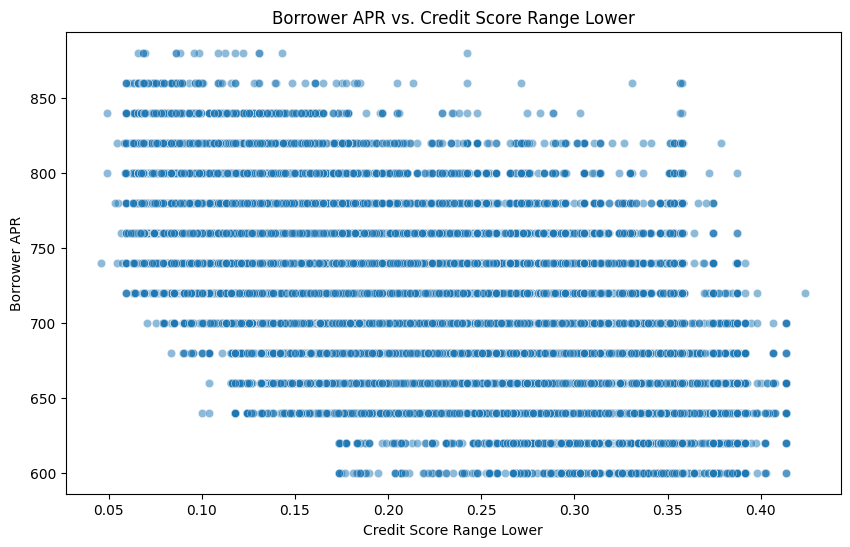
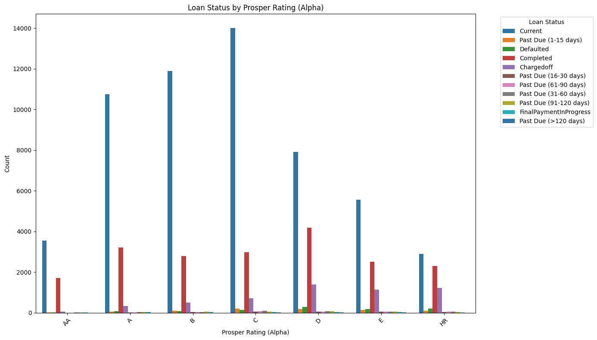
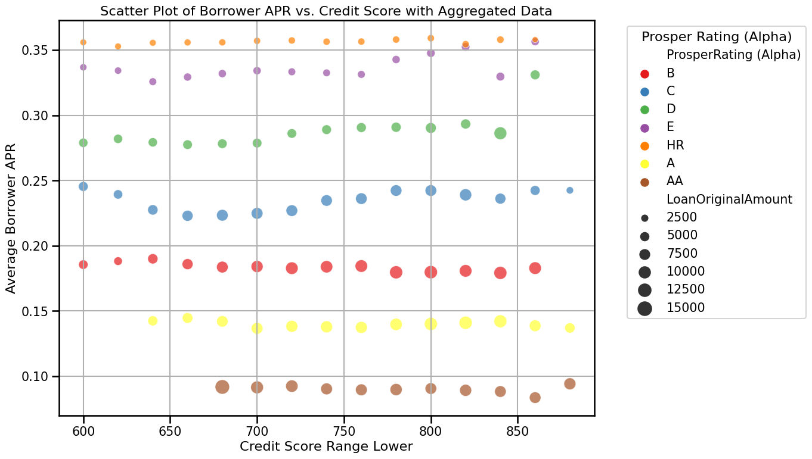

# Part II - Loan Data from Prosper
## by Tatiana Mihalciuc

## Investigation Overview


   In this investigation, the goal was to explore the factors influencing loan performance and borrowing costs within a lending dataset. The main focus was on examining how borrower characteristics such as credit score, loan amount, and Prosper Rating affect key outcomes like Borrower APR (Annual Percentage Rate), loan status, and estimated returns. By understanding these relationships, we tried to identify patterns that help explain lending risks and potential rewards for lenders.


## Dataset Overview and Executive Summary

```Dataset Overview:``` 

The dataset consists of detailed information on approximately 114,000 loans, including borrower characteristics, loan amounts, interest rates, and credit scores. Key attributes include Borrower APR (Annual Percentage Rate), credit score ranges, Prosper Ratings, loan statuses, income ranges, and estimated returns. Some data points were excluded from the analysis due to missing values or inconsistencies.

```Executive Summary of Findings:```

- **Relationship between Credit Score and APR**: Higher credit scores are generally associated with lower APRs, indicating that better credit ratings result in more favorable loan terms.

- **Loan Status and Prosper Rating**: Loans with higher Prosper Ratings (AA, A) tend to have positive outcomes such as "Current" or "Completed" statuses, while lower ratings (HR, E) are associated with higher risks like defaults and charge-offs.

- **Estimated Return and Loan Size**: Larger loans show a wide range of estimated returns, suggesting that factors other than loan size influence the expected profitability for lenders.

These insights will be further supported and explored through visualizations to highlight key patterns and relationships within the data.


```python
# import all packages and set plots to be embedded inline
import numpy as np
import pandas as pd
import matplotlib.pyplot as plt
import seaborn as sns

# suppress warnings from final output
import warnings
warnings.simplefilter("ignore")
```


```python
# load in the dataset into a pandas dataframe
df=pd.read_csv('filtered_prosper_loan_data.csv')
```


```python
df.head()
```


<div>
<style scoped>
    .dataframe tbody tr th:only-of-type {
        vertical-align: middle;
    }

    .dataframe tbody tr th {
        vertical-align: top;
    }

    .dataframe thead th {
        text-align: right;
    }
</style>
<table border="1" class="dataframe">
  <thead>
    <tr style="text-align: right;">
      <th></th>
      <th>BorrowerAPR</th>
      <th>EstimatedReturn</th>
      <th>LoanStatus</th>
      <th>EmploymentStatus</th>
      <th>ProsperRating (Alpha)</th>
      <th>CreditScoreRangeLower</th>
      <th>LoanOriginalAmount</th>
      <th>IncomeRange</th>
      <th>ListingCategory (numeric)</th>
      <th>ListingCreationDate</th>
      <th>ListingCategoryLabel</th>
    </tr>
  </thead>
  <tbody>
    <tr>
      <th>0</th>
      <td>0.12016</td>
      <td>0.05470</td>
      <td>Current</td>
      <td>Employed</td>
      <td>A</td>
      <td>680.0</td>
      <td>10000</td>
      <td>$50,000-74,999</td>
      <td>2</td>
      <td>2014-02-27 08:28:07.900</td>
      <td>Home Improvement</td>
    </tr>
    <tr>
      <th>1</th>
      <td>0.12528</td>
      <td>0.06000</td>
      <td>Current</td>
      <td>Employed</td>
      <td>A</td>
      <td>800.0</td>
      <td>10000</td>
      <td>$25,000-49,999</td>
      <td>16</td>
      <td>2012-10-22 11:02:35.010</td>
      <td>Motorcycle</td>
    </tr>
    <tr>
      <th>2</th>
      <td>0.24614</td>
      <td>0.09066</td>
      <td>Current</td>
      <td>Employed</td>
      <td>D</td>
      <td>680.0</td>
      <td>15000</td>
      <td>$100,000+</td>
      <td>2</td>
      <td>2013-09-14 18:38:39.097</td>
      <td>Home Improvement</td>
    </tr>
    <tr>
      <th>3</th>
      <td>0.15425</td>
      <td>0.07077</td>
      <td>Current</td>
      <td>Employed</td>
      <td>B</td>
      <td>740.0</td>
      <td>15000</td>
      <td>$100,000+</td>
      <td>1</td>
      <td>2013-12-14 08:26:37.093</td>
      <td>Debt Consolidation</td>
    </tr>
    <tr>
      <th>4</th>
      <td>0.31032</td>
      <td>0.11070</td>
      <td>Current</td>
      <td>Employed</td>
      <td>E</td>
      <td>680.0</td>
      <td>3000</td>
      <td>$25,000-49,999</td>
      <td>1</td>
      <td>2013-04-12 09:52:56.147</td>
      <td>Debt Consolidation</td>
    </tr>
  </tbody>
</table>
</div>


## (Visualization 1)

#### Distribution of Borrower APR vs. Credit Score Range Lower

This plot shows how Borrower APR (interest rate) varies with Credit Score Range Lower. The APRs range from about 6% to over 40%. The pattern clearly shows that lower credit scores are linked with higher APRs, indicating that borrowers with poorer credit scores tend to get higher interest rates. The points are spread out in distinct lines, which suggests that specific credit score cutoffs are used to set these rates.


```python
# Create a scatter plot
plt.figure(figsize=(10, 6)) # Sets the size of the plot to ensure it is large enough.
sns.scatterplot(data=df, x='BorrowerAPR', y='CreditScoreRangeLower', alpha=0.5)
plt.title('Borrower APR vs. Credit Score Range Lower')
plt.xlabel('Credit Score Range Lower')
plt.ylabel('Borrower APR')
plt.show()
```


    

    


## (Visualization 2)

#### Loan Status by Prosper Rating (Alpha)

This plot illustrates the distribution of loan statuses across different Prosper Ratings. Borrowers with higher ratings (AA, A) predominantly have loans in the "Current" status, indicating active and timely repayment. As the ratings decrease from B to HR, the frequency of negative loan outcomes, such as "Defaulted" and "Chargedoff," increases noticeably. Lower ratings are associated with a higher risk of past-due loans, highlighting the clear connection between borrower ratings and loan performance. This pattern highlights how ratings play a crucial role in predicting loan outcomes, with higher ratings generally resulting in more positive loan statuses.


```python
# Define the correct order for Prosper Ratings which ranges from AA (highest rating) to HR (highest risk rating).
rating_order = ['AA', 'A', 'B', 'C', 'D', 'E', 'HR']

plt.figure(figsize=(14, 8)) # Sets the size of the plot to make it easier to read.
sns.countplot(data=df, x='ProsperRating (Alpha)', hue='LoanStatus', order=rating_order, palette='tab10') # Using a palette with distinct colors
plt.title('Loan Status by Prosper Rating (Alpha)')
plt.xlabel('Prosper Rating (Alpha)')
plt.ylabel('Count')
plt.legend(title='Loan Status', bbox_to_anchor=(1.05, 1), loc='upper left') # Positions the legend outside the plot area on the right.
plt.xticks(rotation=45)
plt.tight_layout()
plt.show()
```


    

    


## (Visualization 3)

#### Borrower APR by Loan Status and Prosper Rating

This plot shows how Borrower APR varies with Loan Status across different Prosper Ratings. Borrowers with higher ratings (A, AA) generally have lower APRs and are more often in positive loan statuses such as "Current" and "Completed," reflecting lower risk and better repayment behavior. As Prosper Ratings decline to D, E, and HR, there is a noticeable shift towards higher APRs and a greater frequency of negative outcomes like "Defaulted" and "Chargedoff." This trend highlights the direct link between borrower credit ratings and loan performance, where lower ratings correspond to higher borrowing costs and increased risk of negative loan statuses.


```python
plt.figure(figsize=(12, 10))
sns.set_context("talk", font_scale=0.9)  # Adjust context and scale for better readability

# Create a loan satus order
loan_status_order = [
    'Current', 'Completed', 'FinalPaymentInProgress', 'Past Due (1-15 days)', 
    'Past Due (16-30 days)', 'Past Due (31-60 days)', 'Past Due (61-90 days)', 
    'Past Due (91-120 days)', 'Past Due (>120 days)', 'Chargedoff', 'Defaulted'
]
# Set the color palette
palette = sns.color_palette("tab10")

# Create the FacetGrid
g = sns.FacetGrid(df, col="LoanStatus", hue="ProsperRating (Alpha)", col_wrap=3, palette=palette, height=4, hue_order=rating_order, col_order=loan_status_order) # Order from AA-highest to HR-lowest and loan satus
g.map(plt.scatter, "BorrowerAPR", "ProsperRating (Alpha)", alpha=0.7)  # Set point size and transparency
g.add_legend(title="Prosper Rating (Alpha)", fontsize='medium')

# Adjust layout and titles
g.set_titles(col_template="{col_name}", size=14)
g.set_axis_labels("Borrower APR", "Prosper Rating (Alpha)", fontsize=12)
g.set(xlim=(0, 0.45))  # Adjust x-axis limits if needed

plt.subplots_adjust(top=0.9)
g.fig.suptitle('Borrower APR by Loan Status and Prosper Rating', fontsize=16)
plt.show()
```


    <Figure size 1200x1000 with 0 Axes>


    

    


## (Visualization 4)

#### Scatter Plot of Borrower APR vs. Credit Score with Aggregated Data

This plot shows how Average Borrower APR varies with Credit Score Range across different Prosper Ratings. Borrowers with higher Prosper Ratings (AA, A) consistently receive the lowest APRs, even as credit scores vary, reflecting their lower risk and stronger credit profiles. As Prosper Ratings decrease to C, D, E, and HR, there is a clear increase in average APRs, demonstrating higher borrowing costs associated with lower ratings. The size of the points indicates average loan amounts, which are generally larger for those with better ratings and lower APRs. This plot highlights the strong relationship between credit ratings, borrowing costs, and loan sizes, where better ratings lead to more favorable loan terms and lower costs.


```python
# Aggregating data by average Borrower APR for specific credit score bands and ratings
# Group by Credit Score and Prosper Rating, then calculate the mean Borrower APR and Loan Amount
aggregated_data = df.groupby(['CreditScoreRangeLower', 'ProsperRating (Alpha)']).agg({
    'BorrowerAPR': 'mean',
    'LoanOriginalAmount': 'mean'
}).reset_index()

# Set the distinct color palette for Prosper Ratings
distinct_palette = sns.color_palette("Set1", n_colors=len(df['ProsperRating (Alpha)'].unique()))

# Create a scatter plot using aggregated data
plt.figure(figsize=(14, 8))
sns.scatterplot(
    data=aggregated_data,
    x='CreditScoreRangeLower',
    y='BorrowerAPR',
    hue='ProsperRating (Alpha)',
    size='LoanOriginalAmount',
    sizes=(50, 300),
    alpha=0.7,
    palette=distinct_palette
)

plt.title('Scatter Plot of Borrower APR vs. Credit Score with Aggregated Data')
plt.xlabel('Credit Score Range Lower')
plt.ylabel('Average Borrower APR')
plt.legend(title='Prosper Rating (Alpha)', bbox_to_anchor=(1.05, 1), loc='upper left')
plt.grid(True)
plt.tight_layout()
plt.show()
```


    

    

