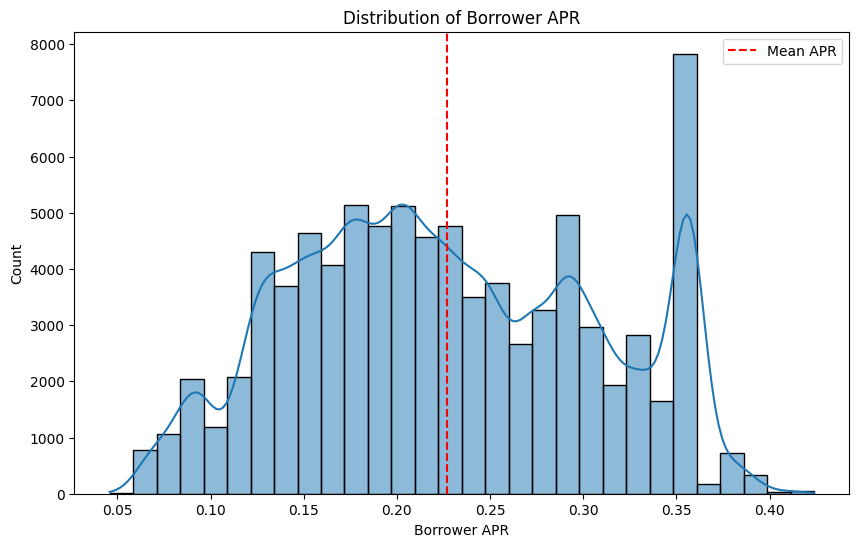
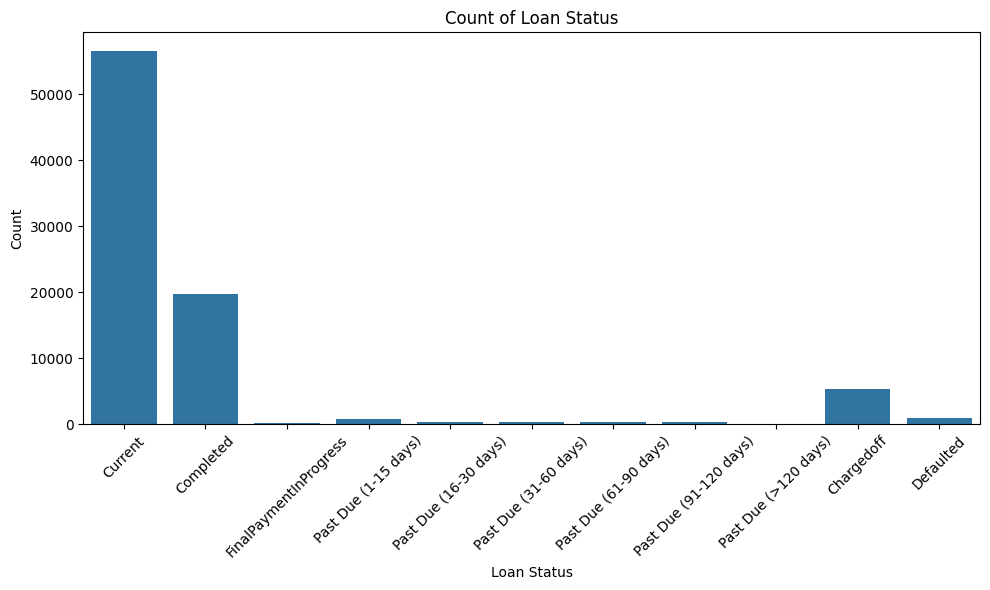
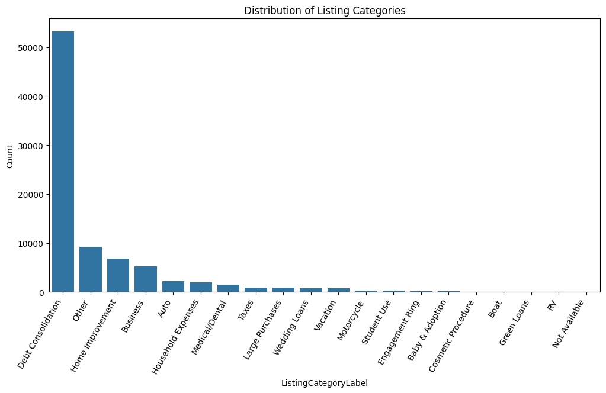
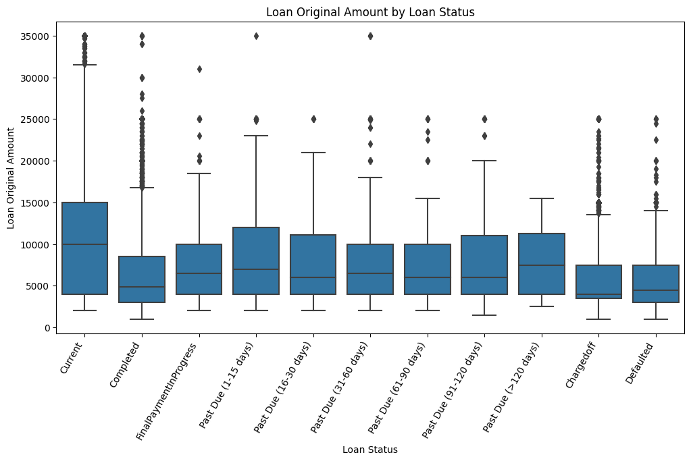
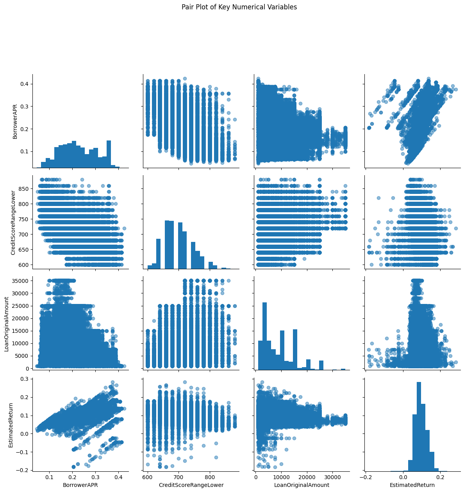
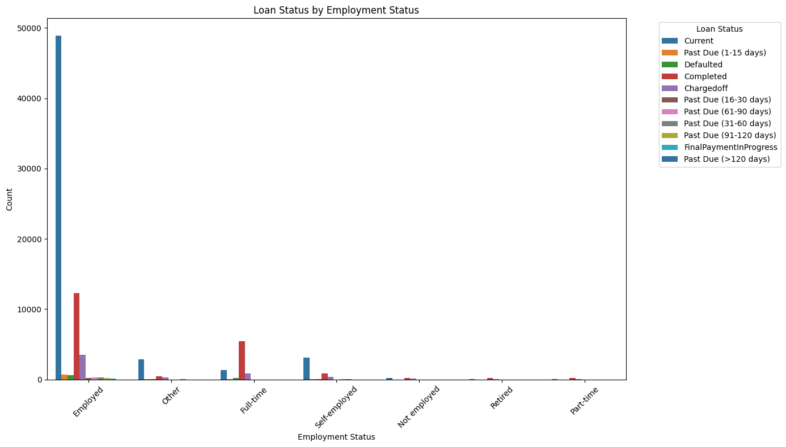
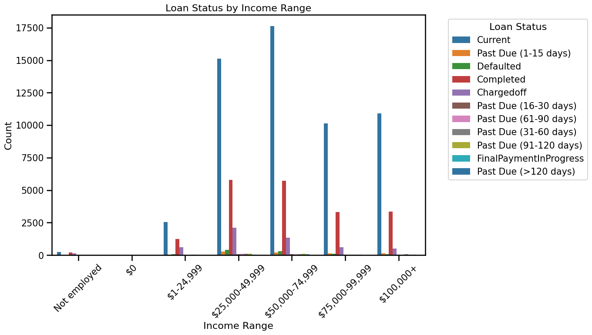
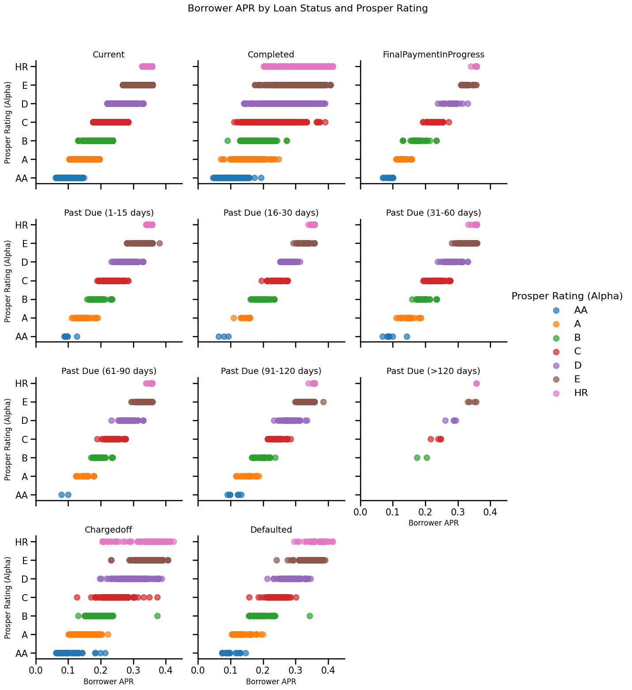

# Part I - Loan Data from Prosper

## by Tatiana Mihalciuc

## Introduction

   This data set contains 113,937 loans with 81 variables on each loan, including loan amount, borrower rate (or interest rate), current loan status, borrower income, and many others.

#### Main Focus:
The primary focus of this dataset is to understand how borrower characteristics, such as credit scores and income, influence loan terms like Borrower APR and loan performance outcomes. The main area of concentration is exploring the relationships between credit ratings, borrowing costs, and loan statuses to identify key factors that drive successful loan repayment or lead to defaults.

#### Exploration Goals:
Examine the Impact of Creditworthiness: To analyze how credit scores and Prosper Ratings affect Borrower APR and loan performance, highlighting the link between borrower risk and borrowing costs.

#### Investigate Loan Outcomes:
To explore how different loan statuses (e.g., Current, Defaulted) relate to borrower characteristics and loan terms, aiming to identify patterns of risk and repayment behavior.

#### Understand Risk-Reward Trade-offs: 
To assess the relationship between estimated returns and loan characteristics, particularly for high-risk borrowers, and how these trade-offs shape lending decisions.

I will consider main columns for my analysis:

```BorrowerAPR``` - The Borrower's Annual Percentage Rate (APR) for the loan.

```EstimatedReturn``` - The estimated return assigned to the listing at the time it was created. Applicable for loans originated after July 2009.

```LoanStatus```- The current status of the loan: Cancelled,  Chargedoff, Completed, Current, Defaulted, FinalPaymentInProgress, PastDue. The PastDue status will be accompanied by a delinquency bucket.

```EmploymentStatus```- The employment status of the borrower at the time they posted the listing.

```ProsperRating (Alpha)```- The Prosper Rating assigned at the time the listing was created between AA - HR.  Applicable for loans originated after July 2009.

```CreditScoreRangeLower```- The lower value representing the range of the borrower's credit score as provided by a consumer credit rating agency.

```LoanOriginalAmount```- The origination amount of the loan.

```IncomeRange```- The income range of the borrower at the time the listing was created.

```ListingCategory (numeric)```- The category of the listing that the borrower selected when posting their listing: 0 - Not Available, 1 - Debt Consolidation, 2 - Home Improvement, 3 - Business, 4 - Personal Loan, 5 - Student Use, 6 - Auto, 7- Other, 8 - Baby&Adoption, 9 - Boat, 10 - Cosmetic Procedure, 11 - Engagement Ring, 12 - Green Loans, 13 - Household Expenses, 14 - Large Purchases, 15 - Medical/Dental, 16 - Motorcycle, 17 - RV, 18 - Taxes, 19 - Vacation, 20 - Wedding Loans

```ListingCreationDate```- The date the listing was created.


## Preliminary Wrangling


```python
# import all packages and set plots to be embedded inline
import numpy as np
import pandas as pd
import matplotlib.pyplot as plt
import seaborn as sns

```


```python
df = pd.read_csv('prosperLoanData.csv')
```


```python
df.head()
```


<div>
<style scoped>
    .dataframe tbody tr th:only-of-type {
        vertical-align: middle;
    }

    .dataframe tbody tr th {
        vertical-align: top;
    }

    .dataframe thead th {
        text-align: right;
    }
</style>
<table border="1" class="dataframe">
  <thead>
    <tr style="text-align: right;">
      <th></th>
      <th>ListingKey</th>
      <th>ListingNumber</th>
      <th>ListingCreationDate</th>
      <th>CreditGrade</th>
      <th>Term</th>
      <th>LoanStatus</th>
      <th>ClosedDate</th>
      <th>BorrowerAPR</th>
      <th>BorrowerRate</th>
      <th>LenderYield</th>
      <th>...</th>
      <th>LP_ServiceFees</th>
      <th>LP_CollectionFees</th>
      <th>LP_GrossPrincipalLoss</th>
      <th>LP_NetPrincipalLoss</th>
      <th>LP_NonPrincipalRecoverypayments</th>
      <th>PercentFunded</th>
      <th>Recommendations</th>
      <th>InvestmentFromFriendsCount</th>
      <th>InvestmentFromFriendsAmount</th>
      <th>Investors</th>
    </tr>
  </thead>
  <tbody>
    <tr>
      <th>0</th>
      <td>1021339766868145413AB3B</td>
      <td>193129</td>
      <td>2007-08-26 19:09:29.263000000</td>
      <td>C</td>
      <td>36</td>
      <td>Completed</td>
      <td>2009-08-14 00:00:00</td>
      <td>0.16516</td>
      <td>0.1580</td>
      <td>0.1380</td>
      <td>...</td>
      <td>-133.18</td>
      <td>0.0</td>
      <td>0.0</td>
      <td>0.0</td>
      <td>0.0</td>
      <td>1.0</td>
      <td>0</td>
      <td>0</td>
      <td>0.0</td>
      <td>258</td>
    </tr>
    <tr>
      <th>1</th>
      <td>10273602499503308B223C1</td>
      <td>1209647</td>
      <td>2014-02-27 08:28:07.900000000</td>
      <td>NaN</td>
      <td>36</td>
      <td>Current</td>
      <td>NaN</td>
      <td>0.12016</td>
      <td>0.0920</td>
      <td>0.0820</td>
      <td>...</td>
      <td>0.00</td>
      <td>0.0</td>
      <td>0.0</td>
      <td>0.0</td>
      <td>0.0</td>
      <td>1.0</td>
      <td>0</td>
      <td>0</td>
      <td>0.0</td>
      <td>1</td>
    </tr>
    <tr>
      <th>2</th>
      <td>0EE9337825851032864889A</td>
      <td>81716</td>
      <td>2007-01-05 15:00:47.090000000</td>
      <td>HR</td>
      <td>36</td>
      <td>Completed</td>
      <td>2009-12-17 00:00:00</td>
      <td>0.28269</td>
      <td>0.2750</td>
      <td>0.2400</td>
      <td>...</td>
      <td>-24.20</td>
      <td>0.0</td>
      <td>0.0</td>
      <td>0.0</td>
      <td>0.0</td>
      <td>1.0</td>
      <td>0</td>
      <td>0</td>
      <td>0.0</td>
      <td>41</td>
    </tr>
    <tr>
      <th>3</th>
      <td>0EF5356002482715299901A</td>
      <td>658116</td>
      <td>2012-10-22 11:02:35.010000000</td>
      <td>NaN</td>
      <td>36</td>
      <td>Current</td>
      <td>NaN</td>
      <td>0.12528</td>
      <td>0.0974</td>
      <td>0.0874</td>
      <td>...</td>
      <td>-108.01</td>
      <td>0.0</td>
      <td>0.0</td>
      <td>0.0</td>
      <td>0.0</td>
      <td>1.0</td>
      <td>0</td>
      <td>0</td>
      <td>0.0</td>
      <td>158</td>
    </tr>
    <tr>
      <th>4</th>
      <td>0F023589499656230C5E3E2</td>
      <td>909464</td>
      <td>2013-09-14 18:38:39.097000000</td>
      <td>NaN</td>
      <td>36</td>
      <td>Current</td>
      <td>NaN</td>
      <td>0.24614</td>
      <td>0.2085</td>
      <td>0.1985</td>
      <td>...</td>
      <td>-60.27</td>
      <td>0.0</td>
      <td>0.0</td>
      <td>0.0</td>
      <td>0.0</td>
      <td>1.0</td>
      <td>0</td>
      <td>0</td>
      <td>0.0</td>
      <td>20</td>
    </tr>
  </tbody>
</table>
<p>5 rows × 81 columns</p>
</div>


Check all the columns from the data set


```python
df.columns
```


    Index(['ListingKey', 'ListingNumber', 'ListingCreationDate', 'CreditGrade',
           'Term', 'LoanStatus', 'ClosedDate', 'BorrowerAPR', 'BorrowerRate',
           'LenderYield', 'EstimatedEffectiveYield', 'EstimatedLoss',
           'EstimatedReturn', 'ProsperRating (numeric)', 'ProsperRating (Alpha)',
           'ProsperScore', 'ListingCategory (numeric)', 'BorrowerState',
           'Occupation', 'EmploymentStatus', 'EmploymentStatusDuration',
           'IsBorrowerHomeowner', 'CurrentlyInGroup', 'GroupKey',
           'DateCreditPulled', 'CreditScoreRangeLower', 'CreditScoreRangeUpper',
           'FirstRecordedCreditLine', 'CurrentCreditLines', 'OpenCreditLines',
           'TotalCreditLinespast7years', 'OpenRevolvingAccounts',
           'OpenRevolvingMonthlyPayment', 'InquiriesLast6Months', 'TotalInquiries',
           'CurrentDelinquencies', 'AmountDelinquent', 'DelinquenciesLast7Years',
           'PublicRecordsLast10Years', 'PublicRecordsLast12Months',
           'RevolvingCreditBalance', 'BankcardUtilization',
           'AvailableBankcardCredit', 'TotalTrades',
           'TradesNeverDelinquent (percentage)', 'TradesOpenedLast6Months',
           'DebtToIncomeRatio', 'IncomeRange', 'IncomeVerifiable',
           'StatedMonthlyIncome', 'LoanKey', 'TotalProsperLoans',
           'TotalProsperPaymentsBilled', 'OnTimeProsperPayments',
           'ProsperPaymentsLessThanOneMonthLate',
           'ProsperPaymentsOneMonthPlusLate', 'ProsperPrincipalBorrowed',
           'ProsperPrincipalOutstanding', 'ScorexChangeAtTimeOfListing',
           'LoanCurrentDaysDelinquent', 'LoanFirstDefaultedCycleNumber',
           'LoanMonthsSinceOrigination', 'LoanNumber', 'LoanOriginalAmount',
           'LoanOriginationDate', 'LoanOriginationQuarter', 'MemberKey',
           'MonthlyLoanPayment', 'LP_CustomerPayments',
           'LP_CustomerPrincipalPayments', 'LP_InterestandFees', 'LP_ServiceFees',
           'LP_CollectionFees', 'LP_GrossPrincipalLoss', 'LP_NetPrincipalLoss',
           'LP_NonPrincipalRecoverypayments', 'PercentFunded', 'Recommendations',
           'InvestmentFromFriendsCount', 'InvestmentFromFriendsAmount',
           'Investors'],
          dtype='object')


```python
# Create a copy of data set
df=df.copy()
```

Key columns to keep for the analysis


```python
df = df[['BorrowerAPR', 'EstimatedReturn', 'LoanStatus', 'EmploymentStatus',  'ProsperRating (Alpha)', 'CreditScoreRangeLower', 'LoanOriginalAmount', 'IncomeRange', 'ListingCategory (numeric)', 'ListingCreationDate']]
```


```python
# Check if fillter for the column worked
df.head()
```


<div>
<style scoped>
    .dataframe tbody tr th:only-of-type {
        vertical-align: middle;
    }

    .dataframe tbody tr th {
        vertical-align: top;
    }

    .dataframe thead th {
        text-align: right;
    }
</style>
<table border="1" class="dataframe">
  <thead>
    <tr style="text-align: right;">
      <th></th>
      <th>BorrowerAPR</th>
      <th>EstimatedReturn</th>
      <th>LoanStatus</th>
      <th>EmploymentStatus</th>
      <th>ProsperRating (Alpha)</th>
      <th>CreditScoreRangeLower</th>
      <th>LoanOriginalAmount</th>
      <th>IncomeRange</th>
      <th>ListingCategory (numeric)</th>
      <th>ListingCreationDate</th>
    </tr>
  </thead>
  <tbody>
    <tr>
      <th>0</th>
      <td>0.16516</td>
      <td>NaN</td>
      <td>Completed</td>
      <td>Self-employed</td>
      <td>NaN</td>
      <td>640.0</td>
      <td>9425</td>
      <td>$25,000-49,999</td>
      <td>0</td>
      <td>2007-08-26 19:09:29.263000000</td>
    </tr>
    <tr>
      <th>1</th>
      <td>0.12016</td>
      <td>0.05470</td>
      <td>Current</td>
      <td>Employed</td>
      <td>A</td>
      <td>680.0</td>
      <td>10000</td>
      <td>$50,000-74,999</td>
      <td>2</td>
      <td>2014-02-27 08:28:07.900000000</td>
    </tr>
    <tr>
      <th>2</th>
      <td>0.28269</td>
      <td>NaN</td>
      <td>Completed</td>
      <td>Not available</td>
      <td>NaN</td>
      <td>480.0</td>
      <td>3001</td>
      <td>Not displayed</td>
      <td>0</td>
      <td>2007-01-05 15:00:47.090000000</td>
    </tr>
    <tr>
      <th>3</th>
      <td>0.12528</td>
      <td>0.06000</td>
      <td>Current</td>
      <td>Employed</td>
      <td>A</td>
      <td>800.0</td>
      <td>10000</td>
      <td>$25,000-49,999</td>
      <td>16</td>
      <td>2012-10-22 11:02:35.010000000</td>
    </tr>
    <tr>
      <th>4</th>
      <td>0.24614</td>
      <td>0.09066</td>
      <td>Current</td>
      <td>Employed</td>
      <td>D</td>
      <td>680.0</td>
      <td>15000</td>
      <td>$100,000+</td>
      <td>2</td>
      <td>2013-09-14 18:38:39.097000000</td>
    </tr>
  </tbody>
</table>
</div>


```python
df.info()
```

    <class 'pandas.core.frame.DataFrame'>
    RangeIndex: 113937 entries, 0 to 113936
    Data columns (total 10 columns):
     #   Column                     Non-Null Count   Dtype  
    ---  ------                     --------------   -----  
     0   BorrowerAPR                113912 non-null  float64
     1   EstimatedReturn            84853 non-null   float64
     2   LoanStatus                 113937 non-null  object 
     3   EmploymentStatus           111682 non-null  object 
     4   ProsperRating (Alpha)      84853 non-null   object 
     5   CreditScoreRangeLower      113346 non-null  float64
     6   LoanOriginalAmount         113937 non-null  int64  
     7   IncomeRange                113937 non-null  object 
     8   ListingCategory (numeric)  113937 non-null  int64  
     9   ListingCreationDate        113937 non-null  object 
    dtypes: float64(3), int64(2), object(5)
    memory usage: 8.7+ MB


We need to filter the data using the ListingCreationDate column, ensuring that all variables start from the same date. Specifically, EstimatedReturn and ProsperRating (Alpha) are applicable only for loans originated after July 2009. To avoid misinterpretation of the data and to draw accurate conclusions, the data should be filtered accordingly.


```python
# Convert ListingCreationDate to datetime format
df['ListingCreationDate'] = pd.to_datetime(df['ListingCreationDate']) 
```


```python
# Check that column data type is now accurate
assert df.ListingCreationDate.dtype=='datetime64[ns]'
```


```python
# Filter data to include only loans originated after July 2009
df = df[df['ListingCreationDate'] >= '2009-07-01']
```


```python
# Check if filter for start date worked
assert df['ListingCreationDate'].min() >= pd.to_datetime('2009-07-01')
```


```python
df.info()
```

    <class 'pandas.core.frame.DataFrame'>
    Int64Index: 84853 entries, 1 to 113936
    Data columns (total 10 columns):
     #   Column                     Non-Null Count  Dtype         
    ---  ------                     --------------  -----         
     0   BorrowerAPR                84853 non-null  float64       
     1   EstimatedReturn            84853 non-null  float64       
     2   LoanStatus                 84853 non-null  object        
     3   EmploymentStatus           84853 non-null  object        
     4   ProsperRating (Alpha)      84853 non-null  object        
     5   CreditScoreRangeLower      84853 non-null  float64       
     6   LoanOriginalAmount         84853 non-null  int64         
     7   IncomeRange                84853 non-null  object        
     8   ListingCategory (numeric)  84853 non-null  int64         
     9   ListingCreationDate        84853 non-null  datetime64[ns]
    dtypes: datetime64[ns](1), float64(3), int64(2), object(4)
    memory usage: 7.1+ MB


Now we can clearly see that there is no more missing values. 

### What is the structure of your dataset?

 Our dataset contains information on loans, borrowers, and their financial characteristics, including credit scores, loan amounts, APR, income, and loan statuses. This data helps assess the risk, performance, and potential returns of loans in the marketplace.

### What is/are the main feature(s) of interest in your dataset?

 The key features of interest relate to the risk, return, and performance of loans. These features help understand how borrower characteristics impact loan outcomes:

- **BorrowerAPR**:
Represents the Annual Percentage Rate charged to borrowers, indicating the cost of the loan. It reflects the perceived risk level and influences the borrower's decision to take the loan. Examining APR helps understand how borrower characteristics and credit ratings affect borrowing costs.

- **LoanStatus**:
Shows the current state of the loan (e.g., Current, Completed, Defaulted). This feature is critical for evaluating loan performance, default risk, and the overall health of the loan portfolio.

- **ProsperRating (Alpha) & ProsperScore**:
These ratings and scores assess borrower creditworthiness, ranging from AA (best) to HR (worst). They are key predictors of loan performance, influencing APR and default likelihood.

- **EstimatedReturn**:
Reflects the expected profitability of a loan, serving as a measure of investment quality. It helps evaluate potential returns and understand how loans are likely to perform financially.

- **CreditScoreRangeLower**:
Represents the lower bound of the borrower’s credit score, providing an indication of financial health and risk. Higher credit scores typically correlate with lower APRs and better loan outcomes.

- **LoanOriginalAmount**:
The amount initially borrowed. Analyzing loan size helps explore whether larger amounts are linked with different performance patterns or risks compared to smaller loans.


### What features in the dataset do you think will help support your investigation into your feature(s) of interest?

 Supporting features provide additional context and help validate relationships between the main features of interest:

- **CreditScoreRangeLower**:
Offers a numerical representation of creditworthiness. Higher scores often lead to lower APRs and improved loan performance, supporting analysis of risk and return.

- **ProsperRating (Alpha) & ProsperScore**:
These scores help evaluate how credit ratings impact loan outcomes, APRs, and returns, illustrating the role of borrower risk in loan performance.

- **LoanOriginalAmount**:
Examining loan size helps determine whether larger loans carry higher risks or perform differently compared to smaller loans.

- **EmploymentStatus**:
Provides insight into the borrower’s financial stability, with stable employment often linked to better loan performance and lower risk.

- **IncomeRange**:
Helps assess repayment capacity, as higher incomes generally correlate with better loan outcomes and lower borrowing costs.

- **ListingCategory (numeric)**:
Identifies the purpose of the loan, which can affect risk and performance. For example, Debt Consolidation loans may have different risk profiles compared to Business or Personal Loans.

- **EstimatedReturn**:
Offers a perspective on the expected performance of loans, aiding in evaluating whether loans are meeting profitability expectations.

- **LoanStatus**:
As the primary indicator of loan performance, LoanStatus helps analyze which factors (APR, credit score, income) influence whether a loan performs well or poorly.

## Univariate Exploration

#### Visualizing what is the distribution of the Borrower APR (Annual Percentage Rate) across the dataset using histogram.


```python
plt.figure(figsize=(10, 6)) # Sets the size of the plot to ensure it is large enough.
sns.histplot(df['BorrowerAPR'], bins=30, kde=True, color='tab:blue')
plt.title('Distribution of Borrower APR')
plt.xlabel('Borrower APR')
plt.ylabel('Count')
plt.axvline(df['BorrowerAPR'].mean(), color='red', linestyle='--', label='Mean APR') # Mean of the BorrowerAPR, helps to visually identify where the average value lies.
plt.legend()
plt.show()
```


    

    


Overall, this plot provides a visual summary of the spread and central tendency of Borrower APR values, highlighting that most loans have APRs between 0.1 and 0.35, with notable concentrations around 0.2 and 0.35. The distribution has a slight skew towards the right (positive skew), indicated by the extended tail on the right side. This suggests that there are a few loans with significantly higher APRs compared to the bulk of the data.

#### Creating a bar chart to see the count of each unique value in the LoanStatus column.


```python
# Create the order for loan status
loan_status_order = [
    'Current', 'Completed', 'FinalPaymentInProgress', 'Past Due (1-15 days)', 
    'Past Due (16-30 days)', 'Past Due (31-60 days)', 'Past Due (61-90 days)', 
    'Past Due (91-120 days)', 'Past Due (>120 days)', 'Chargedoff', 'Defaulted'
]

# Plot the count of Loan Status with the specified order
plt.figure(figsize=(10, 6))  # Sets the size of the plot 
sns.countplot(data=df, x='LoanStatus', order=loan_status_order, color='tab:blue')
plt.title('Count of Loan Status')
plt.xlabel('Loan Status')
plt.ylabel('Count')
plt.xticks(rotation=45)  # Rotates the x-axis labels for better readability.
plt.tight_layout() 
plt.show()
```


    

    


The vast majority of loans are either actively being repaid ("Current") or have been successfully completed, suggesting generally good loan performance.
There is a smaller, yet important, portion of loans that are charged off, defaulted, or past due, which could indicate some risk areas for the lender.

####  Analysisng what are the most common loan purposes based on listing categories using count plot.


```python
# First we have to perform transformation of labeling listing categories
category_labels = {
    0: "Not Available",
    1: "Debt Consolidation",
    2: "Home Improvement",
    3: "Business",
    4: "Personal Loan",
    5: "Student Use",
    6: "Auto",
    7: "Other",
    8: "Baby & Adoption",
    9: "Boat",
    10: "Cosmetic Procedure",
    11: "Engagement Ring",
    12: "Green Loans",
    13: "Household Expenses",
    14: "Large Purchases",
    15: "Medical/Dental",
    16: "Motorcycle",
    17: "RV",
    18: "Taxes",
    19: "Vacation",
    20: "Wedding Loans"
}

# Apply the mapping
df.loc[:, 'ListingCategoryLabel'] = df['ListingCategory (numeric)'].map(category_labels)

# Display the first few rows to verify the transformation
df[['ListingCategory (numeric)', 'ListingCategoryLabel']].head()
```


<div>
<style scoped>
    .dataframe tbody tr th:only-of-type {
        vertical-align: middle;
    }

    .dataframe tbody tr th {
        vertical-align: top;
    }

    .dataframe thead th {
        text-align: right;
    }
</style>
<table border="1" class="dataframe">
  <thead>
    <tr style="text-align: right;">
      <th></th>
      <th>ListingCategory (numeric)</th>
      <th>ListingCategoryLabel</th>
    </tr>
  </thead>
  <tbody>
    <tr>
      <th>1</th>
      <td>2</td>
      <td>Home Improvement</td>
    </tr>
    <tr>
      <th>3</th>
      <td>16</td>
      <td>Motorcycle</td>
    </tr>
    <tr>
      <th>4</th>
      <td>2</td>
      <td>Home Improvement</td>
    </tr>
    <tr>
      <th>5</th>
      <td>1</td>
      <td>Debt Consolidation</td>
    </tr>
    <tr>
      <th>6</th>
      <td>1</td>
      <td>Debt Consolidation</td>
    </tr>
  </tbody>
</table>
</div>


```python
# Create a count plot
plt.figure(figsize=(12, 6)) # Sets the size of the plot to ensure it is large enough.
order=df['ListingCategoryLabel'].value_counts().index # Orders the categories by their frequency.
sns.countplot(data=df, x='ListingCategoryLabel', order=order,color='tab:blue')
plt.title('Distribution of Listing Categories')
plt.xlabel('ListingCategoryLabel')
plt.ylabel('Count')
plt.xticks(rotation=60, ha='right')  # Rotate labels and align them to the right
plt.show()
```


    

    


The chart shows that most people take out loans to manage existing debt, with other common reasons including personal needs and home improvements. The remaining categories are less frequent, with some being used for more specialized or specific purposes.

#### Discuss the distribution(s) of your variable(s) of interest. Were there any unusual points? Did you need to perform any transformations?

```Unusual Points:```
The most unusual aspect across the plots is the extreme skewness in all distributions. The data tends to cluster heavily in a few categories or specific ranges (e.g., high APR around 0.35, a large number of "Current" loans, and a massive focus on "Debt Consolidation").

```Transformations:```
No major transformations were performed as the raw distributions provided a clear understanding of each variable. However, filtering the data based on specific criteria, such as loans issued after a particular date, was necessary to ensure consistency and relevance of the observed distributions. 

### Of the features you investigated, were there any unusual distributions? Did you perform any operations on the data to tidy, adjust, or change the form of the data? If so, why did you do this?

```Filtering by Date:```

Reason: Since features like EstimatedReturn and ProsperRating (Alpha) are applicable only for loans issued after July 2009, the data was filtered to include only relevant entries from this date onwards. This filtering was crucial to avoid misinterpretation and ensure the analysis accurately reflected the characteristics of loans with these features.

```Ensuring Correct Data Types:```

Reason: For the ListingCreationDate, ensuring it was in the correct datetime format was necessary for proper filtering and chronological analysis. This operation helped maintain the integrity of time-based analyses and ensured consistency when working with date-related features.

```Handling Missing or Inconsistent Data:```

Reason: Although not explicitly shown in the plots, part of the data tidying process involved checking for missing or inconsistent entries, especially in critical fields like APR, loan status, and listing categories. Ensuring clean data was essential for reliable visualizations and interpretations.

## Bivariate Exploration

For the Bivariate Exploration, we will investigate relationships between pairs of variables that were introduced in the Univariate Exploration. This will help us understand how different factors interact with each other.

#### To examine how the Borrower APR varies with the borrower's credit score using scatter plot. We expect that lower credit scores might be associated with higher APRs due to perceived higher risk.


```python
# Create a scatter plot
plt.figure(figsize=(10, 6)) # Sets the size of the plot to ensure it is large enough.
sns.scatterplot(data=df, x='BorrowerAPR', y='CreditScoreRangeLower', alpha=0.5)
plt.title('Borrower APR vs. Credit Score Range Lower')
plt.xlabel('Credit Score Range Lower')
plt.ylabel('Borrower APR')
plt.show()
```


    

    


The plot effectively demonstrates the expected trend: higher credit scores are associated with lower borrowing costs. This scatter plot confirms the importance of maintaining a good credit score for securing more favorable loan terms.
The spread of points, especially among lower scores, suggests that factors other than credit score also play a significant role in determining APR, pointing to the need for a multi-faceted risk assessment in lending.

#### To compare the loan amounts across different loan statuses using box plot. This will help us see if non-performing loans (like Defaulted or Chargedoff) are associated with higher or lower loan amounts.


```python
# Create a box plot
plt.figure(figsize=(12, 6)) # Sets the size of the plot to make it easier to read.
sns.boxplot(data=df, x='LoanStatus', y='LoanOriginalAmount',order=loan_status_order, color='tab:blue')
plt.title('Loan Original Amount by Loan Status')
plt.xlabel('Loan Status')
plt.ylabel('Loan Original Amount')
plt.xticks(rotation=60, ha='right') # Rotate the labels.
plt.show()
```


    

    


The box plot provides valuable insights into how loan amounts vary by status. Generally, loans that are "Current" or "Completed" have higher median values, while delinquent and defaulted loans are typically smaller. This trend suggests that loan size might be a factor in loan performance, with larger loans more often maintained in good standing. Additionally, the presence of outliers across categories highlights that while most loans conform to typical ranges, exceptions do exist that could skew overall financial outcomes.

#### To explore how loan statuses vary across different Prosper Ratings using clustered bar chart. This will help us understand how credit ratings influence loan performance.


```python
# Define the correct order for Prosper Ratings which ranges from AA (highest rating) to HR (highest risk rating).
rating_order = ['AA', 'A', 'B', 'C', 'D', 'E', 'HR']

plt.figure(figsize=(14, 8)) # Sets the size of the plot to make it easier to read.
sns.countplot(data=df, x='ProsperRating (Alpha)', hue='LoanStatus', order=rating_order, palette='tab10') # Using a palette with distinct colors
plt.title('Loan Status by Prosper Rating (Alpha)')
plt.xlabel('Prosper Rating (Alpha)')
plt.ylabel('Count')
plt.legend(title='Loan Status', bbox_to_anchor=(1.05, 1), loc='upper left') # Positions the legend outside the plot area on the right.
plt.xticks(rotation=45)
plt.tight_layout()
plt.show()
```


    

    


This chart visually confirms the expected relationship between credit ratings and loan performance: higher ratings correspond to better loan outcomes, while lower ratings are indicative of increased financial risk. The distribution of loan statuses across ratings underscores the value of these ratings in assessing borrower reliability and managing lending risk.

#### To create a matrix with variables of interest we will use Seaborn PairGrid function. We can focus on 4 main variables BorrowerAPR, CreditScoreRangeLower, LoanOriginalAmount, EstimatedReturn.


```python
# Define the variables of interest
stats = ['BorrowerAPR', 'CreditScoreRangeLower', 'LoanOriginalAmount', 'EstimatedReturn']

# Create the PairGrid with scatter plots on the off-diagonals and histograms on the diagonal
g = sns.PairGrid(data=df, vars=stats, height=3)  # Adjust height for better readability
g.map_offdiag(plt.scatter, alpha=0.5, color='tab:blue')  # Adding alpha for transparency in scatter plots
g.map_diag(plt.hist, bins=20, color='tab:blue')  # Customizing the histogram appearance
plt.subplots_adjust(top=0.9)
g.fig.suptitle('Pair Plot of Key Numerical Variables', y=1.05)
plt.show()
```


    

    


```Borrower APR vs. Credit Score Range Lower```: Borrowers with higher credit scores generally have lower APRs, showing an inverse relationship. This suggests that better credit scores lead to more favorable borrowing terms.

```Borrower APR vs. Loan Original Amount```: APR values vary widely across different loan amounts with no strong direct link. Smaller loans tend to have higher APRs, possibly because lenders see them as higher risk.

```Borrower APR vs. Estimated Return```: Higher APRs are linked with higher estimated returns, indicating that loans with higher borrowing costs also offer higher potential rewards due to their higher risk.

```Credit Score Range Lower vs. Loan Original Amount```: Loans are issued across a wide range of credit scores, but smaller loans are often associated with lower credit scores, reflecting cautious lending to less creditworthy borrowers.

```Credit Score Range Lower vs. Estimated Return```: Higher credit scores are typically connected to lower estimated returns, aligning with the lower risk profile of these borrowers. Safer borrowers yield less for lenders.

```Loan Original Amount vs. Estimated Return```: There’s no strong relationship between loan size and estimated return, but larger loans show a wide range of returns, suggesting that factors beyond loan size influence profitability expectations.

#### Interesting to know how LoanSatus is affected by EmploymentStatus


```python
plt.figure(figsize=(14, 8))
sns.countplot(data=df, x='EmploymentStatus', hue='LoanStatus', palette='tab10')
plt.title('Loan Status by Employment Status')
plt.xlabel('Employment Status')
plt.ylabel('Count')
plt.xticks(rotation=45)
plt.legend(title='Loan Status', bbox_to_anchor=(1.05, 1), loc='upper left') # Positions the legend outside the plot area on the right.
plt.xticks(rotation=45)
plt.tight_layout()
plt.show()
```


    

    


The chart highlights how employment status significantly influences loan performance, with "Employed" and "Full-time" borrowers showing the best loan outcomes. Higher risk is evident among self-employed and unemployed borrowers, emphasizing the importance of employment stability in lending decisions. The data underscores the need for careful risk assessment based on employment status when evaluating loan applications.

#### How LoanStatus is affected by IncomeRange


```python
# Clustered bar chart to compare Income Range by Loan Status
plt.figure(figsize=(14, 8))

# Create the order of income ranges
income_order = ['Not employed','$0', '$1-24,999', '$25,000-49,999', 
                '$50,000-74,999', '$75,000-99,999', '$100,000+']
sns.countplot(data=df, x='IncomeRange', hue='LoanStatus', order=income_order, palette='tab10')
plt.title('Loan Status by Income Range')
plt.xlabel('Income Range')
plt.ylabel('Count')
plt.xticks(rotation=45)
plt.legend(title='Loan Status', bbox_to_anchor=(1.05, 1), loc='upper left') # Positions the legend outside the plot area on the right.
plt.tight_layout()
plt.show()
```


    

    


The chart effectively demonstrates the strong correlation between income range and loan performance. Higher income ranges are associated with a greater number of loans in good standing, while lower income and no income categories show increased risk of delinquency and default. This data underscores the critical role of income in evaluating loan eligibility and managing lending risk.

### Talk about some of the relationships you observed in this part of the investigation. How did the feature(s) of interest vary with other features in the dataset?

```Credit Score and APR```: The scatter plot of Credit Score Range Lower versus Borrower APR reveals an inverse relationship where lower credit scores are generally associated with higher APRs, reflecting the increased risk perceived by lenders. Despite this trend, there is a notable spread of APRs within each credit score band, suggesting that other factors, such as the purpose of the loan, borrower credit history, or additional credit evaluations, significantly influence the APR set for individual borrowers.

```Loan Amount and Status```: The box plot of Loan Original Amount by Loan Status shows that larger loans are predominantly categorized as "Current" or "Completed," indicating active repayment and better performance. Smaller loans are more often in trouble, like being "Defaulted" or "Charged-off." This pattern suggests that larger loans might be subject to stricter underwriting criteria or that borrowers prioritize repaying these higher-stake obligations, possibly due to the higher financial commitments involved.

```Prosper Rating and Loan Status```: The bar chart of Loan Status by Prosper Rating (Alpha) highlights that higher Prosper Ratings (AA, A, B) are closely associated with favorable outcomes, including "Current" and "Completed" loan statuses. Conversely, lower ratings (D, E, HR) show a higher frequency of defaults, charge-offs, and past-due loans. This relationship underscores the predictive power of Prosper Ratings in evaluating loan performance, reinforcing the trend that better credit scores correlate with more reliable repayment behavior.

```Overall Feature Interactions```: The pair plot of key numerical variables further emphasizes the interconnectedness of credit score, APR, loan amount, and estimated return, illustrating how these factors collectively impact loan outcomes. This comprehensive view of the data helps to validate the observed relationships, highlighting the complexity of loan performance and the multitude of factors influencing borrower risk profiles.

### Did you observe any interesting relationships between the other features (not the main feature(s) of interest)?

```Employment Status and Loan Performance:```
The bar chart of Loan Status by Employment Status showed that borrowers with stable employment (e.g., "Employed" and "Full-time") had significantly better loan outcomes, with most loans being "Current" or "Completed." Conversely, those with less stable employment statuses, such as "Self-employed" or "Not employed," exhibited higher instances of defaults, charge-offs, and various past-due statuses. This relationship underscores the importance of employment stability in lending decisions, as it directly impacts a borrower’s ability to maintain regular repayments.

```Income Range and Loan Status:```
The chart showing Loan Status by Income Range illustrated that higher income ranges correlated with more favorable loan outcomes, such as "Current" or "Completed." In contrast, lower income ranges, especially those below $25,000, were associated with a greater frequency of defaults and charge-offs. This suggests that income stability is a critical factor in assessing a borrower's repayment capacity, as those with higher and more consistent incomes are better positioned to meet their financial obligations.

## Multivariate Exploration

#### To examine how Borrower APR varies across different loan statuses and Prosper Ratings using facet plot. This will help us understand if better-rated borrowers consistently receive lower APRs, even across different loan performance outcomes.


```python
plt.figure(figsize=(12, 10))
sns.set_context("talk", font_scale=0.9)  # Adjust context and scale for better readability

# Set the color palette
palette = sns.color_palette("tab10")

# Create the FacetGrid with the improved settings
g = sns.FacetGrid(df, col="LoanStatus", hue="ProsperRating (Alpha)", col_wrap=3, palette=palette, height=4,  hue_order=rating_order, col_order=loan_status_order) # Hue_order and col_order is used from previous chart
g.map(plt.scatter, "BorrowerAPR", "ProsperRating (Alpha)", alpha=0.7)  # Set point size and transparency
g.add_legend(title="Prosper Rating (Alpha)", fontsize='medium')

# Adjust layout and titles
g.set_titles(col_template="{col_name}", size=14)
g.set_axis_labels("Borrower APR", "Prosper Rating (Alpha)", fontsize=12)
g.set(xlim=(0, 0.45))  # Adjust x-axis limits if needed

plt.subplots_adjust(top=0.9)
g.fig.suptitle('Borrower APR by Loan Status and Prosper Rating', fontsize=16)
plt.show()
```


    <Figure size 1200x1000 with 0 Axes>


    

    


The plot shows the relationship between Prosper Rating (Alpha), Borrower APR, and loan status. The data shows that lower Prosper Ratings (e.g., HR, E) are associated with higher APRs and more frequent negative loan outcomes, such as "Defaulted" and "Chargedoff" statuses. In contrast, borrowers with higher Prosper Ratings (e.g., AA, A) benefit from lower borrowing costs and are more likely to have loans in "Current" or "Completed" statuses, reflecting successful repayment behavior. This visualization effectively demonstrates how borrower creditworthiness, as reflected by Prosper Ratings, influences both the cost of borrowing and loan performance across various scenarios.

#### Scatter plot with multiple encodings, showing the relationship between Borrower APR and Credit Score Range Lower, with Prosper Rating (Alpha) as the color encoding and Loan Original Amount as the size encoding using aggregated data for easy readability.


```python
# Aggregating data by average Borrower APR for specific credit score bands and ratings
# Group by Credit Score and Prosper Rating, then calculate the mean Borrower APR and Loan Amount
aggregated_data = df.groupby(['CreditScoreRangeLower', 'ProsperRating (Alpha)']).agg({
    'BorrowerAPR': 'mean',
    'LoanOriginalAmount': 'mean'
}).reset_index()

# Set the distinct color palette for Prosper Ratings
distinct_palette = sns.color_palette("Set1", n_colors=len(df['ProsperRating (Alpha)'].unique()))

# Create a scatter plot using aggregated data
plt.figure(figsize=(14, 8))
sns.scatterplot(
    data=aggregated_data,
    x='CreditScoreRangeLower',
    y='BorrowerAPR',
    hue='ProsperRating (Alpha)',
    size='LoanOriginalAmount',
    sizes=(50, 300),
    alpha=0.7,
    palette=distinct_palette
)

plt.title('Scatter Plot of Borrower APR vs. Credit Score with Aggregated Data')
plt.xlabel('Credit Score Range Lower')
plt.ylabel('Average Borrower APR')
plt.legend(title='Prosper Rating (Alpha)', bbox_to_anchor=(1.05, 1), loc='upper left')
plt.grid(True)
plt.tight_layout()
plt.show()
```


    

    


Borrowers with better credit scores and higher Prosper Ratings are rewarded with lower APRs and tend to qualify for larger loan amounts.
The Prosper Rating is a critical factor in determining APR, perhaps even more influential than the exact credit score within certain bands.
There’s a strong visual cue of risk differentiation between ratings, reflecting the effectiveness of the Prosper Rating system in classifying borrower risk.

### Talk about some of the relationships you observed in this part of the investigation. Were there features that strengthened each other in terms of looking at your feature(s) of interest?

```Borrower APR and Prosper Rating Across Loan Statuses:```
The scatter plot of Borrower APR by Loan Status and Prosper Rating shows clear patterns. Borrowers with high Prosper Ratings (AA, A, B) consistently have lower APRs across all loan statuses, such as "Current" and "Completed." This suggests that higher ratings help borrowers get better loan terms. In contrast, borrowers with lower ratings (D, E, HR) face much higher APRs and are often found in more negative loan statuses like "Defaulted" and "Chargedoff." This shows that lower ratings not only increase borrowing costs but also lead to more repayment difficulties.

```Borrower APR, Credit Score, and Loan Amount:```
The scatter plot of Borrower APR versus Credit Score shows that borrowers with higher credit scores generally have lower APRs. Prosper Ratings play an important role, as better ratings are linked with the lowest APRs. The size of the data points shows average loan amounts, which tend to be larger for those with higher ratings and lower APRs. This means that borrowers with good credit and ratings not only pay less in interest but also qualify for larger loans.


### Were there any interesting or surprising interactions between features?

```High APRs Among Good Ratings:``` One surprising observation from the scatter plots was the presence of high APRs even among borrowers with good Prosper Ratings (A, B), especially in statuses like "Past Due" and "Defaulted." This suggests that other factors, such as borrower behavior or specific loan terms, can influence APRs and lead to unexpected loan outcomes, even for those with strong ratings.

```Borrower APR and Loan Status Patterns:``` The scatter plots show that while low APR loans often perform well, many high APR loans are still marked as "Current" or "Completed." This indicates that borrowers with high APRs are not necessarily at a higher risk of default. These borrowers may have other motivations, loan terms, or financial strategies that help them maintain regular repayments despite higher costs.


## Conclusions


#### Summary Findings:

 - **Borrower APR Distribution**: 
 The distribution of Borrower APR was right-skewed, with most APR values clustered between 10% and 35%. This skew suggests that many borrowers are subject to moderate to high borrowing costs, likely reflecting varying risk levels assessed by lenders.

 - **Loan Status Overview**:
 The majority of loans were in the "Current" status, indicating active repayment. However, there were also significant counts in "Completed" and problematic statuses such as "Defaulted" and "Chargedoff," highlighting the presence of both reliable and high-risk borrowers within the portfolio.

 - **Prosper Rating and Loan Status**:
 Higher Prosper Ratings (AA, A, B) were strongly linked to favorable loan outcomes, such as "Current" and "Completed" statuses. Conversely, lower ratings (D, E, HR) were associated with higher instances of defaults and charge-offs, reinforcing the importance of credit ratings in predicting loan performance.

 - **Credit Score and APR Relationship**:
 A clear inverse relationship was observed between credit scores and APR, where lower credit scores were associated with higher APRs. This reflects the risk-based pricing model employed by lenders, where borrowers perceived as higher risk face steeper borrowing costs.

 - **Loan Amount and Performance**:
 Larger loan amounts were often found in the "Current" status, while smaller loans were more frequently linked with defaults and charge-offs. This pattern suggests that loan size, along with approval criteria, influences repayment behavior, with borrowers potentially more motivated to repay larger obligations.

 - **High APR Loans Across Loan Statuses**:
 High APR loans were still observed in "Current" status, indicating that high borrowing costs alone do not necessarily predict default. This finding suggests that other factors, such as borrower motivation, lending conditions, or stricter criteria, also play significant roles in maintaining repayment.

 - **Estimated Return and Credit Score**:
 Loans with lower credit scores were linked with higher estimated returns and APRs, highlighting the risk-reward trade-off inherent in lending. Interestingly, loan size did not significantly alter expected returns, suggesting that creditworthiness and APR are more dominant factors influencing profitability.

 - **Surprising Interactions with Prosper Ratings**:
 High APRs were observed even among loans with good Prosper Ratings (A, B), especially in delinquent statuses. This indicates that beyond credit rating, factors such as loan terms, borrower circumstances, and specific conditions contribute to unexpected loan outcomes.

 - **Complex Interactions Among Variables**:
 The scatter plots and pair plots demonstrated intricate relationships between key variables, showing that borrower behavior and loan outcomes are influenced by a mix of credit scores, APRs, loan sizes, and individual borrower characteristics.

#### Reflection on Data Exploration Process:

```Handling Missing Data:```
Dealing with missing data, particularly in specific loan categories, was essential to ensure accurate analysis and avoid misinterpretation of empty plots.
```Multivariate Analysis:```
The investigation revealed complex, multi-layered interactions between variables like credit scores, APRs, and loan statuses, demonstrating that borrower performance cannot be fully captured by single metrics alone.

#### Key Takeaways:

The analysis highlights the significant impact of creditworthiness on borrowing costs and loan performance, reaffirming the critical role of credit ratings in lending decisions.
Lending is a nuanced process that requires balancing risk, expected return, and borrower-specific conditions, going beyond traditional credit assessments.
Future lending strategies should consider integrating additional borrower characteristics, such as employment stability and income levels, to better predict loan outcomes and optimize risk management.
