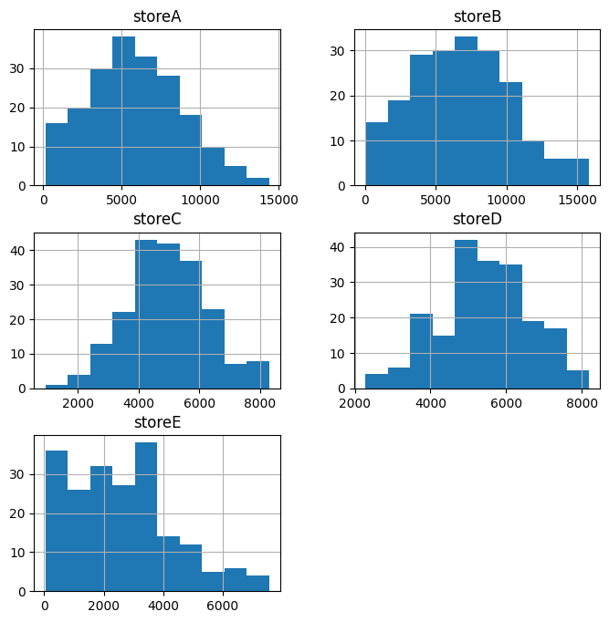

# Drawing Conclusions Quiz
Use the space below to explore the `store_data.csv` dataset to answer the quiz questions below.
  * Which store has the highest total sales for the final month of data?
  * Which store makes the most sales on average?
  * Which store sells the most during the week of March 13th, 2016?
  * In what week does store C make its worst sales?
  * Which store has the most sales in the latest 3-month period?


```python
# imports and load data
import pandas as pd

df = pd.read_csv('store_data.csv')
df.head()
```


<div>
<style scoped>
    .dataframe tbody tr th:only-of-type {
        vertical-align: middle;
    }

    .dataframe tbody tr th {
        vertical-align: top;
    }

    .dataframe thead th {
        text-align: right;
    }
</style>
<table border="1" class="dataframe">
  <thead>
    <tr style="text-align: right;">
      <th></th>
      <th>week</th>
      <th>storeA</th>
      <th>storeB</th>
      <th>storeC</th>
      <th>storeD</th>
      <th>storeE</th>
    </tr>
  </thead>
  <tbody>
    <tr>
      <th>0</th>
      <td>2014-05-04</td>
      <td>2643</td>
      <td>8257</td>
      <td>3893</td>
      <td>6231</td>
      <td>1294</td>
    </tr>
    <tr>
      <th>1</th>
      <td>2014-05-11</td>
      <td>6444</td>
      <td>5736</td>
      <td>5634</td>
      <td>7092</td>
      <td>2907</td>
    </tr>
    <tr>
      <th>2</th>
      <td>2014-05-18</td>
      <td>9646</td>
      <td>2552</td>
      <td>4253</td>
      <td>5447</td>
      <td>4736</td>
    </tr>
    <tr>
      <th>3</th>
      <td>2014-05-25</td>
      <td>5960</td>
      <td>10740</td>
      <td>8264</td>
      <td>6063</td>
      <td>949</td>
    </tr>
    <tr>
      <th>4</th>
      <td>2014-06-01</td>
      <td>7412</td>
      <td>7374</td>
      <td>3208</td>
      <td>3985</td>
      <td>3023</td>
    </tr>
  </tbody>
</table>
</div>


```python
# explore data by creating histograms on the entire DataFrame
df.hist(figsize=(8,8))
```


    array([[<AxesSubplot: title={'center': 'storeA'}>,
            <AxesSubplot: title={'center': 'storeB'}>],
           [<AxesSubplot: title={'center': 'storeC'}>,
            <AxesSubplot: title={'center': 'storeD'}>],
           [<AxesSubplot: title={'center': 'storeE'}>, <AxesSubplot: >]],
          dtype=object)


    

    


```python
# Use tail to find the end of the dataset to locate where the last month is via its index
df.tail()
```


<div>
<style scoped>
    .dataframe tbody tr th:only-of-type {
        vertical-align: middle;
    }

    .dataframe tbody tr th {
        vertical-align: top;
    }

    .dataframe thead th {
        text-align: right;
    }
</style>
<table border="1" class="dataframe">
  <thead>
    <tr style="text-align: right;">
      <th></th>
      <th>week</th>
      <th>storeA</th>
      <th>storeB</th>
      <th>storeC</th>
      <th>storeD</th>
      <th>storeE</th>
    </tr>
  </thead>
  <tbody>
    <tr>
      <th>195</th>
      <td>2018-01-28</td>
      <td>282</td>
      <td>6351</td>
      <td>7759</td>
      <td>5558</td>
      <td>1028</td>
    </tr>
    <tr>
      <th>196</th>
      <td>2018-02-04</td>
      <td>4853</td>
      <td>6503</td>
      <td>4187</td>
      <td>5956</td>
      <td>1458</td>
    </tr>
    <tr>
      <th>197</th>
      <td>2018-02-11</td>
      <td>9202</td>
      <td>3677</td>
      <td>4540</td>
      <td>6186</td>
      <td>243</td>
    </tr>
    <tr>
      <th>198</th>
      <td>2018-02-18</td>
      <td>3512</td>
      <td>7511</td>
      <td>4151</td>
      <td>5596</td>
      <td>3501</td>
    </tr>
    <tr>
      <th>199</th>
      <td>2018-02-25</td>
      <td>7560</td>
      <td>6904</td>
      <td>3569</td>
      <td>5045</td>
      <td>2585</td>
    </tr>
  </tbody>
</table>
</div>


```python
# Use iloc to create a slice of the last month and sum up the weeks
# to find the total sales for the last month
df_last_month=df.iloc[196:].sum()
df_last_month.head()
```


    week      2018-02-042018-02-112018-02-182018-02-25
    storeA                                       25127
    storeB                                       24595
    storeC                                       16447
    storeD                                       22783
    dtype: object


```python
# Use the mean method to find the average sales for each store
df.mean()
```
    storeA    5865.480
    storeB    6756.710
    storeC    4942.105
    storeD    5431.405
    storeE    2580.025
    dtype: float64


```python
# Find the sales of all stores by filtering on the week of march 13, 2016
df[df['week']=='2016-03-13']
```


<div>
<style scoped>
    .dataframe tbody tr th:only-of-type {
        vertical-align: middle;
    }

    .dataframe tbody tr th {
        vertical-align: top;
    }

    .dataframe thead th {
        text-align: right;
    }
</style>
<table border="1" class="dataframe">
  <thead>
    <tr style="text-align: right;">
      <th></th>
      <th>week</th>
      <th>storeA</th>
      <th>storeB</th>
      <th>storeC</th>
      <th>storeD</th>
      <th>storeE</th>
    </tr>
  </thead>
  <tbody>
    <tr>
      <th>97</th>
      <td>2016-03-13</td>
      <td>2054</td>
      <td>1390</td>
      <td>5112</td>
      <td>5513</td>
      <td>2536</td>
    </tr>
  </tbody>
</table>
</div>


```python
# Use the min method to filter the dataset to find the worst week for store C
print("Minimum value in 'storeC':", df['storeC'].min())
min_value = df['storeC'].min()
filtered_df = df[df['storeC'] == min_value]
print( filtered_df)
```

    Minimum value in 'storeC': 927
             week  storeA  storeB  storeC  storeD  storeE
    9  2014-07-06    8567    3228     927    3277     168


```python
# Filter the DataFrame on the most recent 3 month period. You can filter by selecting
# greater than or equal to 2017-12-01
last_three_months = df[df['week']>='2017-12-01']
# Find the total sales during this 3 month 
last_three_months.iloc[:, 1:].sum()  # exclude sum of week column
```


    storeA    87591
    storeB    79394
    storeC    66538
    storeD    75190
    storeE    27334
    dtype: int64


```python

```
