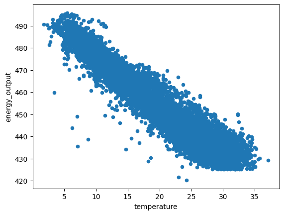
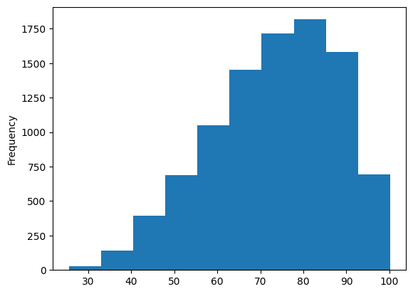
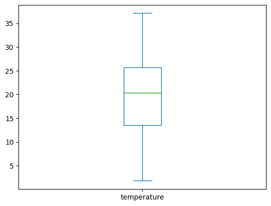
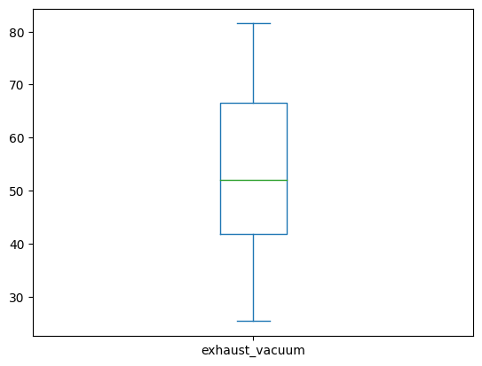
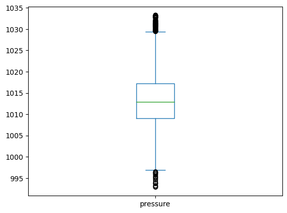
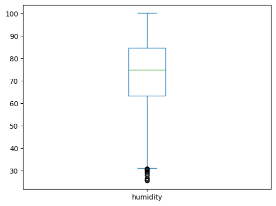
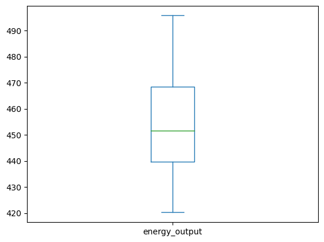

# Exploring Data with Visuals Quiz
Use the space below to explore the `powerplant_data_edited.csv` dataset to answer the quiz questions below.
  * What is the relationship between temperature and electrical output? 
  * Does the humidity variable appear to be normally distributed?
  * Which variable appears to have the most outliers?


```python
# import pandas
import pandas as pd
```


```python
# load powerplant_data_edited.csv
df = pd.read_csv('powerplant_data_edited.csv')
df.head()
```


<div>
<style scoped>
    .dataframe tbody tr th:only-of-type {
        vertical-align: middle;
    }

    .dataframe tbody tr th {
        vertical-align: top;
    }

    .dataframe thead th {
        text-align: right;
    }
</style>
<table border="1" class="dataframe">
  <thead>
    <tr style="text-align: right;">
      <th></th>
      <th>temperature</th>
      <th>exhaust_vacuum</th>
      <th>pressure</th>
      <th>humidity</th>
      <th>energy_output</th>
    </tr>
  </thead>
  <tbody>
    <tr>
      <th>0</th>
      <td>8.34</td>
      <td>40.77</td>
      <td>1010.84</td>
      <td>90.01</td>
      <td>480.48</td>
    </tr>
    <tr>
      <th>1</th>
      <td>23.64</td>
      <td>58.49</td>
      <td>1011.40</td>
      <td>74.20</td>
      <td>445.75</td>
    </tr>
    <tr>
      <th>2</th>
      <td>29.74</td>
      <td>56.90</td>
      <td>1007.15</td>
      <td>41.91</td>
      <td>438.76</td>
    </tr>
    <tr>
      <th>3</th>
      <td>19.07</td>
      <td>49.69</td>
      <td>1007.22</td>
      <td>76.79</td>
      <td>453.09</td>
    </tr>
    <tr>
      <th>4</th>
      <td>11.80</td>
      <td>40.66</td>
      <td>1017.13</td>
      <td>97.20</td>
      <td>464.43</td>
    </tr>
  </tbody>
</table>
</div>


```python
# plot relationship between temperature and electrical output using a scatter plot
df.plot(x='temperature', y='energy_output', kind='scatter');
```


    

    


```python
# plot distribution of humidity using a histogram
df['humidity'].plot(kind='hist')
```


    <AxesSubplot: ylabel='Frequency'>


    

    


```python
# plot box plots for temperature
df['temperature'].plot(kind='box')
```


    <AxesSubplot: >


    

    


```python
# plot box plots for exhaust_vacuum
df['exhaust_vacuum'].plot(kind='box')
```


    <AxesSubplot: >


    

    


```python
# plot box plots for pressure
df['pressure'].plot(kind='box')
```


    <AxesSubplot: >


    

    


```python
# plot box plots for humidity
df['humidity'].plot(kind='box')
```


    <AxesSubplot: >


    

    


```python
# plot box plots for energy_output
df['energy_output'].plot(kind='box')
```


    <AxesSubplot: >


    

    


```python

```
