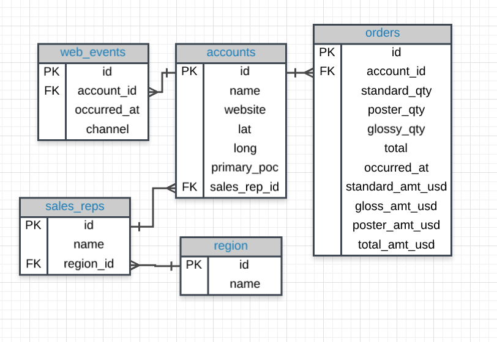

# SQL Practise
DB Schema:



#### Task: Select all users from table
```sql
SELECT * FROM USERS
```
#### Task 1: Filter the accounts table to include the company name, website, and the primary point of contact (primary_poc) just for the Exxon Mobil company in the accounts table.
```sql
SELECT name, website, primary_poc
FROM accounts
WHERE primary_poc='Exxon Mobil';
```
#### Task 2: Create a column that divides the standard_amt_usd by the standard_qty to find the unit price for standard paper for each order. Limit the results to the first 10 orders, and include the id and account_id fields.
```sql
SELECT id,account_id,poster_amt_usd/standard_qty
FROM orders
LIMIT 10;
```
#### Task 3: Use the accounts table to find all companies whose names contain the string 'one' somewhere in the name.
```sql
SELECT *
FROM accounts
WHERE name LIKE '%one%';
```
#### Task 4: Use the web_events table to find all information regarding individuals who were contacted via the channel of organic or adwords.
```sql
SELECT * 
FROM web_events
WHERE channel IN ('organic','adwords');
```
#### Task 5: Use the web_events table to find all information regarding individuals who were contacted via the organic or adwords channels, and started their account at any point in 2016, sorted from newest to oldest.
```sql
SELECT * 
FROM web_events
WHERE channel IN('organic','adwords') AND occurred_at BETWEEN '2016-01-01' AND '2017-01-01'
ORDER BY occurred_at DESC;
```
#### Task 6: Provide a table for all the for all web_events associated with account name of Walmart. There should be three columns. Be sure to include the primary_poc, time of the event, and the channel for each event. Additionally, you might choose to add a fourth column to assure only Walmart events were chosen.
```sql
SELECT a.primary_poc,w.occurred_at AS date,w.channel,a.name
FROM web_events AS w
JOIN accounts AS a
ON w.account_id=a.id
WHERE a.name = 'Walmart';
```
#### Task 7: Provide the name for each region for every order, as well as the account name and the unit price they paid (total_amt_usd/total) for the order. Your final table should have 3 columns: region name, account name, and unit price. A few accounts have 0 for total, so I divided by (total + 0.01) to assure not dividing by zero.
```sql
SELECT r.name AS region_name,a.name AS account_name,(o.total_amt_usd/(o.total+0.01)) AS unit_price
FROM orders AS o
JOIN accounts AS a
ON o.account_id=a.id
JOIN sales_reps AS s
ON s.id=a.sales_rep_id
JOIN region AS r
ON s.region_id=r.id;
```
#### Task 8: Provide a table that provides the region for each sales_rep along with their associated accounts. This time only for the Midwest region. Your final table should include three columns: the region name, the sales rep name, and the account name. Sort the accounts alphabetically (A-Z) according to account name.
```sql
SELECT r.name AS region,s.name AS sales,a.name AS account
FROM region AS r
JOIN sales_reps AS s
ON r.id=s.region_id
JOIN accounts AS a
ON a.sales_rep_id=s.id
WHERE r.name='Midwest'
ORDER BY a.name;
```
#### Task 9: Provide a table that provides the region for each sales_rep along with their associated accounts. This time only for accounts where the sales rep has a last name starting with K and in the Midwest region. Your final table should include three columns: the region name, the sales rep name, and the account name. Sort the accounts alphabetically (A-Z) according to account name.
```sql
SELECT r.name AS region,s.name AS sales,a.name AS account
FROM region AS r
JOIN sales_reps AS s
ON r.id=s.region_id
JOIN accounts AS a
ON a.sales_rep_id=s.id
WHERE r.name='Midwest' AND s.name LIKE'% K%'
ORDER BY a.name;
```
#### Task 10: What are the different channels used by account id 1001? Your final table should have only 2 columns: account name and the different channels. You can try SELECT DISTINCT to narrow down the results to only the unique values.
```sql
SELECT DISTINCT a.name AS account,w.channel AS channel
FROM web_events AS w
JOIN accounts AS a
ON w.account_id=a.id
WHERE a.id='1001';
```
#### Task 11: Find all the orders that occurred in 2015. Your final table should have 4 columns: occurred_at, account name, order total, and order total_amt_usd.
```sql
SELECT w.occurred_at,a.name,o.total,o.total_amt_usd
FROM orders AS o
JOIN accounts AS a
ON a.id=o.account_id
LEFT JOIN web_events AS w
ON a.id=w.account_id
WHERE w.occurred_at BETWEEN '01-01-2015' AND '01-01-2016'
ORDER BY o.occurred_at DESC;
```
#### Task 12: When was the earliest order ever placed? You only need to return the date.
```sql
SELECT MIN(occurred_at)
FROM orders;
```
#### Task 13: Find the mean (AVERAGE) amount spent per order on each paper type, as well as the mean amount of each paper type purchased per order. Your final answer should have 6 values - one for each paper type for the average number of sales, as well as the average amount.
```sql
SELECT AVG(standard_amt_usd) AS avr_standard_spent,
       AVG(gloss_amt_usd) AS avr_sgloss_spent,
       AVG(poster_amt_usd) AS avr_poster_spent,
       AVG(standard_qty) AS avr_standard_qty,
       AVG(gloss_qty) AS avr_gloss_qty,
       AVG(poster_qty) AS avr_poster_qty
FROM orders;
```
#### Task 14: What is the MEDIAN total_usd spent on all orders?
```sql
SELECT PERCENTILE_CONT(0.5) WITHIN GROUP (ORDER BY total_amt_usd) AS median
FROM orders;
```
#### Task 15: Which account (by name) placed the earliest order? Your solution should have the account name and the date of the order.
```sql
SELECT a.name AS account_name, o.occurred_at AS date
FROM accounts AS a
JOIN orders AS o
ON a.id=o.account_id
ORDER BY date 
LIMIT 1;
```
#### Task 16: Find the total sales in usd for each account. You should include two columns - the total sales for each company's orders in usd and the company name.
```sql
SELECT a.name AS account_name, SUM(o.total_amt_usd) AS total_sales
FROM accounts AS a
JOIN orders AS o
ON a.id=o.account_id
GROUP BY a.name;
```
#### Task 17: Via what channel did the most recent (latest) web_event occur, which account was associated with this web_event? Your query should return only three values - the date, channel, and account name.
```sql
SELECT a.name AS name,w.occurred_at AS time,w.channel AS channel
FROM accounts AS a
JOIN web_events AS w
ON a.id=w.account_id
ORDER BY time
LIMIT 1;
```
#### Task 18: Find the total number of times each type of channel from the web_events was used. Your final table should have two columns - the channel and the number of times the channel was used.
```sql
SELECT channel, COUNT(*) AS num_used
FROM web_events
GROUP BY channel;
```
#### Task 19: Who was the primary contact associated with the earliest web_event?
```sql
SELECT a.primary_poc AS contact,w.occurred_at AS occurred_time
FROM accounts AS a
JOIN web_events AS w
ON a.id=w.account_id
ORDER BY occurred_time 
LIMIT 1;
```
#### Task 20: What was the smallest order placed by each account in terms of total usd. Provide only two columns - the account name and the total usd. Order from smallest dollar amounts to largest.
```sql
SELECT a.name AS name,MIN(o.total_amt_usd) AS total_spend
FROM accounts AS a
JOIN orders AS o
ON a.id=o.account_id
GROUP BY a.name
ORDER BY total_spend;
```
#### Task 21: Find the number of sales reps in each region. Your final table should have two columns - the region and the number of sales_reps. Order from fewest reps to most reps.
```sql
SELECT r.name AS region,COUNT(s.name) AS number_sales_rep
FROM region AS r
JOIN sales_reps AS s
ON r.id=s.region_id
GROUP BY region
ORDER BY number_sales_rep;
```
#### Task 22: For each account, determine the average amount of each type of paper they purchased across their orders. Your result should have four columns - one for the account name and one for the average spent on each of the paper types.
```sql
SELECT a.name AS name, AVG(o.standard_qty) AS avg_standard, AVG(o.gloss_qty) AS avg_gloss, AVG(o.poster_qty) AS avg_poster
FROM accounts AS a
JOIN orders AS o
ON a.id=o.account_id
GROUP BY name; 
```
#### Task 23: Determine the number of times a particular channel was used in the web_events table for each sales rep. Your final table should have three columns - the name of the sales rep, the channel, and the number of occurrences. Order your table with the highest number of occurrences first.
```sql
SELECT s.name AS name, w.channel AS channel, COUNT(*) AS number_occurred
FROM web_events AS w
JOIN accounts AS a
ON a.id=w.account_id
JOIN sales_reps AS s
ON a.sales_rep_id=s.id
GROUP BY w.channel,s.name
ORDER BY number_occurred desc;
```
#### Task 24: Determine the number of times a particular channel was used in the web_events table for each region. Your final table should have three columns - the region name, the channel, and the number of occurrences. Order your table with the highest number of occurrences first.
```sql
SELECT r.name AS name, w.channel AS channel, COUNT(*) AS number_occurred
FROM web_events AS w
JOIN accounts AS a
ON a.id=w.account_id
JOIN sales_reps AS s
ON a.sales_rep_id=s.id
JOIN region AS r
ON r.id=s.region_id
GROUP BY w.channel,r.name
ORDER BY number_occurred desc;
```
#### Task 25: Which accounts used facebook as a channel to contact customers more than 6 times?
```sql
SELECT a.id, a.name, w.channel, COUNT(*) use_of_channel
FROM accounts a
JOIN web_events w
ON a.id = w.account_id
GROUP BY a.id, a.name, w.channel
HAVING COUNT(*) > 6 AND w.channel = 'facebook'
ORDER BY use_of_channel;
```
#### Task 26: Find the sales in terms of total dollars for all orders in each year, ordered from greatest to least. Do you notice any trends in the yearly sales totals?
```sql
SELECT DATE_PART('YEAR', occurred_at),SUM(total_amt_usd)
FROM orders
GROUP BY DATE_PART('YEAR', occurred_at)
ORDER BY SUM(total_amt_usd) DESC;
```
#### Task 27: In which month of which year did Walmart spend the most on gloss paper in terms of dollars?
```sql
SELECT DATE_TRUNC('month',o.occurred_at) AS month,a.name AS name,SUM(o.gloss_amt_usd) AS gloss_usd_total
FROM accounts AS a
JOIN orders AS o
ON a.id=o.account_id
GROUP BY DATE_TRUNC('month',o.occurred_at),a.name
HAVING a.name='Walmart'
ORDER BY SUM(gloss_amt_usd) DESC
LIMIT 1;
```
#### Task 28: Change the date format.
```sql
WITH t1 AS(SELECT date, STRPOS(date,''),LEFT(date,10) AS new_date 
FROM sf_crime_data
LIMIT 10)
SELECT new_date,SUBSTRING(new_date,4,2) AS day,LEFT(new_date,2) AS month,RIGHT(new_date,4) AS year,CAST(RIGHT(new_date,4)||'/'||LEFT(new_date,2)||'/'||SUBSTRING(new_date,4,2) AS DATE)
FROM t1 ;
```
#### Task 29:  Create a running total of standard_amt_usd (in the orders table) over order time with no date truncation. Your final table should have two columns: one with the amount being added for each new row, and a second with the running total.
```sql
SELECT standard_amt_usd,
       SUM(standard_amt_usd) OVER (ORDER BY occurred_at) AS total_by_date
FROM orders;
```
#### Task 30:  Create a running total of standard_amt_usd (in the orders table) over order time, but this time, date truncate occurred_at by year and partition by that same year-truncated occurred_at variable. Your final table should have three columns: One with the amount being added for each row, one for the truncated date, and a final column with the running total within each year.
```sql
SELECT standard_amt_usd, DATE_TRUNC('year',occurred_at) AS year,
SUM(standard_amt_usd) OVER (PARTITION BY DATE_TRUNC('year',occurred_at) ORDER BY occurred_at) AS total_by_year
FROM orders;
```
#### Task 31: Select the id, account_id, and total variable from the orders table, then create a column called total_rank that ranks this total amount of paper ordered (from highest to lowest) for each account using a partition. Your final table should have these four columns.
```sql
SELECT id, account_id, total,
RANK() OVER (PARTITION BY account_id ORDER BY total DESC) AS total_rank
FROM orders;
```
#### Task 32: Use the NTILE functionality to divide the accounts into 4 levels in terms of the amount of standard_qty for their orders. Your resulting table should have the account_id, the occurred_at time for each order, the total amount of standard_qty paper purchased, and one of four levels in a standard_quartile column.
```sql
SELECT account_id, occurred_at, standard_qty,
NTILE(4) OVER (PARTITION BY account_id ORDER BY standard_qty) AS standard_quartile
FROM orders
ORDER BY account_id DESC;
```
#### Task 33: Use the NTILE functionality to divide the orders for each account into 100 levels in terms of the amount of total_amt_usd for their orders. Your resulting table should have the account_id, the occurred_at time for each order, the total amount of total_amt_usd paper purchased, and one of 100 levels in a total_percentile column.
```sql
SELECT account_id,occurred_at,total_amt_usd,
NTILE(100) OVER (PARTITION BY account_id ORDER BY total_amt_usd) AS total_ntile
FROM orders
ORDER BY account_id DESC;
```
#### Task 34:  Write a query that left joins the accounts table and the sales_reps tables on each sale rep's ID number and joins it using the < comparison operator on accounts.primary_poc and sales_reps.name.
```sql
SELECT a.name AS account_name,a.primary_poc AS primary_contact_name,s.name AS rep_name
FROM accounts AS a
LEFT JOIN sales_reps AS s
ON s.id=a.sales_rep_id
AND a.primary_poc<s.name;
```
#### Task 35: Write a query that uses UNION ALL on two instances (and selecting all columns) of the accounts table.
```sql
SELECT *
FROM accounts
UNION ALL
SELECT *
FROM accounts;
```


